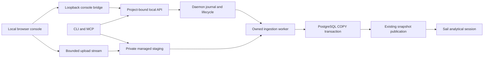

# Local console and file ingestion

*Status: Proposed next product phase · Date: 2026-09-08*

Build a browser console and a shared file-ingestion service in
`supabricks/platform`. The first demonstration is: open the console, import a
CSV, query the resulting PostgreSQL table, branch it, change the branch and show
that the original is unchanged. The next demonstration adds analytical snapshot
refresh and queries against an explicitly selected epoch.

This document specifies intended behavior, not capabilities already shipped.
The [implementation plan](../plans/console-ingestion-implementation.md) defines
the PR sequence and qualification gates. The baseline is
`platform/main@278926b857673b4f7be0a6b86dde300318fbe4b1` after R03, PR #17.
Commands introduced here are proposed syntax until their implementation lands.

## 1. Product decisions

- Ship a local browser console first. `supabricks console` opens it against the
  installed runtime; no editor, cloud account, Node installation or frontend
  development server is required on the user's machine.
- Add a thin VS Code extension after the browser workflow is qualified. Reuse
  the domain API and frontend components, with an editor-specific transport.
- Make ingestion a platform service used by the console, CLI and MCP. Browser
  code does not implement the authoritative parser or execute database writes.
- Import into new PostgreSQL tables first. These tables immediately participate
  in application queries, branching, backup and the existing snapshot pipeline.
- Plan direct analytical ingestion as a separate later capability. Large files
  should eventually enter managed analytical storage without a PostgreSQL copy.
- Keep using the bundled Arrow, Psycopg, Delta and upstream Sail components.
  Neither a Sail fork nor a custom ingestion engine is required for this phase.

Local Linux x86_64 and macOS arm64 remain the supported runtime targets. Public
hosting, enterprise IAM, remote database administration, source connectors, CDC,
scheduled pipelines, arbitrary Python notebooks and data merge/revert are outside
the first console release. This phase does not complete R03's outstanding
reboot/power-loss or public-distribution qualification.

## 2. Existing implementation and ownership

| Existing source | Reuse and boundary |
| --- | --- |
| `crates/local/src/api.rs`, `client.rs`, `project.rs` | Project/worktree binding and typed local actions; extend these contracts |
| `crates/local/src/cli.rs`, `mcp.rs` | Human and agent adapters; add imports over the same service |
| `crates/local/src/store/`, `engine/`, `sessions.rs` | Durable operations, process ownership, connection leases and snapshot/session lifetimes |
| `python/analytics/`, `install/native/analytics.py` | Already bundled private Python, Arrow, Psycopg and analytical dependencies |
| `install/native/`, `recovery.rs`, `upgrade.rs` | Immutable release inventory, offline assembly, coordinated recovery and strict upgrade checks |
| `ui/`, `crates/operator/` | Existing Kubernetes UI and HTTP/MCP API; preserve their current deployment contract |

The existing React/Vite/Carbon UI is not a local-runtime console. Its estate,
capacity and authentication model belongs to the operator. PR #1, which proposes
removing that UI, remains open at this inspection. Put new source in `console/`
and leave that PR's disposition independent. Reuse suitable ideas/components
only after inspecting their dependencies; do not copy the operator's `/mcp`
transport or cluster assumptions.

All new runtime, ingestion, console, packaging and later extension work belongs
in `platform`. `neon` and `postgres` remain engine-source owners; this phase
requires no planned engine patch. `rfcs` may mirror decisions but is not a build
dependency. `website/` remains the separate public site, with deployment deferred.

## 3. Console experience

The initial console opens an existing project discovered from the CLI's working
directory or `--project PATH`. Missing project configuration produces a clear
`supabricks init NAME` next step. Startup can invoke the existing `up` path and
must show actionable readiness errors. A supplied demo dataset is optional and
explicit; opening the console never silently creates application data.

The first release binds each launch to one canonical project/worktree. Show its
identity and the active branch prominently. A later project switcher can select
explicitly registered worktrees; it must not turn an HTTP path argument into
arbitrary filesystem access. Browser branch selection is session-local and does
not silently change the CLI's persisted worktree selection. Every database
request carries an explicit branch UUID. Tabs and saved queries retain their
binding when the user changes the navigation selection.

| Area | First useful behavior |
| --- | --- |
| Overview | Runtime readiness, project identity, branch inventory, create/resume/suspend/delete progress |
| Data explorer | Schemas, tables, columns and bounded row previews; refresh after completed imports |
| SQL workspace | PostgreSQL editor, result grid, types, elapsed time, limits, cancellation and explicit write mode |
| Import | File picker/drop, sample preview, schema controls, target branch/schema/table, progress and errors |
| Activity | Durable operation/import status, retry guidance and bounded diagnostics |
| Analytics, following the first demo | Refresh, epoch inventory, explicit snapshot/session binding and analytical SQL |

Keep a persistent PostgreSQL/Analytics mode indicator. Analytical results show
their epoch and source identity; refreshing does not mutate an already pinned
session. A successful PostgreSQL import does not claim the analytical snapshot
has refreshed. Offer that as a separate action with its own progress.

The SQL workspace starts with existing single-statement and result limits.
Truncation or cancellation must be visible. Do not fetch an entire table into
the browser or convert bigint/decimal values into JavaScript floating point.
Add backend query handles for targeted cancellation rather than relying on
aborting `fetch`. A write interrupted near commit may have an uncertain outcome;
the UI does not automatically replay it. Persistent multi-statement transactions
remain ordinary PostgreSQL-client work until separately designed.

Save queries only on an explicit user action, privately under the data root.
Closing/reopening a page may lose unsaved text; do not silently retain SQL,
results or credentials in browser local storage. Connection strings are hidden
until requested and copied explicitly. Keyboard operation, focus handling,
readable error states and a virtualized result grid are acceptance requirements.

## 4. Runtime and browser boundary



Use React/TypeScript and a locked frontend build in `console/`. Select and pin
the editor, accessible controls and virtualized grid during C01/C02; evaluate
bundle cost and licenses before adding them. Axum and static-asset embedding
already exist in the operator dependency graph and are candidates for a small
local bridge. Reuse libraries without importing the Kubernetes operator crate.
Node is build-time machinery only; include every font/script/style in the signed
release inventory and fetch no CDN assets at runtime.

The bridge is a daemon-owned child with recorded process identity, bound to an
OS-allocated `127.0.0.1` port. It forwards typed actions through the private socket
and never opens SQLite itself. Parsing and copying run in separately owned
workers so uploads and queries do not block lifecycle reconciliation. A browser
closing does not stop the cell or cancel an accepted import. `down` accounts for
the bridge, upload streams and ingestion workers as part of coordinated shutdown.
Daemon replacement revokes browser sessions and transient query handles. Durable
job/operation IDs remain available after reconnecting through a new session.

An open localhost port is not authentication. Exchange a short-lived, single-use
launch secret from a URL fragment for an HttpOnly, SameSite session cookie; clear
the fragment immediately. Scope session credentials to the console instance and
project, accounting for the fact that cookies are not isolated by TCP port.
Validate Host and exact Origin, require CSRF protection
for state-changing requests and reject cross-origin access. Set a restrictive
content security policy and do not put tokens in query strings, logs or local
storage. The server exposes only the console's API, upload and compiled-asset
routes, with explicit body limits; no arbitrary filesystem or shell endpoint.
Project binding and local sessions prevent accidental/remote-browser access;
they do not create a security boundary against the filesystem owner.

The bridge uses bounded polling initially for durable job progress; SSE is an
optional later transport. API version/capability negotiation must reject a stale
frontend rather than guess new request shapes. A future extension uses the same
typed domain client through an extension-host adapter. VS Code webviews require
their own resource URLs, messaging and content policy; embedding is not just
opening the browser URL. See [VS Code's webview contract](https://code.visualstudio.com/api/extension-guides/webview).

## 5. Ingestion inputs and schema contract

| Format | First supported shape | Controls and failure behavior |
| --- | --- | --- |
| CSV/TSV | UTF-8 tabular records, optional BOM/header, quoted/multiline fields | Delimiter, quote, null strings, header and explicit column types; reject malformed records |
| JSONL/NDJSON | One object per record | Map fields to columns; missing fields become null; nested values use explicit `jsonb` mapping |
| JSON | Top-level array of objects, or one explicitly selected document stored as `jsonb` | Reject ambiguous shapes; do not silently explode nested arrays or infer joins |
| Parquet | A local file with a supported tabular schema | Use embedded types; map decimals/timestamps explicitly; nested structures require a supported mapping |

Use the bundled Arrow reader in batches for CSV and Parquet. Arrow's JSON reader
accepts line-delimited JSON, not arbitrary JSON arrays. Initially support array
and document JSON with a conservative size bound; select a pinned streaming
parser before promising large JSON-array inputs. Reading documentation does not
qualify an implementation against the pinned runtime.
[Arrow CSV](https://arrow.apache.org/docs/python/csv.html),
[Arrow JSON](https://arrow.apache.org/docs/python/json.html),
[Arrow Parquet batches](https://arrow.apache.org/docs/python/generated/pyarrow.parquet.ParquetFile.html).

A preview samples data and proposes a schema; it does not validate the whole
file. Freeze the approved parser options and destination schema before loading.
Validate every subsequent record against them and fail atomically if later
records disagree. Never silently skip malformed rows or widen a type mid-import.
Offer text overrides for postal codes and other values with significant leading
zeros. Distinguish null, empty string and missing fields. Preserve decimal
precision and timestamp/timezone semantics, and reject unsupported conversions.
Duplicate/empty headers require an explicit proposed rename. Quote identifiers
with the driver's identifier API; never interpolate file headers into SQL.

Provisional first-release limits are 100 MiB source files for CSV/JSONL/Parquet,
10 MiB for ordinary JSON, 100 preview rows capped at 256 KiB, 256 columns, 1 MiB
per decoded field/record, one active import per cell and a 512 MiB sampled worker
RSS budget. Bound decoded bytes separately (initially 512 MiB), since a small
Parquet file can expand substantially. Use a ten-minute job deadline and explicit
free-disk admission checks. These are initial engineering ceilings, not measured
capacity claims; I01/I03 must qualify or lower them. Cap parser batch/metadata
allocation and terminate workers that exceed the budget. Compressed text files,
archives, URLs, folders and multi-file dataset discovery are deferred.

## 6. Shared ingestion service

Expose versioned actions for source staging, inspection, import creation,
status/list, cancellation and source disposal. The console, CLI and MCP use the
same schema and job identifiers. A proposed CLI flow is:

```sh
supabricks ingest inspect ./orders.csv --branch main
supabricks ingest load ./orders.csv --branch main --table public.orders \
  --schema-file ./orders.schema.json --key orders-first-import --wait
supabricks ingest status JOB_ID
supabricks ingest cancel JOB_ID
```

The schema file describes mappings/options, not executable expressions. A load
without an approved mapping must return a preview/plan or require an explicit
inference option. Human import confirmation and agent write authorization both
name the destination branch. MCP returns bounded metadata, not base64 file bytes;
an agent stages an explicitly requested local file through a scoped local adapter.

Browser uploads stream from the file picker into server-managed staging; browser
file paths are not trusted server paths. CLI staging copies only an explicitly
named regular file and detects changes during copying. Bind a staged source ID
to project, content hash, size and generation. Preview and load consume those
same immutable bytes. Rename/unlink of the original file after staging does not
change the job. No parser receives an arbitrary user URL or storage URI.

The private data root owns `ingest/sources/` and job evidence; directories are
0700 and files 0600. Incomplete uploads are unusable and restarted from zero in
the first release. Delete successful/cancelled source payloads once no worker or
job references them; retain failed sources for an explicit retry or 24 hours,
with visible expiry and a delete action. Expire abandoned previews after 24 hours.
Enforce an aggregate staging budget. Retain compact job metadata and receipts;
avoid raw data in logs and CI artifacts. User-managed original files are untouched.

### Transaction and retry boundary

Create a new target table and load it using Psycopg `COPY FROM STDIN` in one
PostgreSQL transaction. Use a private working table/name if needed; publication
of the requested name and an import receipt occur in that same transaction.
Existing target tables are refused, including a table created concurrently.
Cancellation or parse failure before commit rolls back the table and rows.
Psycopg's COPY API participates in ordinary transaction commit/rollback.
[Psycopg COPY documentation](https://www.psycopg.org/psycopg3/docs/basic/copy.html).

SQLite and PostgreSQL do not share a transaction. A worker can commit and die
before the daemon records success. Persist a unique receipt in a reserved
PostgreSQL schema with the job ID, installation/project/origin-branch identity,
source hash, mapping fingerprint, target identity and row count. A retry with the
same key must reconcile that receipt through the original branch before doing
any more loading. If the database is unreachable, report reconciliation pending;
absence cannot be inferred from a connection error. Changed input under the same
key conflicts. Do not claim generic exactly-once delivery from a SQLite status
flag. Manual receipt/table changes yield an explicit conflict, not automatic reload.

Branches inherit PostgreSQL receipts physically. The origin-branch identity
prevents an inherited receipt from satisfying a new branch's import. Reserve the
internal schema and hide it from normal table browsing and analytical exports,
while retaining it in physical branches/backups. Test these interactions before
shipping the receipt mechanism. Existing application roles are a same-owner
model; schema hiding is not multi-user authorization.

Proposed state progression is `receiving -> staged -> inspecting -> ready ->
queued -> loading -> reconciling -> succeeded`, with explicit failed, cancelled
and expired states. Track bytes received, rows parsed/copied and committed rows
separately. Cancellation during uncertain commit stays reconciling until the
receipt proves success or the fenced transaction proves rollback. The first
release retries a rolled-back load from the immutable source; it does not resume
COPY at an arbitrary byte offset.

### Lifecycle, recovery and migration

Hold the existing branch connection/work protections while loading. Suspension,
TTL/delete and shutdown must observe the import and either wait or use the
existing explicit cancellation/force semantics. Record worker generation and
verified process identity; fence a surviving worker before retry. Snapshot export
must observe either the complete committed import or the prior state. Test the
receipt boundary against branching and concurrent snapshot refresh.

Coordinated backup stops upload admission, accounts for workers and reconciles
commit outcomes before stopping the required computes and copying. If an outcome
cannot be resolved, fail maintenance with an actionable pending-job state;
never record success by assumption. Include retained staged sources and job metadata
under the durable root; exclude only explicitly documented transient sockets and
browser credentials. Restore preserves source/job references and invalidates old
browser sessions. Any active upload/load restores as interrupted/reconciling,
never as a running process. Expiry/cleanup must not race a backup or active reader.

R03 only accepts catalog version 8 and identical declared data formats. Import
metadata needs a new schema, so shipping it requires a named migration with a
verified pre-migration backup, a durable migration journal and interrupted-upgrade
tests. Update the exact compatibility declaration, not the broad rejection rule.
Startup of older binaries against migrated roots remains refused. Return to the
old version through its retained release and pre-upgrade backup in a new root.
This migration is an explicit implementation slice, not frontend setup work.

## 7. Later destinations and integrations

Append, replace and upsert need separate contracts for schema compatibility,
constraints, conflict keys, concurrent writers and recovery. New-table import is
the first supported write mode; do not advertise those modes through an unchecked
dropdown. Excel, compressed inputs, object-store sources, database connectors and
scheduling follow demonstrated demand and bounded qualification.

Direct analytical ingestion will reuse source staging and decoding, but write
managed Delta/Parquet generations instead of PostgreSQL. Before implementing it,
define dataset ownership, atomic publication, schema evolution, epoch/session
bindings, joins with PostgreSQL snapshots, retention, deletion and backup. A
source file on a user's desktop is not a durable table location. Direct datasets
do not automatically inherit PostgreSQL branching or transaction semantics.
Keep destination types explicit so this can be added without pretending every
analytical table has a PostgreSQL source OID.

The VS Code extension follows the browser release. Initially discover
`supabricks.toml`, show branch/status, open the console/query views and import a
selected local file through the shared service. Require workspace trust before
launching processes or reading files. Local desktop execution is the first target;
SSH, containers, Codespaces and browser-only VS Code need a separately qualified
host/path/port model. Ship no second database runtime or independent job journal.

## 8. Demonstration and release evidence

The first demo must use the actual installed release and a fresh private root:
initialize a project, open the console, import the supplied CSV, inspect types
and exact rows, run a query, create a branch, change its data and verify the
parent is unchanged. Repeat through the CLI and inspect the same job via MCP.
Reopen the browser and restart the cell to prove retained state. The analytical
extension refreshes an epoch, queries it, changes PostgreSQL and demonstrates
that the pinned analytical results change only after an explicit new refresh.

Qualify both native targets with networking disabled, bundled browser assets,
malformed inputs, process failures, cancellation, source mutation, stale tabs,
full disk and interrupted upgrade/restore. Reports identify the release and
browser versions, source fixture hashes, committed counts, job outcomes and
limits without raw user data. A browser test runner is build/test machinery, not
an end-user dependency. Public website and signing work remain separate gates.
