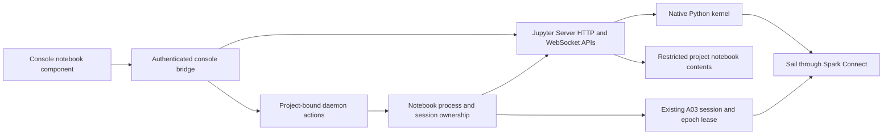

# Local notebooks in the Supabricks console

*Status: Proposed notebook phase · Date: 2026-09-09*

Build in `supabricks/platform`, after I02 at
`main@d18aae72b3aa5e130adfe6ddcfc2241926a3277b` (PR #23). This document describes
intended behavior; notebooks are not in the alpha.8 release. The
[implementation plan](../plans/notebook-implementation.md) defines PR slices,
dependency selection and qualification gates.

The first demonstration is: **open a notebook in the console -> query the
selected branch's analytical snapshot -> save -> reopen -> restart the kernel
and run again**. Use the existing CSV import and `public.orders` fixture. A user
should not have to install Jupyter, Python, Node, Java or a separate Spark cluster.

## 1. Component decisions

| Layer | Proposed component | Supabricks responsibility |
| --- | --- | --- |
| Notebook editor | Upstream JupyterLab notebook/services through a React adapter (N01 selection) | Console navigation, branch/snapshot context, toolbar and component adapter |
| Notebook protocol and kernel services | Jupyter Server | Authenticated bridge, restricted contents adapter and lifecycle integration |
| Python kernel | Upstream `ipykernel` | Bundled kernelspec, private configuration and Spark bootstrap |
| Analytical execution | Existing PySpark Connect client and Sail | Existing A03 admission, epochs, leases and worker limits |
| Document format | Standard `.ipynb` | Conflict-aware saves, project file ownership and metadata |

[N01 qualification](n01-notebook-qualification.md) selects upstream JupyterLab
notebook/services with Jupyter Server and ipykernel. The retained Datalayer
2.0.14 candidate fails under the existing Vite configuration on a JupyterLite
asset import. The decision record contains exact locks, the comparison probe,
measurements and required adapters; it does not enable a product feature.

Use upstream [Jupyter Server APIs](https://jupyter-server.readthedocs.io/en/latest/developers/rest-api.html)
and its [kernel WebSocket protocol](https://jupyter-server.readthedocs.io/en/latest/developers/websocket-protocols.html).
Keep notebook models, editing, rendering and execution in those upstream
components. An external JupyterLab tab may help diagnosis but does not complete
the embedded UI.

Use a native Python kernel. Browser kernels have different package/execution
constraints ([JupyterLite documentation](https://jupyterlite.readthedocs.io/en/stable/howto/configure/kernels.html));
adapting the qualified native PySpark stack to WebAssembly is outside this phase.
JupyterHub, collaborative editing, remote kernels, terminals, extension galleries,
scheduled notebook execution, custom engines and direct analytical writes are
also outside this phase. Public hosting remains deferred.

## 2. User experience and database semantics

- Add **Notebooks** to the existing console. List, create and open notebooks for
  its bound project/worktree. Reading a file does not start a kernel or execute
  saved cells. First **Start kernel** is explicit and identifies local Python
  execution; subsequent cell execution uses ordinary notebook controls.
- Select a branch before starting. Show project, branch, kernel state, snapshot
  identity and age persistently. A navigation change does not retarget a running
  notebook or the CLI's selected branch.
- Bootstrap `spark` using the entire A03 Spark Connect endpoint, including its
  session parameters; expose `epoch` metadata as in the existing Spark shell.
  `spark.table("public.orders")` and `spark.sql(...)` work immediately.
- Initial access can use A03's existing first-snapshot publication path. Show
  export/publication progress before declaring the kernel ready. Existing
  snapshots remain stable until an explicit refresh.
- **Refresh data** publishes a new epoch without changing the current kernel.
  **Restart on latest snapshot** explicitly discards Python state and creates a
  new bound kernel/session. A branch change likewise requires an explicit new
  execution context; previously displayed outputs retain their source metadata.
- Provide run cell/all, interrupt, restart and shutdown, plus Markdown, text,
  tables and qualified static image outputs. `spark.sql` is the first SQL-in-cell
  interface; `%sql`, rich widget support and additional plotting packages are
  separate extensions after the basic workflow is measured.
- Save standard files that ordinary Jupyter and VS Code can open. Kernel memory,
  live endpoints and credentials are never notebook metadata. Reopening a file
  restores source and explicitly saved outputs, not a running computation.

This reuses the [A03 session contract](a03-analytical-sessions.md). Analytical
views have the original PostgreSQL schema/table names but read frozen exports;
imports and PostgreSQL changes require refresh to appear in new analytical
sessions. A database branch does not branch notebook files. Files belong to the
application worktree; Git/worktrees manage their history.

## 3. Runtime ownership and transport

Start Jupyter lazily, with at most one server per active canonical worktree and
an installation-wide admission limit. It uses the immutable private Python
environment and private runtime/configuration directories; disable discovery of
ambient user Jupyter configuration, kernelspecs and server extensions. Kernel
working directories belong to the project. Install packages only at build time.

The daemon remains the only local catalog writer. Jupyter manages its kernel
protocol, while a narrow adapter reports kernel identities/generations and asks
the daemon for analytical session admission. Every kernel is associated with one
project, branch UUID, epoch and A03 session. Record enough ownership before
launch to reconcile crashes; no browser-created arbitrary kernelspec or Spark
endpoint can bypass admission. Reuse the supervisor's process identity checks
for servers, kernels and managed descendants, including kernels launched by
Jupyter. Do not stop an unrelated PID on recovery.

Expose a same-origin, allowlisted HTTP/WebSocket route through the console
bridge. Keep the upstream Jupyter token server-side and authenticate every
browser connection using the existing project-bound console session. Preserve
exact Host/Origin checks, CSRF protection, protocol negotiation, body limits and
cookie isolation between console instances. WebSocket handshakes additionally
need a same-origin session-bound, single-use authorization mechanism compatible
with the selected client; N01 proves it and N02 pins its contract. Credentials
must not enter URLs used for logs, notebook files or persistent browser storage.
Revoke open sockets when their authorization expires or the user signs out.

Allow only the contents, kernelspec, kernel, session and channel operations
needed by the notebook adapter, with ownership checks for every referenced ID.
Reject generic proxy destinations, server configuration, arbitrary kernel
selection, terminal APIs and unrelated file routes. The private upstream binds
loopback and still requires its own authentication. Configuring a permissive
Jupyter CORS setting is not a substitute for the console boundary.

Rendering rich outputs must not give saved notebook HTML access to console
credentials or APIs. Reuse Jupyter trust/sanitization behavior with explicit
tests under our CSP. Disable active JavaScript outputs and unqualified widgets;
limit MIME types and sanitize HTML/Markdown. Any component-required styling
exception must be narrow and measured, with script restrictions preserved.

## 4. Execution state, limits and failure behavior

Proposed public states: `stopped`, `starting`, `ready`, `busy`, `interrupting`,
`stopping`, `expired`, `failed` and `lost`. Bind requests to a kernel generation;
late messages from an old generation cannot alter a replacement kernel's state.
Separate Jupyter execution request IDs from durable platform operation IDs.
Lost replies or browser reconnects never automatically resend an execute request.

| Event | Required behavior |
| --- | --- |
| Browser reload or disconnection | Reconnect to the same owned kernel while authorized and alive; report any output gap; never rerun cells |
| Browser tab closes | Kernel remains bounded by its existing idle/lifetime policy; explicit shutdown remains available |
| Console sign-out/session expiry | Revoke channels and stop kernels owned by that browser session; another authenticated client cannot silently adopt them |
| Python-only interrupt | Interrupt that kernel, report completion only after it is observed idle |
| Spark call cannot be interrupted | Close its A03 session as the documented fallback; mark Spark unavailable and require an explicit restart |
| Kernel restart | Stop old kernel/session and release leases before admitting a replacement; clear variable state, retain document |
| Daemon or Jupyter server dies | Fence owned processes and report execution lost; retain saved files; no automatic code replay |
| A03 session expires or worker fails | Show Spark context lost; stop the bound kernel and require explicit restart |
| Branch deleted or stale identity | Refuse new execution; stop affected kernel/session before forced deletion completes; otherwise return a useful active-session conflict |
| Runtime down, backup or upgrade | Stop and account for all notebook children before existing coordination proceeds |

An interrupt acknowledgement from Python is not proof that a Sail query stopped.
N02 must qualify the actual cancellation path. Partial Python side effects are
possible; no transaction or rollback guarantee applies to an arbitrary cell.

Initial proposed bounds, finalized with measurements in N01/N02:

| Resource | Starting policy |
| --- | --- |
| Jupyter servers | At most 2 per installation; lazy start, stop when idle without kernels |
| Running notebook kernels | At most 2 per installation, also subject to A03's shared 2-session cap including CLI/shell clients |
| Kernel lifetime | 15 minutes initially, matching A03 default; visible expiry, no hidden extension |
| Disconnected/idle kernel | Stop after 5 minutes without execution or an attached authorized client; document how busy work is counted |
| Simultaneous execution | One submitted execution per kernel; bounded client queue, no unbounded Run All submission |
| Notebook document | 10 MiB serialized file, 500 cells initially, attachments included |
| Browser output | 1 MiB per cell, 10 MiB retained per notebook; cap individual protocol frames and aggregate queues before forwarding |
| Kernel memory | 1 GiB sampled RSS watchdog per kernel; measure Jupyter overhead separately and set its bound in N02 |

Overflow produces a visible truncation or explicit failure; a saturated output
channel must not prevent shutdown/control messages. Cap upstream accumulation as
well as browser rendering. A03 Sail memory, spill and lifetime limits still apply.
Its CLI/MCP result limits do not bound raw DataFrame collection in Python.
Watchdogs are sampled limits, not an OS sandbox or a hard memory quota.

Notebooks execute trusted local code as the installation's OS user. Restricting
the browser's contents API to a project does not sandbox Python filesystem or
network access. Do not describe a Python kernel as read-only because the managed
analytical SQL API is read-only. Exported generations remain immutable platform
assets; modifying them via raw engine/file APIs is unsupported.

## 5. Files, saving and recovery

Store documents under `<canonical-worktree>/notebooks/`; create that directory
only on explicit notebook creation. The contents adapter allows `.ipynb` files
inside this root and rejects traversal, absolute paths, symlinks and unsupported
filesystem entries, including ancestor replacement races. It never exposes the
application root or Supabricks data directory through a generic file browser.
Specify ownership and restrictive create permissions without changing existing
project permissions. Native Python retains the privileges described above.

Reuse Jupyter contents interfaces with a narrow adapter for these policies.
Create is exclusive; saves use validated notebook JSON, an expected prior
content hash, a same-directory temporary file, sync and atomic replacement.
Serialize competing writes in the contents service; recheck identity/content
before replacement and reject detected external edits. Use a conflict-copy path
when the adapter cannot safely protect a concurrent edit. N01 must establish the
actual guarantees against external editors; do not promise cross-process atomic
compare-and-swap on ordinary filesystems. Handle rename under the same rules.

Begin with explicit Save and a dirty indicator; no autosave or durable browser
cache. Save code and Markdown by default; **Save outputs** explicitly retains
bounded outputs with branch/epoch provenance. Outputs can contain user data, so
do not automatically add or commit notebooks to Git. Import/open never executes
cells and treats stored rich output as untrusted. Unknown supported nbformat
metadata round-trips without injecting session credentials. Failed saves leave
the previous file intact and preserve in-memory edits for retry/download.

Project notebook files follow application-source backup/version control. The
existing Supabricks data-root backup does **not** include external worktrees;
state this in the UI/runbook and recovery report. Backup/upgrade first stops
kernels to quiesce platform-owned work, but does not serialize Python memory or
capture arbitrary filesystem writes. Catalog ownership metadata, if added, goes
through explicit R03 migration/backup compatibility. Kernel connection files,
tokens, sockets, outputs in flight and live endpoints are ephemeral and excluded.
Restoring a root requires reopening the original or separately restored project,
then explicitly starting a new kernel against available branch/epoch identities.

## 6. Packaging and release boundaries

Extend `python/analytics/` locks and native assembly with Jupyter Server,
`ipykernel`, their native dependency wheels, the bootstrap and kernelspec.
Keep versions of the existing analytical stack fixed unless a separately tested
compatibility change is necessary. Measure compressed archive size, cold-start
time, idle RSS and notebook frontend bytes against alpha.8. Lazy-load notebook
assets so the existing SQL/import workflow does not pay their startup cost.

All JS/CSS/fonts, Python packages and MIME renderer assets must be in the signed
inventory. No runtime pip/npm install, CDN, model account or network bootstrap.
Ship upstream license texts/notices with exact component provenance; Supabricks
source remains Apache-2.0. Confirm both Linux x86_64 and macOS arm64 wheel support
and relocation; never use a globally installed developer Jupyter to pass tests.

Notebook delivery can precede I03 and C03 because A03's analytical services
already exist. Shared branch/snapshot controls should be reusable by C03, which
still owns the analytical SQL workspace. N05 qualifies notebooks; R04 still owns
the combined console/formats/analytics release. Neither milestone claims public
distribution, Safari support, real power-loss durability or completion of the
outstanding real-agent usability check.
