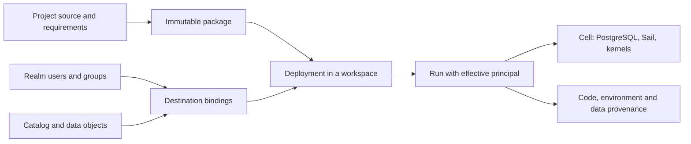

# Portable projects, deployments and governance

Status: proposed, not implemented. Baseline: platform `916a793` (PR #45),
console `70af6a2`, catalog schema 10, PG17.8 and source-built Sail 0.7.1.
Research date: 2026-09-13.
[Industry evidence](../research/project-packaging-industry.md) ·
[Implementation slices](../plans/project-packaging-implementation.md).

## Decision

Make a Supabricks project a portable definition of code, resources, dependencies
and required access. Build an immutable package from that definition. Deploy it
into an execution workspace by binding those requirements to local resources,
identities and catalog objects. Record the resolved result and its provenance.

One local workspace and the current OS user remain the default experience.
Catalog servers, login screens, registries and Kubernetes are not prerequisites
for packaging. Shared on-prem deployments add those capabilities through the
same identifiers and contracts, with a separate execution isolation gate.

The first milestone is concrete: export an existing project's notebooks, saved
SQL, dependency declarations and selected demo fixtures; inspect the package on
a second supported installation; create a fresh project instance; prepare its
locked environment offline; and explicitly execute the same demo. Opening or
inspecting a package never runs code.

## Current implementation and gaps

| Existing contract | Packaging implication |
| --- | --- |
| `project.rs`: strict format-1 manifest containing UUID and name | Extend deliberately; old readers reject new fields, and copied UUIDs identify the same runtime project |
| `api.rs` / `client.rs`: project UUID plus canonical worktree binding | Introduce a resolver between portable identity and runtime identity before allowing multiple deployments |
| `store/`: project-scoped branches, journal and worktree selection | Reuse the daemon's single-writer model, idempotency and revision checks |
| `console/workspace.rs`: saved SQL under private `queries/<project-id>` | Add explicit export/adoption into portable query files; merely archiving the project directory misses these queries |
| `notebooks/files.rs`: project `.ipynb` files; NE environment declarations and locks | Package source and locks; regenerate environments and runtime handles on destination |
| A01/A02: frozen PostgreSQL exports and immutable Delta epochs | Reuse consistency/lease machinery for a later data profile; current descriptors contain source runtime identities and cannot be copied verbatim |
| R03: stopped physical backup of a whole cell, including credentials | Preserve as a separate recovery product; it is neither project export nor a safe shareable package |
| Native connections: PostgreSQL authenticates behind a byte-relay gateway | Adding a UI role does not change SQL privileges |
| Notebook execution: host-user processes | Packaging trust and future multiuser isolation require explicit treatment |

References: [project parser](../../crates/local/src/project.rs),
[binding](../../crates/local/src/api.rs),
[saved queries](../../crates/local/src/console/workspace.rs),
[epochs](a02-analytical-epochs.md), [recovery](r03-recovery-upgrades.md),
[connections](native-connections.md),
[notebook environment contract](../plans/notebook-environments-implementation.md).

## Objects and ownership

| Object | Stable identity and purpose | Authority |
| --- | --- | --- |
| Security realm | Principal/group namespace; one local realm initially | Destination identity service |
| Workspace | Execution and access scope inside a realm; one `local` default | Platform control plane |
| Cell | A concrete native runtime/data root hosting execution | Existing daemon and supervisor |
| Project definition | Portable UUID retained in Git; name is a label | Project author/source control |
| Package | Digest of immutable inventory and portable metadata | Verified artifact bytes |
| Deployment | New UUID for one installed project instance in a workspace | Destination platform journal |
| Target | Named configuration such as `local` or `staging`; not an identity or privilege | Project defaults plus destination binding |
| Resource key | Stable logical key inside a project, such as `database.main` | Project definition |
| Runtime resource | Actual branch, endpoint, kernel or operation UUID | Owning runtime/provider |
| Catalog asset | Provider-qualified object ID plus incarnation/version where needed | Catalog provider; PostgreSQL remains authoritative for live PG objects |
| Binding | Logical requirement mapped to a specific destination resource/principal | Authorized destination operator |
| Run | Actor, effective principal, deployment/package, environment and data versions | Runtime execution journal |

A project can have many deployments. A workspace can run many projects. A
project may consume multiple catalogs; a catalog may serve multiple projects.
A cell is placement, not the permanent identity of a project or catalog.
Do not equate a Git branch, database branch, deployment target or Python
environment. Those are different selections with independent lifecycles.



Use the existing runtime `projects.id` as the physical project/container identity
in the first migration. Add definition/deployment records that map to it. Existing
projects get one legacy deployment preserving their runtime UUID and branch
identities. New deployments of the same definition allocate distinct runtime
project UUIDs, and hence distinct Neon tenant identities. Do not insert a new
meaning into every existing project foreign key at once.

All CLI, MCP, console, notebooks and environment operations must pass through
the new resolver. A source UUID is identification, never proof of access. An
unbound copy with an existing UUID requires explicit attach or a new deployment;
it cannot silently select live production resources by name or manifest content.
An explicit local attach is recorded by the destination, not authorized by a
package-carried marker or an editable `.supabricks/` file. A second Git worktree
may explicitly attach to the existing deployment and keep
its independent branch/environment selection. Creating a template fork gives it
a new definition UUID and records optional origin provenance.

## Source and artifact contract

Proposed layout; all commands and new manifest fields below are future interfaces:

```text
supabricks.toml                    # definition and portable requirements
supabricks.lock                    # resolved project/component compatibility
notebooks/*.ipynb
notebooks/environment/pyproject.toml
notebooks/environment/uv.lock     # Python resolution remains owned by uv/NE
queries/*.sql
resources/*.toml                   # explicitly included typed declarations
migrations/*.sql                   # ordered, checksummed PostgreSQL changes
fixtures/*                        # explicit, bounded sample inputs
src/*                             # optional project source, included explicitly
.supabricks/                      # ignored local selection/binding hints only
```

`supabricks.lock` does not duplicate Python dependency resolution or pin a
customer's credentials. It records schema/capability requirements, hashes of
nested locks and source inputs, and supported target artifact closures. The
runtime's own release manifest continues to pin PG, Sail, Python and helpers.
Initial qualification uses exact compatible release/kernel contracts; future
version ranges require explicit compatibility evidence, not just SemVer guesses.

Keep `id` and `name`; introduce manifest `format_version = 2`. Read format 1
through a compatibility adapter. Upgrade files only by an explicit command with
an original-file backup. Unknown execution/security fields and unsupported
required capabilities fail validation. The catalog migration is separately
versioned and follows the existing backed-up upgrade process.

Illustrative format-2 source, not a supported configuration today:

```toml
format_version = 2
id = "707f5d76-71f2-4997-9bc0-71e375856031"
name = "sales"

[package]
version = "0.1.0"
include = ["notebooks/**/*.ipynb", "queries/*.sql", "fixtures/sales.csv",
           "notebooks/environment/pyproject.toml", "notebooks/environment/uv.lock"]
notebook_outputs = "strip"

[requires]
capabilities = ["postgres17", "spark-sql", "managed-notebooks"]

[targets.local]
mode = "development"

[resources.database.main]
kind = "postgres_database"
lifecycle = "retain"

[resources.query.sales_total]
kind = "sql"
engine = "postgres"
file = "queries/sales_total.sql"
database = "database.main"

[resources.notebook.sales]
kind = "notebook"
file = "notebooks/sales.ipynb"
environment = "notebook"
database = "database.main"

[environments.notebook]
pyproject = "notebooks/environment/pyproject.toml"
lock = "notebooks/environment/uv.lock"
```

The later binding schema adds logical references such as `data.sales_input`
with a required object kind, schema contract and access actions. It may express
logical roles such as `analyst`; it never assigns an email address or imports
publisher-side grants. Destination profiles resolve these to realm principal
IDs, runtime objects, provider-qualified catalog IDs and secret references.
V1 packagers must reject required later capabilities rather than silently ignore
their semantics. Tasks/jobs, scheduling, model registry and general application
hosting need their own execution contracts; packaging files does not implement them.

### Portable package profiles

| Profile | Payload | Initial disposition |
| --- | --- | --- |
| `source` | Manifest, resolved graph/lock, selected code, queries, stripped notebooks, fixtures | First deliverable |
| `offline` | Source plus NE-compatible wheel bundles for explicitly named native targets | First runnable portability milestone |
| `data` | Explicitly selected logical PG data or analytical dataset snapshots | Later, separately qualified export/import adapters |
| Physical cell backup | Storage, WAL, credentials, source identities | Existing R03 command; excluded from project packages |

Use a versioned `.sbproj` artifact: deterministic tar+gzip with `package.json`,
`project/` and optional `dependencies/<target>/`. Reuse existing archive/hash
components after inventorying them. Normalize order, modes, timestamps and gzip
headers; reject duplicate/case-colliding paths, traversal, links, special files
and undeclared payloads. Bound entry count, individual files, total expanded
bytes and decompression ratio before publication. The content digest covers
canonical metadata plus all payload hashes; a separate archive digest identifies
the transport bytes. Detached attestations do not participate in a circular
self-hash. Inspection verifies the entire inventory without executing hooks,
resolving dependencies, starting a runtime or contacting a catalog.

An allowlist determines payload; `.gitignore` alone is insufficient. Exclude
`.env`, private keys, connection profiles, local state, caches, venvs, launch
credentials and platform binaries. Strip outputs, execution counts, widget state
and local runtime metadata from the packaged copy of notebooks by default;
leave working files intact. Reject credential-bearing URIs in recognized
configuration fields. Arbitrary code, SQL and user data may still contain
sensitive content: show the complete file inventory and selected data before
export and never claim the allowlist is a complete secret detector.

A hash proves integrity, not who published a package or that code is safe.
Local inspection/extraction requires no signature. Code execution remains an
explicit trusted action. Shared distribution later adds issuer trust and
attestations through standard artifact tooling; it must not reuse the ephemeral
localhost installer signing key as a persistent publisher identity.

Source archives can be portable across OS targets. Offline wheels and data
adapters are capability- and target-specific. If a compatible native wheel is
missing, report that the package is not offline-ready on that target. Never
copy a materialized Linux environment to macOS or silently fetch missing pieces.

## Lifecycle and state model

The intended CLI progression is `project validate`, `project pack`,
`project inspect`, `project unpack`, `project plan` and `project apply`.
`unpack` writes into a new directory and leaves the project unbound and unexecuted.
`plan` is read-only; it resolves target capabilities, references, resource changes,
required grants, disk budget and trust decisions. `apply` consumes an exact plan
ID, package digest, bindings revision and expected deployment/resource revisions.
Any change requires replanning. Lost replies recover through the existing
idempotent operation lookup, with actor and target included in request identity.

Proposed journal sequence:

```text
requested -> validated -> staged -> preparing -> ready_to_activate -> active
                   any pre-activation stage -> failed/cancelled (previous remains active)
```

Prepare in private staging directories. Reuse NE's immutable generations and
leases, ingestion's bounded workers and the operation journal. Publish a
complete deployment revision in one local transaction after its owned resources
are ready. A retained previous revision remains available for source/environment
rollback. Multi-resource changes are a journaled workflow, not a claimed
transaction across PostgreSQL, the filesystem and an external catalog.

Database mutations need special care. Initial deploy creates a fresh owned
branch or explicitly adopts an existing one after checking identity and revision.
Schema/seed execution is a named plan step, never an unpack hook. Migration
history is append-only with content hashes. Group transactional SQL within one
PG transaction; mark non-transactional operations and their recovery strategy.
A failed upgrade after an irreversible DDL/data step reports the actual state;
rolling back code does not automatically roll back the database. Start with
additive/fresh-destination changes; qualify destructive migrations separately.

A missing manifest entry means retained/unmanaged state requiring an explicit
retirement decision. Deleting a deployment never implicitly drops external
catalogs, source tables, shared resources or existing user branches. Adoption,
unbinding and deletion are different operations. Content-addressed dependency
GC respects active revisions, kernels and deployment leases.

Saved queries have one authority per mode: current personal queries stay private
until explicitly exported/adopted; deployment-owned queries come from the pinned
source revision. Editing one in the console creates a worktree draft to package,
not a silent mutation of the installed artifact. In-flight notebook kernels keep
their existing environment and data epoch when a new deployment activates.

## Catalog integration and data portability

Use a narrow provider contract: capabilities, resolve object, inspect metadata,
resolve version, authorize access and acquire scoped read credentials/handles.
Unsupported authorization or version behavior must return unsupported, never
success. Local runtime metadata, external catalog metadata and identity/policy
state each retain a single authority; any index/projection records its provider,
source version and freshness and cannot mint grants.

Default local naming can expose a deployment's database through its existing
`public.table` query context, with a catalog alias available for three-part
names. Explicit bindings allow another project/catalog as input. Never assume
PostgreSQL databases/schemas and UC catalogs/schemas are identical objects.
Maintain a qualified mapping from logical asset to provider ID and incarnation;
a dropped/recreated table must invalidate the old binding even if its name or
PostgreSQL OID is reused. Rename and schema drift produce an explicit plan diff.

A live PostgreSQL table and its exported Delta snapshot are distinct assets with
lineage between them. A catalog may register an analytical snapshot, but it does
not own Neon branching, WAL, compute lifecycle or the control SQLite database.
Keep branch and epoch selection in runtime bindings. Use an epoch-qualified
snapshot set for consistent multi-table reads; publishing tables one-by-one to
UC cannot replace A02's atomic snapshot-set contract. Either reference a complete
immutable set from a platform binding or restrict catalog publication to a
qualified consistency model. Remote readers cannot use local-only `file://`
paths; an explicit shared storage/credential provider is required.

For a future `data` profile, specify selected schemas/tables, snapshot time/LSN,
row counts, schema fidelity, checksums and limits. Reuse frozen exports for a
consistent source; evaluate bundled PG logical dump/restore for PG fidelity and
existing Delta/Parquet for analytical datasets. Allocate fresh destination IDs,
credentials and storage paths; record origin as lineage, not as active foreign
keys. Do not export users, grants, entire branch ancestry or remote storage
credentials. Rebuild analytical descriptors against destination identities and
publish only a complete verified set. This is separate from R03 physical recovery
and does not promise immediate arbitrary cross-major or cross-OS data restore.

## Identity, authorization and execution boundary

The desired cohesive authorization context is:

```text
actor + effective principal + realm/workspace + deployment revision
+ resource binding + requested action + policy revision
```

Define users, groups and service principals in the realm. Assign membership and
roles at workspace/deployment scope. Package roles are logical capability names;
destination assignments are private, audited administrative state. A deployer
must possess both deployment rights and permission to use a different runtime
principal. Group membership and display names are not portable credentials.

| Permission family | Example | Does not imply |
| --- | --- | --- |
| Project control | view source, edit draft, deploy, manage members | Read any catalog table |
| Execution | start notebook, execute SQL, use a runtime principal | Access every object available to the host process |
| Data | read table, write table, use catalog/schema | Export or redistribute a persistent copy |
| Export | create/share a dataset package | Change source ACLs or delegate ownership |
| Administration | manage realm/provider bindings | Routine execution using a permanent superuser token |

The export action governs managed packaging and sharing operations. It cannot
prevent a principal who can retrieve raw rows from copying them through SQL or
Python; it is not a data-loss-prevention guarantee.

For a governed run, admission must satisfy workspace/deployment permission,
allowed resource binding, authorized effective principal, provider data grants
and the required enforcement capability. Do not grant data access solely because
a user is a project editor. Recheck at execution and credential renewal; bind
session caches to identity, target and policy revision. Specify bounded credential
lifetimes and revocation behavior in IAM/UC qualification. After revocation,
prevent new work and cancel/expire affected sessions according to that contract;
do not claim already downloaded bytes can be recalled.

PostgreSQL enforces table/row privileges with restricted database roles.
Analytical engines and storage must prevent alternate direct-path reads from
bypassing policy. Frozen exports must execute with explicitly authorized data
scope: copying rows through an internal administrator bypasses row policies.
Once data is materialized, source PG row policies do not automatically follow
it into Delta. Govern the derived asset explicitly or refuse that export in the
shared profile. Column masks and row filters need capability negotiation and
end-to-end engine qualification before support is advertised.

The current single-user profile runs as the OS owner. Its `local-owner` identity
can support consistent audit fields and admission plumbing, but cannot isolate
that owner from files or processes they control. Before enabling untrusted
multiuser execution, isolate kernels/workers and credentials, protect control
sockets and storage, authorize direct PG/Spark connections, and qualify every
bypass path. OIDC login alone is insufficient. This is a required dependency
for shared-user claims, not a requirement to run a container on every laptop.

Audit deployment, principal/binding changes, grants, execution admission,
export and deletion using stable IDs, revisions and result codes. Record code
package, environment, dataset epoch and effective identity for a run. Keep
credentials and raw result/SQL payloads out of ordinary audit events. Evidence
and audit retention have their own access policy; a local log is not a
multiuser tamper-resistant audit service.

## Components and sequence

Reuse Rust/TOML/JSON, SQLite journal, native archive verification, uv/NE offline
bundles, PostgreSQL tooling, ingestion workers and Sail. Platform owns these
contracts; the separate console consumes typed APIs. Prefer Sail's existing UC
provider to writing another engine connector. Qualify OSS UC and hosted UC as
independent optional backends; retain the local default until a backend earns
its operational cost. Use an existing OIDC provider, with Keycloak as an on-prem
candidate, instead of writing a password/SSO service. Add OCI distribution only
when remote artifact transport is needed.

These choices synthesize the cited [industry research](../research/project-packaging-industry.md):
Databricks' project/target and data governance separation, Snowflake's logical
references, and dbt's source/profile/generated-artifact separation. The exact
Supabricks schema, safety invariants and implementation sequence are proposals.
The UC backend choice remains open; no cloud-hosted control plane is required.
