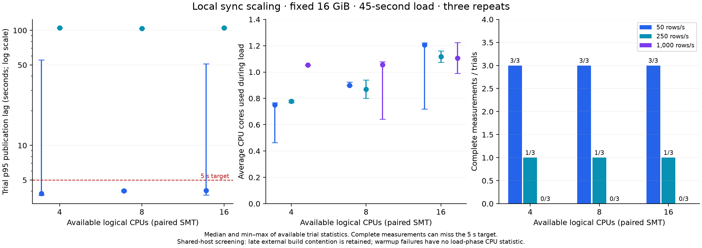
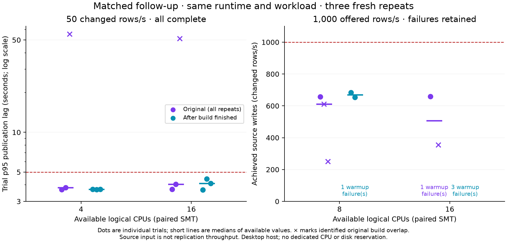

# Local synchronization CPU scaling

[Documentation home](../README.md) · [SY08 release evidence](sy08-installed-sync.md)

## Question and scope

How much does the current PostgreSQL → analytical publication pipeline benefit
from more CPU cores on the same machine? Measure that baseline before changing
worker concurrency, batching, or resource budgets. Source write rate is an offered
load, not proof of replication capacity. The existing 50 changed rows/s test and
five-second p95 gate do not establish a maximum throughput or fixed lag.

This is a local screening experiment on a shared development machine. It does not
establish an EC2 instance recommendation, a product SLA, or installed release
qualification. The runtime is held constant throughout the matrix.

The subsequent [workflow profile](sync-workflow-profile.md) repeats the same
twelve matched profiles with opt-in instrumentation and six activation controls.
It confirms roughly 30 ms durable capture commits with four native sync calls,
identifies `SQLITE_BUSY` in four failed spool metadata reads, and measures repeated
directory scans dominating apply planning. All six 50-row/s profiles pass; all six
overload profiles fail (four resync, two drain timeouts). The separate
[profile archive](sync-performance-evidence/2026-09-24-workflow-profile/README.md)
preserves every final-series trial and earlier collector-development attempts.

## Original matrix — 2026-09-24 UTC

The 27-trial screening matrix found no useful scaling of this small-table sync
workload from 4 to 8 to 16 logical CPUs. At 250 changed rows/s, each allocation
had one complete result at roughly 104–105 seconds p95 and two worker failures
requiring resynchronization. These nine trials preceded the external build
contention identified later in the experiment.

The full [evidence archive](sync-performance-evidence/2026-09-24-local/README.md)
contains every primary trial, raw counters, provenance, summary data, and the
earlier harness-development attempts. No slow or failed primary trial is omitted.

| Logical CPUs / physical cores | 50 rows/s: median trial p95 (range), seconds | 50 rows/s: met 5 s p95 | 250 rows/s: completed / 3; completed trial p95 | 1,000 offered rows/s: completed / 3 |
| --- | --- | --- | --- | --- |
| 4 / 2 | 3.819 (3.686–55.434) | 2 / 3 | 1 / 3; 105.264 s | 0 / 3 |
| 8 / 4 | 4.037 (3.954–4.102) | 3 / 3 | 1 / 3; 103.657 s | 0 / 3 |
| 16 / 8 | 4.053 (3.711–51.284) | 2 / 3 | 1 / 3; 105.101 s | 0 / 3 |

These are medians/ranges of trial p95s, not pooled transaction percentiles. At
250 rows/s the listed latency is the sole complete trial for that allocation;
it is not a latency claim for the two failed repeats. Every complete result
passed the full two-table comparison against frozen PostgreSQL.

Across all 27 trials, 12 completed measurement and final data verification.
Fifteen failed: nine reported `incremental_batch_failed_requires_resync`, and six
did not publish all measured transactions within the 120-second drain limit.
Read-only inspection of their stopped spools independently confirmed uncaptured
source commits in all six timeout cases; see the
[drain evidence](sync-performance-evidence/2026-09-24-local/drain-timeout-evidence.json).
All 27 passed owned-process cleanup, with zero leaked or remaining descendants.
Seven trials met both the offered input rate and five-second p95 target.

At 50 rows/s, the seven trials before the identified contention had p95s between
3.686 and 4.102 seconds across the three CPU allocations. The two later repeats
on 4 and 16 CPUs had 55.434 and 51.284 seconds p95. A separate mutation-test
build had started on the shared host; host I/O wait and stalls rose, and active
compiler writes were observed. Trials 23–27 are flagged in the
[CSV](sync-performance-evidence/2026-09-24-local/trials.csv) because their observed
windows overlapped that build. The flags identify possible interference; they do
not quantify its causal contribution. The affected runs remain in every full
matrix statistic. A quiet-host repeat is tracked in
[#90](https://github.com/supabricks/platform/issues/90).

The three complete 250-row/s trials accepted 249.989–250.011 changed rows/s while
using an average of 0.767, 0.800, and 1.075 CPU cores for the 4/8/16 allocations.
In the 4-CPU trial, capture-observed p95 was 99.361 seconds and durable
commit-acknowledgment-to-admission p95 was 101.926 seconds. Worker-start-to-prepared
p95 was 3.773 seconds and prepared-to-publication p95 was 0.649 seconds. This
locates most of the delay before apply admission; it does not by itself prove
which capture operation or shared resource is responsible. The matched follow-up
below repeats the four configurations affected by the later build; it does not
replace or pool these original results.

The 1,000-row/s setting is an overload probe, **not a demonstrated 1,000-row/s
input**. Four clients achieved only 251.084–659.540 rows/s in the six trials that
reached measurement; the other three failed during warmup. Even the five-second
source-only baselines varied from 139.419 to 894.300 rows/s. This does not establish
maximum PostgreSQL throughput or an analytical capacity number. Source-client
capacity and quiet-host isolation must be established before a sustained
1,000-row/s end-to-end claim.

The tested package was a private diagnostic installation with a locally rebuilt
platform binary from `a8fd376536d3d6c5198df0badb6ee13cfaa6702f`. Its binary hash is
`a521c26a3c12c559e3b2cdce8cc946b631378772f52cd61bec332ddeb85abff9`, and package manifest
hash is `78928698010df68ad72717b042728148abcb48a01774890ff3efdd6af3d9bb48`.
This is not new qualification of a signed alpha.36 archive. Capture throughput
and worker failure diagnosis take priority before using larger machines or
adding table/project concurrency as a performance remedy.

A supplemental rerun added exception-only logging to a private package copy. It
ran during ongoing host contention, accepted 217.054 rows/s at a 250-row/s target,
and hit the drain timeout without emitting an incremental exception. It therefore
did not establish the worker failure's cause. Its instrumentation and outcome
are retained in the evidence archive and excluded from the primary matrix.

## Matched follow-up after the build finished

The [follow-up evidence](sync-performance-evidence/2026-09-24-quiet-followup/README.md)
adds three fresh repeats of each affected configuration. The same package,
CPU affinity, fixed 16 GiB memory limit, four clients, 45-second workload, and
correctness/cleanup gates were used. The original 27 trials remain unchanged.

| Logical CPUs | Offered rows/s | Complete / trials | Fresh trial p95, median (range) | Failure outcome |
| --- | --- | --- | --- | --- |
| 4 | 50 | 3 / 3 | 3.696 s (3.677–3.698) | None |
| 16 | 50 | 3 / 3 | 4.097 s (3.660–4.438) | None |
| 8 | 1,000 | 0 / 3 | No complete latency sample | Two worker failures after measurement; one during warmup |
| 16 | 1,000 | 0 / 3 | No complete latency sample | Three worker failures during warmup |

All six low-load trials met the offered rate and five-second p95 target and
passed full-table equality. The earlier 51–55-second spikes did not recur. This
supports the interpretation that the original low-load outliers were sensitive
to host interference; it does not isolate the build's exact causal contribution.
More available CPUs did not reduce low-load latency in these repeats.

All six overload attempts reported `incremental_batch_failed_requires_resync`;
stopped-fixture inspection confirmed `incremental_worker_failed` in each case.
Only two reached measurement, both on 8 CPUs: they accepted 654.211 and 683.303
changed rows/s while using 1.154 and 0.922 average CPU cores respectively. Their
failed publications provide no valid complete lag percentile or replication
throughput claim. The six five-second source-only baselines achieved
863.707–888.173 rows/s, still below the offered 1,000. All 12 trials had clean
owned-process teardown. The failure remains reproducible without observed
external build activity and is tracked in [#88](https://github.com/supabricks/platform/issues/88).

The original mutation-test process finished naturally. A monitor sampled build
processes and whole-host counters every five seconds. The low-load matrix ran
after a 60-second quiet interval, with no active build samples during its entire
setup-to-cleanup window. New compiler jobs then overlapped an initial overload
attempt: that failed result and the next interrupted attempt are retained
separately, excluded from the quiet comparison for interference, not outcome.
The restart rule was strengthened to five quiet minutes before each overload
trial and repeating any overlapping attempt regardless of its result. All six
subsequent trials met this rule without further retries.

[Host validation](sync-performance-evidence/2026-09-24-quiet-followup/host-validation.json)
records the intervals and sample counts. An unrelated idle Cargo/test pair
remained present with unchanged CPU and I/O counters. Desktop applications and
the user's stack remained running; no unrelated work was stopped. Thus “quiet”
means no active external builds were observed, not exclusive CPU/disk ownership.
Five-second sampling can miss very short jobs. Whole-host I/O wait was still
5.647–5.889% during low-load measurements and 12.389–12.601% in the two measured
overload attempts; absence of external builds does not make the pipeline's own
storage work free.

The follow-up used harness revision `f3dacfe4ecf3192eb84e28a2503337c7a5467800`.
Compared with the original trial code, this adds a post-stop proof check for
ambiguous drain timeouts; workload generation and runtime behavior are unchanged.
No uncontended follow-up hit that timeout path. These short local repeats settle
the affected-profile rerun, not maximum capacity or cloud sizing. Capture
throughput/source-client capacity ([#87](https://github.com/supabricks/platform/issues/87))
and the worker failure remain the next work.

### Second matched run — 14:58–15:20 UTC

A [second 12-trial run](sync-performance-evidence/2026-09-24-repeat-02/README.md)
repeated the same configurations and within-load order with the same runtime and
trial code. Every trial followed five minutes without active build observations;
none overlapped observed build activity or needed replacement. The two follow-ups
remain separate from each other and from the original matrix.

| Logical CPUs | Offered rows/s | Complete / trials | Second-run p95, median (range) | Failure outcome |
| --- | --- | --- | --- | --- |
| 4 | 50 | 3 / 3 | 3.915 s (3.560–4.061) | None |
| 16 | 50 | 3 / 3 | 3.773 s (3.636–4.688) | None |
| 8 | 1,000 | 0 / 3 | No complete latency sample | Two resync failures; one drain timeout |
| 16 | 1,000 | 0 / 3 | No complete latency sample | Three resync failures |

All six low-load trials again met offered rate and five-second p95, passed
full-table equality, and had clean teardown. The small difference between CPU
allocations changed direction between runs; these short samples do not establish
a consistent latency improvement from adding cores.

The overload failures recurred, with different timing: one resync failure was
detected during warmup, four during drain, and one trial reached the 120-second
drain timeout. Its stopped capture spool confirmed at least **8,424 uncaptured
source transactions**, ruling out missing observer history as the sole cause.
The five trials that reached measurement accepted 652.824–815.576 changed rows/s;
the six source-only baselines achieved 858.852–885.843 rows/s. Source rates and
CPU usage in failed trials are not successful replication throughput or scaling
measurements; worker failure can reduce the active replication work during load.
All 12 trials passed owned-process cleanup. The five resync failures each retained
`incremental_worker_failed`, still without a confirmed underlying cause.

Exact identities, all raw reports, host observations, failure codes and timeout
proof are in the new archive. Harness revision was
`e049ec29ff5ec61af43bfb3d18e966625dcb8962`; every harness Python file had the same
hash as the first matched follow-up. The same shared-desktop and short-window
limits apply. Issues [#87](https://github.com/supabricks/platform/issues/87) and
[#88](https://github.com/supabricks/platform/issues/88) remain unresolved.

## Method

The [reproducible harness](../../e2e/native/performance/README.md) runs sequential,
randomized, disposable trials with three repeats per load/configuration pair.

| Variable | Configuration |
| --- | --- |
| Host | AMD Ryzen 7 7800X3D, 8 physical cores, 16 logical CPUs, approximately 62 GiB RAM |
| CPU profiles | 4, 8, 16 logical CPUs; respectively 2, 4, 8 complete SMT sibling pairs |
| Affinity | `0,1,8,9`; `0,1,2,3,8,9,10,11`; all 16 logical CPUs |
| Memory | 16 GiB for each entire trial container; container swap disabled |
| CPU quota | None; CPU affinity alone restricts execution |
| Storage | Fresh directories on the same local NVMe ext4 filesystem |
| Data | Two tables, each with 10,000 integer primary keys and integer values |
| Source workload | Four independent clients; each transaction updates one row in both tables |
| Offered loads | 50, 250, 1,000 changed rows/s (25, 125, 500 transactions/s) |
| Trial phases | Five-second source baseline without sync, reset values, bootstrap, five-second warmup, 45-second measurement, bounded drain, final data comparison |
| Sync configuration | Unchanged default continuous policy: 500 ms batch interval, 5,000 ms freshness target, production apply/retention budgets |
| Repetitions | Three per pair, randomized with seed `20260923` |
| Isolation | One stack per container; package/repository read-only; no external network |

Clients own disjoint keys, avoiding same-row source lock contention. Offered work
is paced against a shared clock. Work not submitted before the measurement window
ends is counted as unsent; completed transactions, achieved rate, source latency,
and submission lateness are retained. Compare the source-only baseline before
attributing a missed input rate to synchronization. Five seconds is only a short
source baseline, not a separate saturation test.

The policy must report healthy after bootstrap and again after warmup before the
measured phase starts. This can add a catch-up gap after warmup. A failure during
warmup is retained as a runtime failure with no measured-phase latency or CPU
claim. Only transactions from the measured phase enter the lag distribution.

For every committed transaction, the observer maps its PostgreSQL transaction ID
to its durable capture end LSN, then to the first atomic analytical publication
covering that LSN. End-to-end lag is publication time minus client-observed COMMIT
acknowledgment time. Both clocks are on the same host. This excludes time between
server commit and client acknowledgment; it does not measure a subsequent Sail
query or query startup. Source request latency is reported separately.

Stage distributions cover acknowledgment → batch admission → worker start →
prepared descriptor → atomic publication. They are weighted by measured source
transactions, not equally by batch. Their individual percentiles cannot be added
to reconstruct an end-to-end percentile. Capture observation is an upper bound
with a nominal 100 ms polling interval and additional SQLite busy retries.
Published timestamps come from the durable publication record, not poll time.

After writes stop, all measured transactions must publish within 120 seconds and
both full analytical tables must equal the frozen PostgreSQL source. Missing
transaction markers invalidate the measurement. Runtime policy failures and
drain timeouts remain failed trials; incomplete latency samples are never
presented as a complete p95. Successful attribution and correctness do not turn
a latency or offered-rate miss into a performance pass.

Resource evidence includes cgroup CPU seconds per elapsed second (average cores
used), quota throttling, memory, I/O counters, pressure counters, and sampled
capture backlog. CPU use includes the native stack and harness. Whole-host CPU
counters help identify interference. Cgroup memory includes page cache; it is
not equivalent to process RSS. Backlog samples may be stale between capture
status updates and do not substitute for transaction publication accounting.

## Limits

SMT threads are not physical cores. Affinity does not reserve these CPUs from
other host applications or reproduce EC2 scheduling, CPU frequency, memory
bandwidth, EBS, or network storage. Shared cache and filesystem page cache remain
enabled; repeated randomized trials reduce order bias but do not eliminate it.
No global caches are dropped and no unrelated services are stopped.
Affinity changes scheduling availability; it does not replace the host's exposed
CPU topology. Libraries that size pools from host CPU count can therefore behave
differently from a VM with fewer enumerated CPUs. Application thread settings are
held unchanged in this experiment.

These narrow-row updates over a small data set do not cover wide rows, large
tables, inserts/deletes, many tables, many projects, long transactions, analytical
query interference, recovery, or long-running retention/compaction. Forty-five
seconds is a screening window, not a steady-state soak. Three trials give a
range, not a strong statistical confidence interval. A summary of trial p95s
must be labeled as such; it is not a pooled transaction p95.

## Follow-up sequence

Tracked findings: [capture throughput and CPU scaling
(#87)](https://github.com/supabricks/platform/issues/87), and [incremental worker
failures requiring resync (#88)](https://github.com/supabricks/platform/issues/88).
The [quiet-host validation follow-up (#90)](https://github.com/supabricks/platform/issues/90)
records the completed matched local repeats and their isolation limits. The
archived matrices establish a baseline and failure cases; the performance and
worker issues are not resolved by adding a benchmark.

The current implementation has several distinct serial boundaries:

- [`Spool.append`](../../python/analytics/capture/spool.py) durably commits each
  captured source transaction using SQLite's rollback journal and `synchronous=FULL`.
  [`capture_worker.py`](../../python/analytics/capture_worker.py) acknowledges only
  that durable cursor. Any group-commit experiment must preserve complete source
  transactions, replay checks, contiguous cursors, disk budgets, and crash-safe
  acknowledgment; turning off durability is not an optimization candidate.
- [Incremental admission](../../crates/local/src/store/incremental.rs) allows one
  active writer per installation. Independent projects therefore cannot assume
  concurrent apply merely because more CPUs are available.
- [`incremental_worker.py`](../../python/analytics/incremental_worker.py) applies
  tables sequentially before preparing a single group descriptor. Parallel table
  work must remain bounded and publish only after every table succeeds.

These code boundaries suggest experiments; measurements determine their order.

1. Preserve the current implementation's complete baseline, including overload
   and failure cases. Identify the limiting stage and whether source generation,
   capture, publication, or apply fails to keep up.
2. Address the demonstrated bottleneck. Evaluate bounded batching and worker
   reuse where setup or durable I/O dominates; evaluate bounded table parallelism
   where apply is CPU-bound. Avoid increasing all thread pools indiscriminately.
   Use capture-only and observer-disabled controls to separate capture cost from
   shared I/O and measurement overhead.
   Diagnose generic `incremental_worker_failed` results with private, bounded
   instrumentation before assigning a cause. In particular, distinguish a busy
   spool reader from decoding, schema, storage, and apply failures. A capture
   group-commit experiment must retain FULL durability and acknowledge only after
   the entire bounded group commits.
3. Replace the installation-wide single-writer restriction only with explicit
   per-source/generation ownership, global resource admission, and fencing.
   Preserve ordered atomic publication across a transaction's tables.
4. Repeat the exact matrix with new binary/script identities and compare all
   repeats, including correctness, source impact, memory, and write amplification.
   Add multi-project and many-table workloads for concurrency changes.
5. Run longer saturation/soak trials, recovery and pinned-reader qualification,
   then verify actual cloud instance families before publishing sizing guidance.

The existing SY08 gates remain unchanged. Performance work does not waive
transaction atomicity, durable acknowledgment, authority, fencing, retained-reader
correctness, or bounded resource use.
