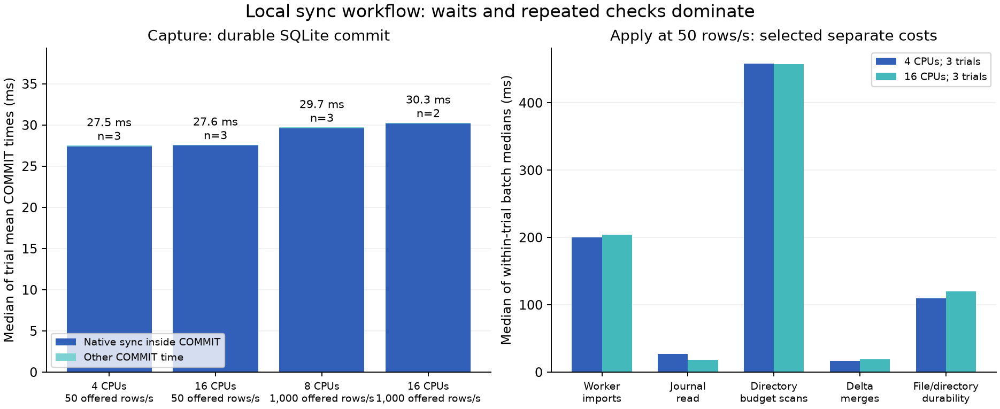

# Synchronization workflow profile

[Documentation home](../README.md) · [CPU scaling history](sync-core-scaling.md)

## Scope and result

This diagnostic experiment instruments the existing PostgreSQL → durable capture
→ incremental Delta application → atomic analytical publication workflow. It
repeats the same 12 trials as the two preceding matched experiments, after six
profiling activation controls. It measures readiness for analytical queries;
it does not benchmark subsequent Sail/Spark query execution or reverse sync.

All six 50-row/s trials passed; all six overload trials failed. Capture processed
about 29–30 transactions/s under load, spending almost all SQLite commit time in
native sync calls. Four overload trials exposed a three-second `SQLITE_BUSY`
metadata read; two exhausted drain time with proven capture backlogs. Repeated
directory scans dominate apply planning, and the four-client source-only baseline
also falls short of 1,000 changed rows/s. These findings prioritize durable capture
batching, safe reader-contention handling, and cheaper planning before more threads.

The experiment keeps the four source clients, two 10,000-row tables, two changed
rows per transaction, five-second baseline/warmup, 45-second measurement, and
120-second drain limit. CPU affinity uses complete SMT pairs: 4 logical CPUs / 2
physical cores, 8 / 4, or 16 / 8. Memory remains 16 GiB with no swap or CPU quota.
Each fixture starts fresh on the same local NVMe ext4 filesystem. Runtime
operations, SQLite FULL durability, acknowledgments, transaction boundaries,
publication authority, and correctness gates are unchanged.

## Measured results — 16:39:59–17:12:35 UTC

The final series includes all twelve requested trials plus six separate activation
controls. Each followed five quiet minutes; no accepted trial overlapped an
observed external build. All owned descendants stopped cleanly. The
[complete archive](sync-performance-evidence/2026-09-24-workflow-profile/README.md)
retains raw profiles, every attempt, safe exceptions, provenance, host validation,
and scripts that reproduce the summaries. Earlier collector-development outcomes
remain separately archived, including the `AccessDenied` attempt that halted the
initial series. The replacement series uses one unchanged collector/package.

| Logical CPUs | Offered changed rows/s | Complete / 3 | Median trial p95 (range), seconds |
| --- | --- | --- | --- |
| 4 | 50 | 3 / 3 | 4.031 (3.867–4.361) |
| 16 | 50 | 3 / 3 | 3.765 (3.676–4.945) |
| 8 | 1,000 | 0 / 3 | No complete latency result |
| 16 | 1,000 | 0 / 3 | No complete latency result |

A complete trial passed full two-table equality and publication attribution. All
six low-load trials met the input-rate and five-second p95 gates. Failed overload
trials are retained, with no latency assigned to incomplete replication:

| CPUs | Repeat | Offered rows/s | Source rows/s during measurement | Capture tx/s in sampled active load interval | Result / detection phase |
| --- | --- | --- | --- | --- | --- |
| 4 | 1 | 50 | 50.037 | 25.23 (46.0 s) | Complete |
| 4 | 2 | 50 | 50.037 | 25.21 (46.0 s) | Complete |
| 4 | 3 | 50 | 50.039 | 25.40 (45.0 s) | Complete |
| 16 | 1 | 50 | 50.039 | 25.31 (45.0 s) | Complete |
| 16 | 2 | 50 | 50.034 | 25.48 (45.0 s) | Complete |
| 16 | 3 | 50 | 50.035 | 25.23 (46.0 s) | Complete |
| 8 | 1 | 1,000 | 654.243 | 29.73 (45.0 s) | incremental_batch_failed_requires_resync / drain |
| 8 | 2 | 1,000 | 654.401 | 30.02 (45.0 s) | publication_drain_timeout / drain |
| 8 | 3 | 1,000 | 651.154 | 29.73 (45.0 s) | incremental_batch_failed_requires_resync / drain |
| 16 | 1 | 1,000 | 651.275 | 29.13 (45.0 s) | publication_drain_timeout / drain |
| 16 | 2 | 1,000 | 653.117 | 28.97 (45.0 s) | incremental_batch_failed_requires_resync / drain |
| 16 | 3 | 1,000 | No measured interval | No measured interval | incremental_batch_failed_requires_resync / warmup |

These are changed source rows/s and capture transactions/s, respectively. Capture
includes control/barrier transactions. A capture interval can end before the
45-second load interval when the worker is fenced after a failure. Source writes
can continue after replication stops; their rate is not replication capacity.

## Where time goes

At 50 rows/s, end-to-end latency also includes batching/admission and worker
startup/planning. Stage p95s below are medians and ranges of the three trial p95s,
not pooled transaction percentiles. They cannot be added; commit-to-admission and
commit-to-publication are cumulative. Capture observation is a polling upper bound.

| Boundary | 4 CPUs: median trial p95 (range), ms | 16 CPUs: median trial p95 (range), ms |
| --- | --- | --- |
| Commit acknowledgment → capture observed | 276.4 (274.2–276.6) | 298.8 (272.9–301.1) |
| Commit acknowledgment → batch admission | 2,298.5 (2,250.4–2,428.4) | 2,235.4 (2,182.7–2,865.7) |
| Admission → worker start | 118.0 (116.0–120.0) | 115.0 (114.0–116.0) |
| Worker start → prepared | 1,686.0 (1,354.0–1,698.0) | 1,230.0 (1,186.0–2,523.0) |
| Prepared → publication | 420.0 (414.0–439.0) | 428.0 (414.0–432.0) |
| Commit acknowledgment → publication | 4,031.4 (3,867.3–4,360.6) | 3,765.4 (3,676.4–4,944.7) |

### Durable capture is the primary throughput constraint

At 50 rows/s, each trial averaged **27.30–27.80 ms per
SQLite COMMIT**. Every measured commit issued **four native sync calls**, and
native sync accounted for **99.67–99.68%**
of commit elapsed time. The C probe measures SQLite's own calls, not only Python's
`os.fsync` wrapper. Decoder time across each sampled load window was
25.64–26.97 ms, versus tens of seconds spent committing.

[`Spool.append`](../../python/analytics/capture/spool.py) commits each complete
source transaction through a DELETE journal with `synchronous=FULL`; the capture
worker sends feedback only after that cursor is durable. At the low-load median
commit cost of 27.54 ms, commit work alone implies roughly
73 changed rows/s for this two-row transaction
shape, before decoding/status/checks. This is a derived local serial cost bound,
not a measured sustainable throughput guarantee. The 1,000-row/s goal needs 500
workload transactions/s, or about 2 ms per transaction on a serial path.

The overload load-window profiles show 28.97–30.02
captured transactions/s, 29.66–30.34 ms mean COMMIT time,
four sync calls per commit, and
99.66–99.68% of commit time in native sync.
Actual sampled durations are listed above. In intervals with capture present at
both OS sample boundaries, it used 0.024–0.025
CPU cores while waiting most of its wall time. More CPUs do not remove this serial
wait. Track the capture improvement in [#87](https://github.com/supabricks/platform/issues/87).
SQLite COMMIT occupied 88.2–89.5% of capture wall time in those five sampled
windows; decoding took only 28.5–30.4 ms over each roughly 45-second interval.

### Worker failure classification

Safe exception profiles identify **four OperationalError / SQLITE_BUSY** failures
in the spool metadata `SELECT` at `incremental/storage.py:87`. Each failed call
took approximately **3.002 seconds**. The stacks place these failures in the
read-only incremental journal path, before this batch's Delta merges.
The journal reader uses a three-second SQLite timeout;
the capture writer keeps committing to the same rollback-journal database. This
confirms transient reader lock contention for the observed failures, rather than
requiring an inference from the generic supervisor error. It does not establish
that every historical generic failure had the same cause. Safe exception stacks
and failed batch IDs are retained in `analysis.json`; private exception text is
excluded. Track classification/retry and recovery behavior in
[#88](https://github.com/supabricks/platform/issues/88).

The timeout outcome independently demonstrates unfinished capture even when
no worker exception stops the pipeline. After the 120-second drain and clean stop,
the spool sequence conservatively proves the following uncaptured source commits
(the sequence also includes control transactions):

| CPUs / repeat | Required source commits | Highest capture sequence | At least this many uncaptured commits |
| --- | --- | --- | --- |
| 16 / 1 | 16,186 | 7,717 | 8,469 |
| 8 / 2 | 16,299 | 7,772 | 8,527 |

Missing observer markers alone cannot explain that backlog.

### Apply planning repeatedly walks the generation directory

For successful apply workers starting during the low-load measurement windows,
trial median directory-budget-check time was
**401.66–485.25 ms per batch**, compared
with **16.56–19.44 ms for Delta
merges** and **199.11–207.16 ms in worker
imports**. Trial median `apply.run` times were
628.79–750.74 ms; they include planning and
must not be added to its child stages.

In the five overload trials reaching measurement, successful workers' trial
median directory checks grew to **1,044–1,214 ms**, versus **18.4–20.1 ms** for
Delta merges. This stage is a secondary constraint that will matter more as
capture throughput improves.

The median of early-third within-trial boundary medians was
202.40 ms, rising to
634.82 ms in the final third.
Delta merge changed from 17.42
to 18.59 ms on the same basis.
The planner invokes a whole-generation path/size/free-space check for every
Arrow scan batch; retained files make those repeated scans more costly as the
run progresses. This is a separate optimization target,
[#91](https://github.com/supabricks/platform/issues/91). Removing resource or path
checks is not an acceptable shortcut.

### Source generation has its own ceiling in this test

The overload source-only baselines reached **857.7–886.0
changed rows/s**, below the requested 1,000. Those baselines precede active capture,
so capture alone cannot explain the input shortfall. With four synchronous
clients, baseline SQL COMMIT p95 was
12.47–12.79 ms, and COMMIT accounted for
96.2–96.8% of measured SQL elapsed time.
Safekeeper flush mean time in those sampled baseline intervals was
3.31–3.41 ms. PostgreSQL wait samples and
storage histogram deltas are retained to separate WAL/storage waits from source
statement work. These are short baselines; a separate sustained source-capacity
experiment is still needed before claiming a 1,000-row/s input workload.
Across baseline-phase samples, 540 of 550 active-client observations were
`SyncRep`, `WalSync`, `WALWrite`, or `WalWrite` waits. This is a sampled observation
count, not a fraction of all elapsed time or a precise storage-latency breakdown.

### Publication and CPU

Whole-container mean CPU use was 0.773–0.793 cores in the 4-CPU low-load trials
and 1.160–1.238 in the 16-CPU low-load trials. The five measured overload windows
used 1.083–1.288 cores across 8/16-CPU allocations. These totals include the
measurement processes; the capture-worker figure above is a separate process
counter. This workload does not approach the available CPU capacity.

At low load, mean publication verification time ranged
12.30–13.74 ms per call, descriptor
writes 18.99–21.50 ms, and the
SQLite publication commit 10.46–11.19
ms. These are function costs, distinct from the scheduling delay represented by
prepared-to-publication latency. Raw daemon stage/self times and durable pipeline
timestamps remain available; publication work must not be confused with capture
commit cost or added across overlapping stages.

## Profiling activation controls

| Pair | Off: p95 lag, seconds | On: p95 lag, seconds | Off / on average CPU cores |
| --- | --- | --- | --- |
| 1 | 3.697 | 3.664 | 0.757 / 0.772 |
| 2 | 4.499 | 3.664 | 0.757 / 0.778 |
| 3 | 3.851 | 3.775 | 0.768 / 0.784 |

All six controls passed source equality and the five-second p95 gate. Median
trial p95 was 3.851 s off and
3.664 s on. Median average CPU use was
0.757 versus
0.778 cores. Three pairs do not
establish a precise overhead estimate or a latency improvement from profiling.
There were 0 explicitly recorded process-access sampling
omissions and 0 storage metric sample errors in the
final profiled attempts. Read the coverage limits below before interpreting zeros
or incomplete worker tails.
Across the fifteen profiled attempts, 19 of 703 worker/daemon streams lacked a
final snapshot, all from incremental workers. Supervisor termination can truncate
their final diagnostics. Batch-cost
summaries require a completed successful `apply.run` span; incomplete run spans
are excluded from those summaries, while every raw stream remains in the archive.

## What the probes cover

| Stage | Evidence |
| --- | --- |
| Source write | Exact client BEGIN, two-table UPDATE, XID lookup and COMMIT durations; 200 ms PostgreSQL wait samples; WAL counters |
| Native storage | Safekeeper/pageserver WAL/flush/write metrics sampled about once per second, with identifying labels removed |
| Capture | Socket wait/receive, decode, checks, append, statement classes, per-COMMIT native fsync/fdatasync count and time, feedback, pruning and status |
| Apply | Worker imports, journal reads, planning, budget scans, hashing, merge, filesystem durability, inventory and maintenance; batch IDs join durable records |
| Publication | Scheduling/dispatch, verification, file sync, descriptor write and SQLite authority commit; durable admission/start/prepared/published timestamps |
| Resources/failures | Owned-process CPU/RSS/I/O/context switches, whole-container accounting, fixed-label exception type/code/stack, clean teardown |

Daemon probes require the `sync-profile` Cargo feature. Python/native hooks exist
only in a separate diagnostic package. Both require the disposable fixture's
explicit profiling marker. The baseline installation is preserved byte for byte.
Run instructions are in the [benchmark README](../../e2e/native/performance/README.md).

## Interpretation and limits

- Each trial p95 covers every measured source transaction only after publication
  attribution and complete two-table equality. Failed trials have no complete
  latency percentile or successful replication throughput.
- Source rates are changed rows/s. Capture transaction rates include barriers;
  two workload rows per transaction does not make every captured transaction a
  two-row update. A 1,000-row/s target requires 500 workload transactions/s.
- Source timing is exact client elapsed time. PostgreSQL waits are samples of
  active client observations, not percentages of all time. WAL I/O timing is
  disabled in this runtime, so zero PG timing counters do not imply free I/O.
- Resource/storage phase samples follow the controller's phase labels. Warmup
  includes five seconds of writes followed by catch-up until healthy, and the
  baseline phase can include source reset/setup before the next label. Exact
  client SQL summaries cover only the corresponding load calls; phase samples
  must not be treated as identically bounded client timing intervals.
- Capture and daemon load metrics use cumulative snapshot differences, with
  actual window bounds retained. These approximate the 45-second measurement
  window at roughly one-second resolution. Apply summaries select successful
  completed run spans whose workers started during measurement; some finish in
  drain. Workers lacking final snapshots have explicitly incomplete tails.
- Spans are inclusive. Planning contains journal/budget work; SQLite COMMIT
  contains native sync time. Do not sum parent/child spans, stage percentiles,
  or overlapping process times. Native sync elapsed time includes OS scheduling
  and filesystem/device waits; it does not identify controller/firmware latency.
- OS sampling can miss short-lived workers. Process CPU deltas for workers present
  at both interval boundaries are lower bounds, not total stack CPU. The existing
  cgroup accounting remains the total-CPU source.
- Storage histograms aggregate original labels within each local service.
  Histograms give bucket bounds, not exact quantiles. Three repeats and a
  five-second source baseline are screening evidence, not a steady-state capacity
  guarantee or cloud-instance sizing result.
- The host monitor requires five minutes without active external builds before
  every trial and retains every attempt. It samples every five seconds and cannot
  exclude shorter jobs or other desktop activity. No exclusive-host claim applies.
- Profiling activation controls use the same diagnostic package; imported probe
  code and launcher checks exist in both arms. They estimate activation overhead
  at 50 rows/s, not every diagnostic-package cost or overload timing perturbation.

## Next experiments

The [SP00–SP12 implementation plan](../plans/sync-performance-implementation.md)
turns these findings into separate changes, with the same twelve trials and
fresh predecessor comparisons after every logical slice. It owns the proposed
sequence and targets; this report retains the original measured evidence.

1. Fix the confirmed capture constraint using bounded group commit while preserving
   FULL durability and only acknowledging the committed contiguous cursor. Bound
   group bytes/count/time, preserve transaction boundaries and replay validation,
   and test crashes before/after group commit and feedback. Do not disable fsync.
2. Handle confirmed transient reader contention at a bounded journal-read boundary before
   this batch’s Delta merges. Keep history/corruption/storage failures distinct and
   retain fencing when output state is uncertain.
3. Reduce repeated generation directory scans without removing disk/path/deadline
   checks; retain conservative reservations and explicit checks at mutation and
   publication boundaries. Measure cold and growing generations.
4. Establish sustained 1,000-row/s source capacity independently. Retain these four-
   client matched comparisons; use separately labeled client-count and source-only
   experiments to distinguish generator concurrency from storage commit capacity.
5. Rerun the identical instrumented matrix after each change, plus capture-only and
   observer-disabled controls. Follow with longer saturation, crash/replay,
   atomic multi-table and retained-reader tests. Explore worker reuse/table
   parallelism after the measured serial I/O and planning costs are addressed.

Instrumentation identifies work; it does not itself fix runtime performance or
qualify a release. Existing SY08 correctness and durability gates remain required.
