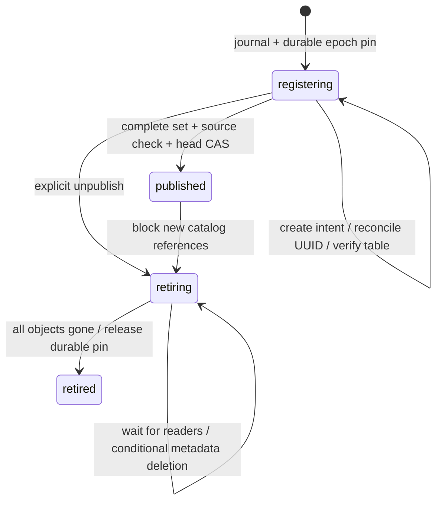

# UC03: durable complete-set catalog publication

UC03 publishes an existing verified A02 snapshot into the selected deployment's
managed local OSS Unity Catalog namespace. It does not export live PostgreSQL a
second time. A project explicitly requests preview, publish, status, resolve,
resume or unpublish through API v1, CLI, MCP or the authenticated console
transport. Browser Data controls remain UC06; Sail resolution remains UC04.

## Authority and identity

Control schema 15 adds a publication journal, logical branch heads, durable epoch
retention, and consumer reference records. Request keys are deployment-scoped;
replaying the same request returns the original publication even after restart.
A changed request under the same key is rejected. An epoch has one canonical UC
registration set per deployment. Retired epochs cannot be republished under a
new identity; create another frozen snapshot instead.

Preview verifies the immutable manifest and Delta schema checksum, checks source
ownership/revision and case collisions, and identifies snapshot time, table set,
location, destination namespace, current binding revision and retention effect.
It hashes the entire proposal. Publish compares that hash plus explicit source
and binding revisions before recording any intent. Namespace creation is the
existing explicit `catalog metadata ensure-namespace` operation.

Names are epoch-qualified provider aliases (`e_<epoch UUID>_<source OID>`).
Original PostgreSQL schema/table labels are preserved separately, including
quoted identifiers. The platform allocates each UC UUID before its remote write.
The pinned UC fork accepts `X-Supabricks-Table-Id` for EXTERNAL DELTA creation,
persists its reservation atomically, and retains a tombstone after deletion.
Reusing that UUID, including at another name, fails. UC properties establish no
ownership. Ordinary clients and authenticated authorization remain unchanged.

## Journal and commit

Each table advances through planned, creating, registered and verified. Intent is
committed before a worker calls UC. A lost receipt leaves the same preassigned
UUID; resume GETs the canonical alias and compares UUID, location, type and
columns before continuing. A different UUID is never adopted. A provider error
pauses the journal with a sanitized diagnostic; `resume` explicitly retries it.
Restart resumes unfinished intent and reverifies candidate objects. It does not
clear a previously recorded error or allocate substitute objects.

The final SQLite transaction commits the full verified set and advances its
logical branch head using the reviewed binding revision. A concurrent refresh
cannot overwrite a newer head. Candidate objects can be visible to independent
UC clients; Supabricks consumers see only the committed complete set. UC02
snapshot metadata includes UC UUIDs only after this commit. This does not issue
storage credentials or grant a reader lease; UC04 must revalidate the provider
and acquire references before installing session aliases.

## Retention and retirement

A durable reference is acquired with publication admission and never expires on
a clock. A02 GC excludes referenced epochs, including during outages and while
the daemon is stopped. Refresh retains older published revisions until explicit
unpublication. Existing snapshot leases, analytical sessions, and catalog consumer
references delay retirement. Consumer reference admission and unpublish use the
same writer; unpublish rejects new catalog references and clears the logical head
atomically when it points to that revision. Retiring a historical revision leaves
the newer head intact.

Cleanup operates only on the journal's bounded object list. It checks namespace,
UUID, schema and location, then uses a UUID-conditional DELETE in the UC database
transaction. Deleted aliases are tolerated; recreated or changed aliases pause
cleanup and preserve retention. No provider enumeration, cascade, file deletion,
or remote location is accepted from a caller. UC removes external metadata only;
after every object is retired and references drain, the platform releases its
pin. Existing A02 GC owns subsequent deletion of verified generation paths.

Before registration and final commit, locations are checked against the current
owned snapshot root. Symlinked or relocated components stop the journal; it never
publishes remembered absolute paths after a data-root move.

The provider-side UUID reservation table is additive UC metastore state and must
be backed up with that metastore. Cross-version UC upgrades and relocation of
registered paths remain UC07; this slice does not weaken the existing strict
installed-upgrade inventory checks.

## Bounds and qualification

One publication worker runs independently of the daemon writer, alongside UC02's
two metadata workers. Each step has a fixed request count, 750 ms individual UC
deadlines, 64 KiB response bounds and no transport retries. A publication contains
1–128 tables and at most 128 columns per table; response metadata fits within
2 MiB. At most 128 unretired publications are admitted per installation. Retire
unused revisions to free capacity. Recorded failures require explicit resume.
Shutdown waits for the worker and preserves the next durable journal step.

Only the pinned managed-local provider and existing immutable local Delta
version-zero generations qualify. External providers, copied cloud objects,
credential vending and governed multiuser isolation are unsupported. No live PG
object is altered. Release candidate alpha.29 uses local control schema 15;
existing roots require the established explicit backed-up upgrade.

Tests cover retained epochs across restart/GC, complete-set commit, concurrent
revision fences, reference drain, immutable schema tampering, lost create receipts,
UUID tombstones and conditional deletion after alias reuse. Installed native
qualification uses actual PostgreSQL, Delta and the source-built UC/JRE, including
a daemon SIGKILL during registration. Full archive qualification is separate.
