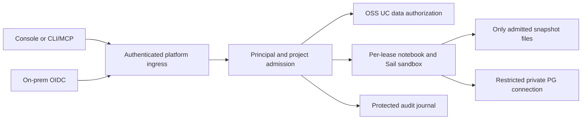

# UC09: governed on-prem scope

Status: implemented and qualified through UC09.8 in platform #74 / console #11–#12.
The Linux shared profile and both local-owner targets passed the complete alpha.35
archive matrix; see the [evidence and deployment limits](uc098-governed-release.md).
This document records the Linux-first scope and threat model established on
2026-09-21. Baseline: UC08 merged in platform #64 as `c44fab5`; its qualified
alpha.34 archives and original tested source remain recorded in the
[UC08 evidence](uc08-release-qualification.md). Execution sequence and acceptance
criteria are in the [UC09 implementation plan](../plans/uc09-governed-implementation.md).

## Product outcome

An administrator connects an on-prem identity provider and creates projects in
the console. Alice publishes a dataset from a project she can author. Bob can
find and query the datasets explicitly shared with him from SQL or a notebook;
he cannot inspect Alice's unshared data, credentials, files or processes. A
project editor does not automatically become a data reader. Revoking Bob's access
prevents new work and stops affected execution within a measured bound.

UC09 is the integration milestone for identity, project permissions, catalog
grants, PostgreSQL access, execution isolation and audit. Adding a login page or
UC grant controls alone does not complete it.

## First supported profile

First target: `governed-single-host-v1` on one Linux x86_64 server with
local disks, one installation realm and the existing project/deployment model.
Use the native platform services, one managed OSS UC instance, an operator-managed
on-prem OIDC provider, and isolated execution. No Kubernetes, hosted Databricks
service, external Internet dependency during ordinary use, or distributed cluster
is required. LAN access to the configured identity provider is expected.

Linux-first is the confirmed target; implementation and qualification are pending. macOS
and Linux retain the current `local-owner-files-v1` experience with no identity
provider or execution sandbox required. Shared macOS execution needs a separately
qualified VM/runtime boundary; it is not enabled by exposing the local console.

The first governed release supports the console and authenticated platform
CLI/MCP; SQL, Spark Connect and notebooks use platform-admitted sessions. Direct
external PostgreSQL, Spark or UC clients are not public endpoints in this profile.
Their private endpoints must be inaccessible to unrelated users and workloads.
Trusted server operators have administrative access. End users have no host login,
root privileges, container-runtime socket or access to platform service accounts.

The threat model includes hostile notebook Python, subprocesses and native
packages from an authenticated user, malicious input files/project archives,
stolen expired session credentials and attempts to reach another user's workers.
It excludes a malicious host administrator, compromised host kernel, physical
attacks and hardware side channels. Quotas limit resource exhaustion; this is
not a high-availability or hard real-time service guarantee.

## Request and execution boundary



The arrows into data services represent checked capabilities, not a shared admin
credential. A sandbox receives neither the platform control socket nor general
access to the UC or storage services.

## Evidence from the current implementation

These observations are from merged platform `c44fab5` and the pinned UC source,
not assumptions based on Databricks' hosted product.

| Boundary | Current implementation | Required governed change |
| --- | --- | --- |
| Console identity | [`console/server.rs`](../../crates/local/src/console/server.rs) consumes local launch tickets and issues session cookies | Real principals, authenticated ingress, session revocation and authorization on every API/stream |
| UC authentication | [`catalog/runtime.rs`](../../crates/local/src/catalog/runtime.rs) selects internal/local-owner authentication; [`catalog/config.rs`](../../crates/local/src/catalog/config.rs) supplies private provider credentials | Distinct user/service identities and least-privilege grants; privileged provisioning separated from user reads |
| UC principal lookup | Pinned [`AuthService.java`](https://github.com/supabricks/unitycatalog/blob/8e195426ce03e593b03c92f87051d7bf013aeee1/server/src/main/java/io/unitycatalog/server/service/AuthService.java) looks up email, falling back to subject, with an internal admin special case | Collision-safe mapping from stable platform IDs; never map arbitrary external email/subject to internal admin |
| Analytical reads | [`catalog/reads.rs`](../../crates/local/src/catalog/reads.rs) resolves a frozen revision; the worker reads local Delta files without UC credentials | Authorize the effective principal, expose only the admitted file set, and bind it to a revocable execution lease |
| Notebook execution | [`notebooks/runtime.rs`](../../crates/local/src/notebooks/runtime.rs) checks directories owned by the daemon's OS user | Separate execution boundary and private per-session filesystem/network/process space |
| PostgreSQL | [`engine/sql.rs`](../../crates/local/src/engine/sql.rs) provisions `supabricks_owner` and a frozen-export role with `pg_read_all_data` | Principal-scoped branch roles and authorization of full-branch export/clone operations; no inherited owner credential |
| Asset ownership | [`project_apply.rs`](../../crates/local/src/project_apply.rs), project bindings and catalog publication journals | Preserve project ownership while checking actor, effective principal and destination authorization |

UC already supplies user and privilege APIs; reuse them rather than implement a
second catalog permission system. Its external authentication and authorization
are distinct stages. The pinned fork's actual behavior, including group support
and metadata filtering, must be probed before choosing an adapter.
[UC authentication](https://docs.unitycatalog.io/server/auth/),
[UC privileges](https://docs.unitycatalog.io/server/users-privileges/).

## Components and ownership of state

| Concern | Proposed component / authority | Supabricks work |
| --- | --- | --- |
| Authentication | OIDC; Keycloak is the first on-prem qualification provider | Login/session adapter, provider configuration, stable identity mapping and disable/revocation handling |
| Project and execution permissions | Platform control database | Small explicit capability model and one authorization entry point; no general policy language in v1 |
| Catalog data grants | OSS UC | Principal mapping, checked delegation and journaled grant operations; provider IDs remain authoritative |
| Live PostgreSQL rights | PG17 roles and grants, provisioned from platform branch permissions | Restricted credentials, isolation, lifecycle and copied-branch reconciliation |
| Untrusted execution | OCI sandbox with gVisor as the first feasibility candidate | Admission, mounts, network policy, resource limits, leases and cleanup; runtime choice remains subject to the first probe |
| Data access | Existing immutable Delta epochs | Exact authorized snapshot file sets and revocable runtime mounts; no broad data-root mount |
| Audit | Platform append-only records protected from workload users | Stable event schema, retention/export, failure behavior and recovery continuity |

Keycloak documents authorization-code, device authorization, service-account and
key-discovery endpoints. It is the initial test provider, not a mandatory new
service on every laptop. Qualify a supported pinned deployment rather than use
its development mode for a shared server.
[OIDC endpoints](https://www.keycloak.org/securing-apps/oidc-layers),
[Keycloak deployment](https://www.keycloak.org/server/containers).

Evaluate gVisor through its OCI interface without a cluster. It restricts the
workload's host-kernel interface but does not decide what mounted data or network
services a workload may access; those restrictions remain platform obligations.
Native package compatibility and memory/startup costs are acceptance questions.
If it cannot run the pinned Python/Arrow/Sail stack within the agreed budget,
record a no-go and evaluate a VM boundary; never silently fall back to host
execution. [OCI integration](https://gvisor.dev/docs/user_guide/quick_start/oci/),
[gVisor security model](https://gvisor.dev/docs/architecture_guide/security/).

Any component included in the governed distribution needs reviewed source/build
pins, dependency/license inventory, immutable artifacts and an update path under
platform `components/`. OCI images alone do not replace source provenance. The
initial provider may remain operator-managed; the qualification fixture still
pins its version, image digest and configuration. Do not create additional forks
unless a concrete patch or source-build requirement needs one.

## Identity and authorization contract

One realm per installation initially. Persist platform UUIDs for users, service
principals and groups. An external user maps through `(issuer, subject)`; email,
name and group labels are display attributes. Disabled/recreated accounts must
not inherit access by reusing an email. Start with platform-managed group
membership; IdP group synchronization/SCIM is a follow-on with its own consistency
contract. OIDC defines issuer and subject as the stable identity pair, unlike
email. [OIDC claim stability](https://openid.net/specs/openid-connect-core-1_0.html#ClaimStability).

Every admitted action carries a server-derived context:

```text
actor_id + effective_principal_id + realm_id + project/deployment_id
+ asset/revision + action + policy_revision + execution_lease_id
```

Interactive work defaults to the actor. Executing as a service principal requires
both execution rights and an explicit `act_as` grant. Editing a notebook or
package must not silently run new code under another person's credentials.
Service-principal runs bind an approved package/code revision; changing that
revision requires renewed authorization by someone allowed to use the principal.
All resources, output artifacts and future job definitions retain project scope.

| Permission family | Initial granularity | Deliberately separate from |
| --- | --- | --- |
| Project control | View, edit, deploy, manage members on a deployment/project | Catalog or PostgreSQL data access |
| Execution | Start/stop own sessions; explicit service-principal use | Other users' sessions and data rights |
| Catalog data | Discover/read an explicitly granted publication/table set | Publishing, grant administration and live source PG access |
| PostgreSQL data | Explicit read/write/DDL administration on a branch | Project membership and other branches |
| Publication/sharing | Publish an authorized complete snapshot; manage grants on owned datasets | Implicit authority to share data merely because it can be read |
| Managed transfer | Export/import `.sbdata`, packages and derived publications | Routine read access or grant delegation |
| Administration | Identity/provider configuration and scoped permission management | Silent superuser identity for routine execution |

Project roles are conveniences over capabilities. A project administrator can
manage project membership but cannot thereby grant themselves another owner's
data or service-principal use. Bootstrap realm administration is trusted and
explicitly audited. Validate every list, detail, mutation, download, log and
WebSocket operation; the browser's hidden buttons are not enforcement.

Use authorization code with PKCE, exact redirect allowlists, state/nonce checks,
audience/issuer/algorithm validation and secure server-side browser sessions.
CLI uses device authorization or a loopback authorization-code flow; unattended
clients use scoped service identities. Do not put privileged tokens in URLs,
local storage, process arguments or package files. Use existing reviewed OIDC
libraries; do not implement cryptography. [OAuth security BCP](https://www.rfc-editor.org/rfc/rfc9700.html).

## UC and PostgreSQL authority

UC09.0 must prove non-admin identity mapping, list filtering and grant enforcement
on the pinned UC server. Prefer a private broker exchanging validated platform
identities for short-lived UC credentials with a collision-free internal subject;
if the existing email lookup cannot preserve that mapping, make a narrow fork
change and regression-test it. Browser/worker code never receives the metastore
admin token. User reads must be checked as the effective principal, not an admin
lookup followed by a client-side filter.

UC is authoritative for effective catalog grants. Platform group membership and
grant intents are administrative input, not a second independent source of data
permissions. Prefer native UC groups only if the pinned implementation qualifies.
Otherwise materialize group grants to stable UC user IDs through a durable journal,
track the origin of each managed grant, and block affected admissions during
incomplete revocation/reconciliation. Never revoke a grant still justified by
another group or explicit assignment. Catalog/provider outage or unknown grant
state denies new catalog access. Existing leases follow the expiry contract.

The first managed governed profile routes policy changes through Supabricks.
Privileged out-of-band UC edits are detected as drift and require reconciliation;
they must not create an unbounded stale allow cache. Publication grants apply to
immutable revisions through a documented stable dataset identity; schema changes
or new tables require a reviewed grant decision. No automatic grant inheritance
on drop/recreate, restore into another realm or a new publication incarnation.

Live PG and published Delta are distinct assets. V1 uses explicit whole-branch PG
permissions and table-set catalog read grants; it does not promise UC-managed
PG row/column policies. Per-principal branch credentials must be non-superuser,
non-owner for ordinary reads/writes, with no role creation, replication or
`BYPASSRLS`, and no unrestricted role inheritance. Privileged schema changes run
only under explicitly authorized DDL administration. PostgreSQL owners and
superusers have special policy behavior, so merely setting an RLS flag is not
sufficient. [PG17 role membership](https://www.postgresql.org/docs/17/role-membership.html),
[PG17 row security](https://www.postgresql.org/docs/17/ddl-rowsecurity.html).

The current frozen exporter reads the full authorized branch. Governed export,
publication and branching therefore require full-source branch/copy authority;
refuse row-filtered or partially authorized sources until a separate exporter is
qualified. Never export through `pg_read_all_data` on behalf of a user granted
only a subset of that source. Fresh clones/imports get destination credentials
and policy before any user endpoint starts; source roles/grants/secrets do not
become destination authority. `.sbproj` remains logical declarations; `.sbdata`
remains data, not an identity/grant transport.

## Runtime and storage boundary

The trusted control plane owns SQLite, UC/H2, engine control credentials, storage
and the launcher. End-user code runs in a separate sandbox per execution lease
(or a proven equivalent), never sharing a writable environment or process space
across principals. Jupyter servers, kernels, Sail sessions, ingestion parsers and package-build hooks
are included; wrapping only the kernel leaves other execution paths open.

Mount only the admitted source revision, a private writable workspace and the
exact authorized immutable Delta files at sandbox paths. Do not mount the host
home, full epoch store, UC state, PG files, control sockets, container socket or
another principal's caches. Canonicalize paths and reject escaping symlinks,
malicious archive entries and Delta references outside the admitted file set.
Initial read grants may expose every row/file in the granted table snapshot;
row/column filtering is outside this profile.

A sandbox can use its own Spark worker and explicitly authorized PG connection.
It cannot reach unrelated workers, PG listeners, UC admin endpoints or the control
socket. Network namespaces and gateway checks must enforce this for direct Python
sockets and subprocesses as well as supported clients. Default egress is denied;
package downloads are a separate approved preparation operation with a pinned
index/cache contract. No arbitrary registry access or shared writable wheel cache.
Apply CPU, memory, disk, process and execution-time limits and clean up the full
process tree after termination, crash or revocation.

Expose one authenticated, TLS-protected application ingress on the LAN. Keep
backend endpoints private and never reuse the local launch-ticket path remotely.
Qualify forwarded-header trust, WebSockets, uploads and TLS renewal with the chosen
on-prem ingress configuration. The host operator may supply TLS termination;
there is no hosted-console dependency.

Notebook outputs, query results, logs, cached data and spilled files are data too.
Private outputs require authorization on later retrieval; shared outputs need an
explicit authorized publication policy. Revocation removes access to platform-held
results, subject to that policy. A person who has legitimately received rows can
copy them into code or another file; managed export permissions cannot provide
DLP or recall bytes already delivered.

## Revocation, audit and recovery targets

Proposed release acceptance targets, to be measured and finalized in UC09.0:

- Platform disable/grant revocation blocks new admissions after its durable deny
  record; requests already admitted are covered by lease termination.
- Active affected kernels, Sail sessions, PG connections and result streams stop
  within 60 seconds of the acknowledged deny. Removal of mounted files alone is
  insufficient because processes may hold file descriptors or cached rows.
- Execution leases last at most 60 seconds without authoritative renewal. Loss
  of UC/policy/liveness checks prevents renewal; supervisor failure must not leave
  orphan execution running indefinitely.
- IdP account disable is a separate propagation boundary: target at most five
  minutes with the qualified provider's status/introspection mechanism. JWT expiry
  alone does not imply immediate disable; unsupported provider behavior is a no-go.
- Restore starts closed to users, reconciles current identity/grant state and
  rotates credentials before admitting work. An old backup cannot reactivate
  revoked grants or old sessions; cross-realm restore needs explicit remapping.

Audit identity/membership/grant changes, impersonation, admission, publication,
export, denied requests and termination using actor/effective IDs, project,
asset/revision, policy version and outcome. Write security-changing intent and its
audit record durably before reporting success; fail new privileged work if that
record cannot be written. User workloads cannot edit the audit store. Specify
retention, bounded storage/backpressure and an operator export path. Do not log
raw SQL, notebook contents, source rows, credentials or signed URLs. Host-root
resistance and an external tamper-resistant archive are separate capabilities.

## Scope boundaries and open decisions

In scope: one shared host, local managed storage, one OIDC issuer, users/service
principals, platform groups, project permissions, explicit data grants, isolated
notebooks/Sail, restricted PG, file ingestion and managed packaging, revocation,
audit, backup/restore and a complete console demonstration.

Deferred: multi-host/HA, shared macOS execution, arbitrary external UC/storage
providers, external PG/Spark clients, SCIM/automatic IdP group sync, policy DSLs,
row filters/column masks, writable analytical tables, managed volumes, CDC, full
lineage, scheduling/model management, hosted delivery and arbitrary Internet
execution. Unsupported modes must be rejected rather than treated as governed.

The first implementation slice must decide the UC identity/group adapter, prove
the isolation runtime with the current native stack, establish measured resource
budgets and finalize the revocation mechanism. If a required property cannot be
met, keep the governed profile disabled and revise the scope explicitly. Existing
local-owner use remains available throughout.
