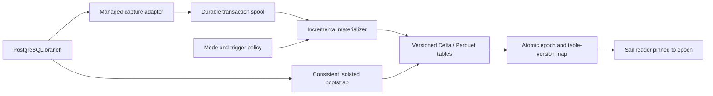

# Managed analytical synchronization — SY00–SY08

[Plan index](README.md) · [Delivery status](status.md) · [Stack overview](../stack.md)

Status: 2026-09-22. [SY00 capture probe](../architecture/sy00-capture-probe.md)
is complete with Linux/macOS qualification. [SY01 managed snapshot policies](../architecture/sy01-managed-snapshots.md)
are implemented; [SY02 durable capture](../architecture/sy02-durable-capture.md) is implemented; [SY03 incremental epochs](../architecture/sy03-incremental-epochs.md) is implemented; [SY04 local triggered sync](../architecture/sy04-triggered-sync.md) is merged. [SY05 bounded local continuous sync](../architecture/sy05-continuous-sync.md) is implemented for review. [SY06 shared controls and governed snapshot service authority](../architecture/sy06-sync-surfaces.md) are in progress; its local console/agent slice is implemented for review. Governed incremental storage, remaining SY06 qualification, SY07 and SY08 remain open.
The delivered baseline is A01–A03/C03 plus UC00–UC09, through alpha.35.
Direction agreed for this workstream: **PostgreSQL → analytical Delta/Parquet
storage → Sail first. Lakehouse → PostgreSQL serving follows separately.**

## Product decision

“No CDC OLTAP” means **no user-managed CDC/ETL pipeline**, not a prohibition on
internal change capture. Supabricks owns capture, checkpoints, materialization,
publication, scheduling, recovery and observability. Users select a freshness/cost
policy; they do not assemble Kafka, Debezium, cron scripts or destination replicas.
A continuous analytical representation is asynchronous but transactionally
consistent at a disclosed source boundary. It is not a synchronous distributed
transaction between PostgreSQL and the analytical engine.

The long-term requirements name Scintilla; the delivered engine is Sail. This
workstream uses Sail and must not wait for a new engine or custom WAL hooks.

### Competitive reference and direction

Databricks describes Snapshot as a full copy, Triggered as explicitly initiated
incremental updates, and Continuous as ongoing incremental synchronization.
Its **synced tables move Unity Catalog data into Lakebase Postgres**, the reverse
of this workstream. The mode vocabulary is useful; the product direction and
consistency contracts are not interchangeable. See the official
[Lakebase synced-table documentation](https://docs.databricks.com/aws/en/oltp/projects/sync-tables),
reviewed 2026-09-22. Its published latency/cost figures are not Supabricks targets.

### Three modes, one consistency contract

| Mode | User intent | Execution contract | Delivery state |
| --- | --- | --- | --- |
| Snapshot | Analyze a chosen point in time | One explicit full export and atomic publication; immutable until another requested refresh | Available through explicit refresh and SY01 managed manual/scheduled policies |
| Triggered | Catch up now, on a schedule or after a supported event | Bootstrap once, then consume committed changes through a fixed run boundary, publish, and stop applying | SY04 local incremental manual/scheduled runs implemented; event and governed incremental modes remain gated |
| Continuous | Keep analytics within a declared freshness budget | Bootstrap once, then repeatedly apply committed changes and publish bounded micro-batches | SY05 bounded local continuous mode implemented; governed incremental mode remains gated |

Separate `mode` (snapshot / triggered / continuous) from `strategy` (full /
incremental), `trigger` (manual / schedule / supported event), and run state.
A scheduled snapshot is still a full refresh. A continuous policy is not repeated
full export presented as streaming. Unsupported combinations must be rejected,
not silently downgraded. Snapshot remains supported after incremental modes ship.

## What we have and what must change

- [A01](../architecture/a01-frozen-exports.md) captures a source LSN, forks a hidden
  frozen branch and exports supported application tables within one read-only
  repeatable-read transaction. It isolates bulk export from the live primary.
- [A02](../architecture/a02-analytical-epochs.md) verifies a complete generation and
  commits one epoch/table map/current pointer in SQLite. Its paths, file inventory
  and immutable generations assume full exports, not a shared mutable Delta log.
- [A03](../architecture/a03-analytical-sessions.md) and
  [C03](../architecture/c03-analytical-workspace.md) pin readers to an epoch.
  Publishing does not retarget an existing SQL or notebook session.
- UC publication/binding pins complete version sets. A new local analytical epoch
  does not automatically refresh an existing shared catalog publication or grant.
- SY01–SY05 add durable policies/scheduling, complete-transaction spooling,
  versioned incremental epochs, fixed triggered cuts and bounded continuous
  supervision with observed lag. SY06 adds product surfaces and scoped snapshot
  service authority. These are source capabilities; installed-release sync
  qualification and governed incremental storage remain separate gates.

Do not rewrite historical A01–A03 acceptance as if it tested CDC. Preserve existing
manifests, sessions, publications and old releases during migration.

## Proposed architecture and correctness boundaries

### SY00 must prove the source contract

Start by evaluating PostgreSQL logical decoding on the **shipped PG17/Neon build**,
not assuming upstream features are available unchanged. Define a capture adapter
so a future storage/WAL interface can replace the implementation without changing
user mode semantics. Record required settings, restart/wake behavior, credentials,
slot/publication ownership, supported types and branch/failover limitations.

PostgreSQL documents slot replay after crashes, retained WAL/catalog resources,
and the snapshot handoff used to initialize a consumer. These are reasons to
prove duplicate handling and bounded retention, not claim exactly-once transport.
See [logical decoding concepts](https://www.postgresql.org/docs/17/logicaldecoding-explanation.html).
[Logical replication restrictions](https://www.postgresql.org/docs/17/logical-replication-restrictions.html)
also require a separate schema policy; row replication is not a DDL replication
contract. Revalidate behavior on the bundled engine.

The present frozen-branch flush LSN cannot simply be equated with an exported
logical snapshot or decoder cursor. Prove a gap-free handoff between the chosen
bootstrap and stream, including transactions open before bootstrap and committed
after it. Prefer a protocol that retains the current isolated bulk-read behavior.
If that cannot be proved, stop at the probe and record the architecture decision;
do not silently introduce a primary-table scan or a potentially lossy boundary.

### Identity, enrollment and atomic visibility

1. A sync policy owns one explicit consistency group in one project, source branch
   and database. Start with the existing complete supported application-table set.
   Table subsets and automatic enrollment need a later explicit contract; an
   unsupported/new table must not be silently omitted while claiming whole-group
   freshness. Local discovery may propose enrollment; governed enrollment requires
   source authority and never expands a service principal's scope implicitly.
2. A checkpoint identifies installation, deployment, project, tenant/timeline,
   branch incarnation, database, group revision and decoder generation. LSNs are
   comparable only inside that source lineage. Fork, restore and reattach create
   or validate identity; never inherit a parent's consumer position by assumption.
3. Bootstrap publishes one consistent initial epoch. Apply complete committed
   transactions after its proved boundary. Order by the qualified commit stream,
   not XID allocation, wall-clock timestamps or the largest LSN observed.
4. Buffer or spill in-flight/large transactions with limits. Uncommitted and aborted
   changes never reach readers. Prepared transactions require an explicit tested
   policy (initially block unsupported two-phase sources); no partial transaction
   may be published to satisfy a latency deadline.
5. Every epoch maps **all group members** to table versions at one source boundary.
   Unchanged tables reuse pinned versions. Stage per-table changes privately, then
   atomically publish the group manifest and published cursor. A Delta commit per
   table alone does not provide cross-table atomicity. No database-wide promise
   is made across groups, branches, databases or external tables.
6. Readers resolve the epoch map, never each table's independent latest version.
   SQL/notebook sessions remain pinned. A user can explicitly open the latest
   epoch; no query or session silently changes its inputs during execution.

### Durable capture and replay-safe application

Track distinct positions: source boundary observed, contiguous committed changes
captured durably, changes applied into staging, and changes published to readers.
The source may release WAL only after the acknowledged prefix is safely replayable
from durable local state. Partial writes and merely received messages do not
advance acknowledgment. The spool and its cursor need an atomic recovery protocol,
checksums, source identity and restrictive storage permissions.

Initial incremental support requires a qualified, non-null unique primary key.
Apply inserts, updates, deletes and key changes deterministically; cover TOAST and
unchanged-column representations. Missing keys, unsupported replica identity,
TRUNCATE, partitions, generated columns, DDL and unsupported types must either
have tested semantics or put the **whole group** into a visible blocked state.
Do not silently ignore events, approximate numeric values, or merge duplicate
source keys. Snapshot mode can retain its existing eligibility independently.

The probe must establish how schema and group-membership changes are detected and
ordered relative to row changes, including DDL that produces no row event. A
catalog poll after publication is insufficient proof of a consistent schema cut.
Use a qualified schema fence/change interface or block unqualified changes; do
not assume row logical decoding supplies a complete DDL history.

Commit identity plus source generation and table mapping makes replay idempotent.
A crash after a table write but before group publication must reconcile the staged
commit before retry. Publish the epoch and published cursor together so recovery
cannot skip unapplied changes or apply a transaction twice. “Exactly-once visible
effect” is an acceptance property, not a claim about message delivery.

### Storage, retention and compatibility

Reuse Delta/Parquet and the A02 publication principle, but version the descriptor
and verifier for incremental generations. Decide between immutable generation
manifests referencing retained data files and versioned table roots with enforced
reader version binding. Do not mutate an existing A02 generation in place or
relax its exact-file verifier to make a prototype pass.

The new format must preserve atomic group visibility, independent format-reader
conformance, permissions and restart verification. Maintain reference accounting
for data/log files shared across epochs. Compaction/vacuum may reclaim only data
unreferenced by sessions, notebook inputs, catalog publications/bindings, retained
history and recovery checkpoints. Avoid full table rewrites per small batch;
measure write amplification, file counts and compaction debt.

A local refresh and a UC catalog publication remain separate operations. Future
automatic catalog publication is opt-in, separately authorized and versioned; it
must not move consumers pinned to a previously reviewed dataset version.

## Mode and lifecycle behavior

### Triggered

A request records its idempotency key, policy revision and a fixed target source
boundary, then catches up to that boundary and stops applying. Concurrent writes
beyond the boundary belong to a later run. Requests can be polled after a lost
reply; browser closure neither cancels nor repeats admitted work. Reusing a key
with different parameters fails. Serialize writers per group; coalesce redundant
scheduled/event requests under a documented rule rather than spawning a backlog.

Offer manual Run now first, then a platform-owned schedule with explicit timezone,
next due time and a missed-run policy. After laptop sleep/offline time, admit at
most one catch-up run by default. Triggering does not depend on an open browser.
Event triggers require a durable supported event source and deduplication; they
are not arbitrary user SQL triggers on every OLTP row. Ship them only after their
producer/recovery contract is qualified.

Incremental triggered mode must retain changes between runs: either managed
capture continues into a bounded spool or the managed source retains them within
a bounded WAL budget. State the chosen strategy and resource cost. Stopping the
materializer does not imply zero storage or capture cost.

### Continuous

A supervised worker starts/resumes under policy, consumes the same transaction
spool and publishes bounded micro-batches. Configuration supplies a desired
freshness budget plus resource limits, not a guarantee that every commit becomes
visible immediately. Idle sources need observed heartbeat/boundary information;
old snapshot age alone does not establish lag.

Distinguish `initializing`, `catching_up`, `healthy`, `lagging`, `paused`, `blocked`
and `failed`. A stopped daemon, sleeping laptop, retained-history gap or blocked
schema cannot report healthy continuous sync. Continuous capture/apply can keep
compute awake; show that effect before enabling it. Support per-installation
admission and fair resource limits so a hot branch cannot starve OLTP or peers.

### Pause, cancel, resync and mode changes

- Pause stops new apply/publication after a safe boundary; disclose whether capture
  remains active and its retention budget. Cancel fences an admitted run and keeps
  the last complete epoch. Neither action means “discard the checkpoint.”
- Track WAL, spool, table files and total disk budgets. On pressure, bound capture
  and retention, preserve OLTP availability, mark the gap and require resync if
  history is lost. Never advance past missing changes and report success.
- Resync builds a new consistent baseline privately, then swaps the group pointer.
  Show its full-copy cost. Require explicit approval or a previously configured
  resync policy; retain the old published epoch while it is still authorized.
- Triggered ↔ continuous can reuse a checkpoint only for an unchanged qualified
  source/group/format. Snapshot → incremental needs a new proved bootstrap unless
  its exact boundary compatibility has been established. Mode changes use policy
  revisions and worker fencing; no concurrent writers.
- Delete stops/fences work and releases owned capture resources after references
  are reconciled. Source deletion/restore/branch expiry invalidates or blocks the
  policy. A portable project may carry declarative intent, never live slots,
  credentials, spool data or consumer cursors to an unrelated installation.

## Console, CLI/API/MCP and governance

Use the existing Data / Analytical snapshots surface for source selection,
mode, supported tables, eligibility and refresh settings; Activity shows runs and
history. Opening a page must not enable capture or create a schedule. “Enable
continuous” includes freshness, resource and compute-lifecycle consequences.

Expose mode, strategy, policy revision, state, last success, next run, source
observation time, captured/published boundary, lag observation time, backlog and
bytes, last error, recovery action and retained epoch. Unknown lag is explicit.
Distinguish data-as-of time from publication time and the active reader's epoch.
No phantom progress percentages or green freshness labels for old observations.
For new reader admission, design optional minimum-source-boundary / maximum-lag
constraints with a wait deadline and an explicit freshness-unavailable result.
A constraint must be checked against observed source identity and progress, not
only publication wall time. Never silently weaken it or retarget an already
pinned session; opening a newer session remains a deliberate action.

Human and agent surfaces share the same idempotent control contracts: create or
update policy, inspect eligibility/status, run, pause/resume, cancel, review resync,
and delete. Names below are conceptual, not existing CLI/API claims. Advertise
separate capability flags for managed snapshot scheduling, incremental triggered,
continuous, and event triggers; old consoles/runtimes degrade explicitly.

Governed mode separates permission to read the source, manage a sync policy,
execute internal capture/apply, read resulting epochs and publish/share them.
Use narrowly scoped service identity, not an expiring browser login. Logical
capture can expose more data than a SQL user's filtered view: admit only the
qualified whole-table authorization profile, never assume SQL RLS or column masks
are enforced on a replication feed. Unsupported policy combinations fail closed.
Fence workers and deny new reads when authority is revoked; invalidate relevant
cached capabilities and recover without granting access to stale protected data.
Audit admission, mode changes, runs, checkpoints, resync, grants and revocation
without logging row contents or secrets. Reuse UC09's isolation and audit model.

## Delivery slices and exit evidence

Each row is a separately reviewable slice. SY00 has a qualified probe implementation;
SY01–SY04 are implemented; SY05 is implemented for review; SY06 is **in progress**, with its local console/agent and governed snapshot slice implemented for review. SY07–SY08 remain **planned**. Implementation
must update the ledger and add an architecture/qualification record before a
capability is reported as delivered.

| Slice | Scope and dependencies | Acceptance gate |
| --- | --- | --- |
| SY00 — Capture and boundary probe | Exact PG17/Neon logical-decoding feasibility; isolated bootstrap handoff; identity/type/DDL matrix; storage-format decision; freshness/cost benchmark. No new engine dependency. | Concurrent long/aborted transactions and bootstrap reconciliation show no gaps; source restart/branch behavior recorded; pick supported profile, thresholds and performance envelope before SY02. |
| SY01 — Managed policies and snapshot scheduling | Durable group/policy/run model, idempotency, admission/fencing, manual and timed full refresh through A01–A03. SY00 defines interfaces. | Sleep/restart/missed runs, duplicate admission and cancellation preserve prior epochs; UI/API calls this managed **snapshot** refresh, not completed triggered incrementality. |
| SY02 — Durable capture | SY00 + SY01; managed source resources, spool, contiguous cursor/ack protocol, quotas and bootstrap. | Crash at every durable-write/ack boundary; replay, source identity change, history gap and pressure cannot lose acknowledged changes or fill disk without a bounded recovery response. |
| SY03 — Incremental epochs | SY02; row apply, key changes, schema guards, versioned descriptors, atomic group map, pinned readers and reference-aware retention. | Correct inserts/updates/deletes versus the source boundary; multi-table transaction atomicity; independent Delta reader; crash between table commits and epoch commit; no mutation of existing A02 snapshots. |
| SY04 — Triggered incremental mode | SY01–SY03; fixed-boundary catch-up, Run now and managed schedule. Qualify event triggers separately if a durable producer is ready. | Bounded run stops at its target while concurrent writes continue; replay/no-change runs and overlapping triggers are correct; demonstrate incremental I/O rather than full exports. |
| SY05 — Continuous mode | SY04; supervision, batching/backpressure, observed lag, pause/resume and compute lifecycle. | Sustained and burst loads meet SY00's declared envelope; source idle differs from outage; laptop sleep, worker death, long transaction and resync preserve correctness. |
| SY06 — Console, agent and governed integration | SY04/SY05 capabilities plus existing UC09; implement shared controls, inspectable operations, freshness and scoped service authority. | Local and governed user journeys, denied/revoked source access, no cross-project leakage, pinned SQL/notebooks and catalog bindings; old client/runtime capability fallback. |
| SY07 — Recovery and resource hardening | SY02–SY06; retention/compaction, schema changes, backup/restore, packaging, upgrades and source retirement. | Deterministic failpoints, ENOSPC, WAL loss, corrupt spool, source restore/fork, worker fencing and credential rotation; no unauthorized reads or deletion of pinned data. |
| SY08 — Installed release qualification | All previous slices; bundled/offline runtime, instructions, current component pins and regression matrix. | Exact archives on Linux x86_64/macOS arm64 local-owner and supported Linux governed profile; existing R04/UC09 gates plus incremental/continuous correctness and workload reports. |

SY01 is useful independently but does not satisfy SY04 or SY05. SY06 API/security
contracts must be designed alongside SY01; it is not permission to ship unsecured
incremental modes while waiting for a later UI slice. Local-only capabilities may
be gated separately until governed qualification passes.

### Requirements traceability

The product requirements amendment adds PRD-11/12 and SYNC-1–12, and clarifies
P5 and OLTAP-2/3/5. The public plan is self-contained; private RFC access is not
required to implement it.

| Requirement area | Owning slices |
| --- | --- |
| Three modes, managed operations and engine independence (P5, PRD-11/12, SYNC-1/7) | SY01, SY04–SY06 |
| Bootstrap, source identity and committed visibility (OLTAP-2/3, SYNC-2/3/4/6) | SY00, SY02, SY03 |
| Freshness constraints and observed state (OLTAP-5, SYNC-9) | SY00, SY04–SY06 |
| Budgets, pinned readers, retention and portability (SYNC-5/8/12) | SY02, SY03, SY05, SY07 |
| Governed background execution and revocation (SYNC-10) | SY01 interface design, SY06 integration, SY07 failure qualification |
| Measured operating envelope and installed evidence (SYNC-11) | SY00 thresholds, SY05 measurements, SY08 release gate |

## Required qualification matrix

- Bootstrap with writes in flight; transaction start before boundary/commit after;
  abort, large/spilled transaction, multi-table update, primary-key change, empty
  table, delete-all and explicitly supported/rejected TRUNCATE/DDL/type cases.
- Kill before/after spool durability, source acknowledgment, per-table commit,
  epoch-pointer update and cleanup. Repeat requests and restart repeatedly; compare
  source state at the declared boundary, not against a changing live table.
- Two concurrent readers retain old/new coherent epochs. GC and compaction cannot
  invalidate SQL, notebook, catalog or recovery references; independent readers
  honor explicit versions and recover from a clean process restart.
- Mode/schedule revision, overlap, timezone/DST, missed runs, offline operation,
  pause duration beyond retention, source downtime and unavailable history.
- Authority revoked during capture/apply and during use of a published epoch;
  project isolation, service identity rotation, audit correlation and redaction.
- Report commit-to-publication p50/p95/p99, observed lag, catch-up throughput,
  CPU/RSS, WAL/spool/disk maxima, write amplification and OLTP throughput/latency
  impact. Publish table count/size, change rate, transaction size, hardware and
  batch settings. SY00 fixes pass/fail thresholds for an initial supported
  envelope; a best-case demo is not a product SLO. Public performance promises
  wait for SY08 evidence.

## Deferred reverse direction and decisions still open

Lakehouse → PostgreSQL serving is a later separately scoped workstream, not a
checkbox on this materializer. It needs source Delta/Iceberg version/change-feed
support, key/type mapping, read-only managed serving destinations, atomic refresh,
ownership and write rejection, authorization, retention-gap handling, and
independent performance/qualification. No dual-writer or automatic round-trip
replication is promised. Reuse policy/run vocabulary only where semantics match.

SY00 must decide the exact capture/bootstrap protocol, supported schema/identity
matrix, incremental storage layout and resource/freshness thresholds. SY01 chooses UTC elapsed intervals with coalesced missed runs and no logical
capture between full snapshot runs; see its architecture record. SY04 must name
any supported event producer. None of these open engineering decisions relaxes
the correctness, authority or no-user-managed-pipeline requirements above.
