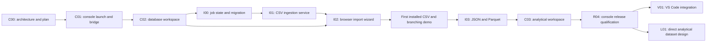

# Console and ingestion implementation plan

*Status: Proposed PR sequence · Date: 2026-09-08*

Implement in `supabricks/platform`, starting from
`main@278926b857673b4f7be0a6b86dde300318fbe4b1` (R03 merged). The
[architecture document](../architecture/local-console-ingestion.md) owns product
behavior, browser boundaries, type mapping, commit reconciliation and recovery.
This plan owns implementation order and evidence required to finish each slice.
IDs are planning identifiers, not existing issues or completion claims.

**Update, 2026-09-09:** C01, C02 and I00-I02 are implemented; I02 merged in PR #23
at `d18aae7`. The first installed CSV/branching demo is complete. The requested
[notebook phase](notebook-implementation.md) now follows that milestone and can
use A03 without waiting for I03 or C03. The sequence below records the original
console/ingestion order; N00-N05 adds an intervening notebook phase. I03, C03 and
R04 remain open, and R04 must include notebook regression evidence if notebooks
ship in its combined release.

Implementation: [C01 console contract and qualification](../architecture/c01-console.md)
and [console runbook](../handbook/local-console.md). C01 supplies launch and the
read-only overview. [C02](../architecture/c02-workspace.md) supplies the PostgreSQL
workspace. [I00](../architecture/i00-ingestion.md) supplies durable ingestion
contracts and the explicit catalog migration. [I01](../architecture/i01-ingestion.md)
implements CSV ingestion; [I02](../architecture/i02-console-ingestion.md) adds the
browser import wizard and installed demo.

The first milestone is a real installed browser demo: **import CSV -> query ->
branch -> mutate the branch -> verify the unchanged parent**. JSON/Parquet and
analytical queries extend that workflow. A VS Code extension and direct
analytical ingestion follow the browser release.

## 1. Scope and repository map

| Component | Repository and proposed location | Responsibility |
| --- | --- | --- |
| Console UI | `platform/console/` | React/TypeScript frontend, domain client, browser tests and locked build |
| Local bridge | `platform/crates/local/src/console/` | Loopback server, browser sessions, API adaptation, uploads and asset serving |
| Import service | `platform/crates/local/src/ingest/`, `src/store/ingest.rs` | Job state, staging references, quotas, reconciliation and lifecycle integration |
| Import worker | `platform/python/ingest/` | Bounded readers, schema mappings, PostgreSQL COPY and receipt protocol; use the existing private Python runtime |
| Shared adapters | Existing `platform/crates/local/src/{api,cli,mcp,client}.rs` | Versioned ingestion actions, CLI/MCP parity and capability discovery |
| Migration/recovery | Existing local store migrations, `upgrade.rs`, `recovery.rs` | Explicit catalog transition and backup compatibility |
| Release | `platform/install/native/`, `components/`, native workflows | Bundle UI/workers, dependency provenance, exact-archive tests |
| Demo/qualification | `platform/examples/console/`, `e2e/native/` | Synthetic fixtures, walkthrough and real browser/runtime tests |
| Extension, later | `platform/extensions/vscode/` | Workspace/branch UI and shared-console adapter |
| Direct analytical ingestion, later | Platform ingestion and analytical modules | Managed dataset catalog and publication |
| Engine sources | `supabricks/neon`, `supabricks/postgres` | Existing qualified PG17 engine; no planned source change in this phase |

These paths are proposals; existing local modules are mostly flat files. Avoid
renaming unrelated code just to match the table. Keep the Kubernetes `ui/`, its
operator transport and required CI behavior intact. PR #1's proposed removal of
that UI is independent of the new `console/` tree. The public website remains a
separate deliverable. No new repository, Sail fork or engine replacement is needed.

## 2. Dependency order and milestones

The arrows define the recommended small-team sequence. Do not start a second
engine, connector framework or notebook subsystem while the first demo remains
incomplete. Split a slice if its review cannot isolate the frontend, transaction
or upgrade behavior. Do not assign calendar dates before C01 and I01 establish
packaging, query and parsing costs.

| Milestone | Required slices | Evidence |
| --- | --- | --- |
| Browse and query | C01-C02 | Installed console against a real project, branch controls and PostgreSQL results |
| First user-data demo | I00-I02 | File picker -> mapped CSV -> exact committed table -> branch isolation |
| Complete initial formats and analytics | I03, C03 | JSON/JSONL/Parquet import plus explicit snapshot workflow |
| Console preview release | R04 | Exact offline archives on both targets, browser/recovery/upgrade evidence and runbook |
| Editor and analytical expansion | V01, L01 | Separate follow-on deliverables; not blockers for the browser preview |

## 3. Implementation slices

### C00 — Record architecture and implementation boundaries

**Deliverable:** this plan, the architecture document and links from existing
runtime planning and handbook entry points. Record the actual R03 baseline, the
legacy UI boundary, PostgreSQL-first import and the future analytical destination.

**Exit:** a contributor can identify the first PR, source ownership, intended
behavior and unimplemented release gates without access to private RFCs.

### C01 — Launch a packaged local console

**Depends on:** C00. **Touch:** `console/`, `crates/local/src/console/`, CLI,
daemon child ownership and native assembly/installation inventory.

- Add `console [--project PATH] [--no-open]`, project binding, runtime readiness
  handling and OS browser launch. Reuse `up`; show its failures instead of hiding
  them behind a blank page. Start with one bound project per launch.
- Add a daemon-owned loopback bridge with single-use launch credentials, session
  revocation, exact Host/Origin validation, CSRF protection and a restrictive CSP.
  Bridge requests use the existing socket client, never a second SQLite writer.
- Add a locked React/TypeScript build, shared request/result types and a small
  overview showing real project identity, branches and runtime availability.
  Select dependencies by measured bundle size, accessibility and license fit.
- Package static assets in immutable releases and negotiate UI/API capabilities.
  A source build without assets gives an explicit build instruction; an installed
  release with missing assets fails verification. Browser closure leaves runtime
  processes under daemon ownership.

**Acceptance:** actual branch data renders on both targets; repeated launch is
controlled; missing project, occupied port, daemon restart, stale asset version
and missing assets produce clear outcomes. Cross-origin/replayed launch requests
fail. Browser JS/CSS/fonts load with no external network and no Node runtime.
Verify `down` accounts for the bridge and leaves no unknown child process.

### C02 — Database explorer and PostgreSQL workspace

**Depends on:** C01. **Touch:** console views/domain client, local SQL/catalog
actions and query worker ownership; explicit private saved-query storage.

- Show schemas/tables/columns and bounded row previews. Add database and branch
  create, resume/suspend and delete views using existing revisions and operation
  IDs. Show accepted/running/failed separately from completion.
- Add SQL editing, bounded/virtualized results, explicit branch and write mode,
  query timing and errors. Preserve exact numeric text and SQL null values.
- Add targeted query cancellation with worker/query identity and generation.
  Existing synchronous API clients remain supported. Handles need not survive
  daemon restart; the UI must surface lost/uncertain outcomes without replaying
  writes. Keep current SQL limits until a separate measured change is justified.
- Save queries explicitly in private, atomically written files under the data
  root; include them in recovery. Keep unsaved query text in memory. Do not put
  query results or connection secrets in persistent browser storage.
- Keep browser branch selection separate from CLI worktree selection. Every tab
  displays its bound branch; stale revisions/deleted branches require resolution.

**Acceptance:** a browser creates a branch, queries it, changes its data in write
mode and proves parent isolation against the real engine. Test cancellation,
limit errors, bigint/decimal/null rendering, query errors, stale tabs, keyboard
operation and connection-string reveal. Reopen/restart and verify saved queries
without replaying prior SQL. Tests must not substitute a mocked database for
branch or write correctness.

### I00 — Durable ingestion contracts and catalog migration

**Depends on:** C02 in the recommended sequence. **Touch:** local store/API,
ingestion coordinator, worker protocol, upgrade/recovery and contract fixtures.

- Define source IDs, content hashes, mapping fingerprints, job IDs, idempotency
  keys, progress fields, terminal outcomes and project/branch ownership. Define
  staged-source acquisition/disposal and bounded inspection responses before
  adding browser upload UI.
- Add versioned SQLite tables and transitions with one daemon writer. Record
  source references, worker identity/generation, retry state and staging expiry.
- Specify and fixture the PostgreSQL commit receipt, reserved schema and origin
  identity. Cover inherited receipts on branches and exclusion of internal tables
  from analytical exports and normal table browsing.
- Implement an explicit R03 catalog-8 migration path: verify/back up old stopped
  data before migration, journal the transition, update exact format declarations
  and reconcile interrupted activation. Refuse unsupported source schemas and old
  binaries on new roots. Preserve restore-to-old-release as the rollback path.
- Add recovery handling for sources, interrupted imports and ephemeral console
  authentication. Register future ingestion workers with the existing ownership
  and shutdown machinery; cleanup obeys active references and backup locks.

**Acceptance:** transition and idempotency contracts pass; a real alpha.3 root
upgrades and retains project/branch/epoch/credential identity. Inject interruption
before/after migration and activation. Verify retained old backup restores under
old binaries; no broad weakening of R03 compatibility checks. Job/source state
round-trips through backup/restore and invalidates browser sessions.

**Review boundary:** land the reviewed migration and storage contract before the
first importer relies on it. An empty scaffold alone does not complete I00.

### I01 — CSV ingestion through CLI and shared service

Implementation: [I01 service](../architecture/i01-ingestion.md),
[CLI/MCP workflow](../handbook/csv-ingestion.md). Native release qualification is
required on both targets before this slice is ready to merge.

**Depends on:** I00. **Touch:** `python/ingest/`, Rust coordinator, CLI/MCP,
bundled-worker inventory and real native ingestion tests.

- Stage immutable regular-file sources with private permissions, hash and size;
  detect changes during copying. Add CSV/TSV inspection, explicit mappings and
  supported null/encoding/header behavior using the existing bundled libraries.
- Implement `ingest inspect/load/status/list/cancel` and equivalent bounded MCP
  actions. Keep proposed schema approval explicit. Import to new tables only.
- Stream COPY in a transaction; atomically publish the table and origin-scoped
  receipt. Reconcile committed receipts after worker/daemon failure before any
  retry. A same-key/different-input request conflicts.
- Hold branch lifecycle protections and limit concurrency, decoded bytes, parser
  allocation, disk use and worker lifetime. Track copied versus committed rows.
  Fence workers before retry/cancellation; preserve ambiguous commit state until
  PostgreSQL can resolve it. Do not implement byte-offset COPY resume.
- Apply staging retention/expiry and safe disposal from the architecture. Raw
  data belongs in private sources, not progress JSON or ordinary logs.

**Acceptance:** exact counts/types/content for valid and multiline CSV/TSV;
malformed late rows, null/empty distinction, leading zeros, duplicate headers,
quoted identifiers, decimal overflow, source mutation and destination collisions.
Kill the worker before commit and after commit/before SQLite success; prove zero
partial tables and no duplicate load on retry. Exercise concurrent branch/export,
shutdown, delete/TTL and disk-full behavior with isolated roots. Read the same
completed job through CLI and MCP. Qualify or lower the provisional 100 MiB source,
512 MiB decoded-data and 512 MiB sampled-RSS limits on both platforms.

### I02 — File picker and browser import wizard

Implementation: [I02 contract](../architecture/i02-console-ingestion.md),
[browser runbook](../handbook/browser-imports.md), and
[synthetic demo](../../examples/console/README.md). Native preview alpha.8;
catalog 9 and the shared ingestion contracts remain unchanged.

**Depends on:** C02, I01. **Touch:** console importer, loopback upload stream,
source/admission actions and browser acceptance fixtures.

- Add click/drop file selection and authenticated streaming upload into a job's
  source slot. Do not buffer entire files in JS or daemon memory. Treat file names
  as display metadata; server-generated IDs determine storage paths.
- Show sample rows, proposed types, parser options and editable mappings. Freeze
  the approved plan against the staged content hash. Display explicit project,
  branch, schema and new table name before import.
- Show upload, inspection, copied-row and committed-row stages separately. Add
  cancel, bounded error detail, retry with retained source and source disposal.
  Page refresh/browser closure must reconnect to accepted jobs rather than retry.
- On success, open the new table with its committed row count. Add a redistributable
  synthetic CSV and scripted branch/mutation walkthrough under `examples/console/`.

**Acceptance:** complete the first installed CSV/branch demo on both targets.
Test aborted upload, limit rejection, wrong session/source binding, stale preview,
disk exhaustion, browser reload during loading and expired staging. Confirm that
the original device file is unchanged and browser input cannot choose server paths.
Keyboard-only file selection is equivalent to drag/drop. This is the first demo
milestone; the UI must call the real service throughout.

### I03 — JSON, JSONL and Parquet

**Depends on:** I02. **Touch:** worker readers/mappings, shared format capabilities,
console format controls, fixtures and packaging locks only if dependencies change.

- Add batched JSONL and Parquet readers. Preserve Parquet decimal/timezone metadata
  and test unsigned ranges, nested structures and unsupported types explicitly.
- Add bounded top-level JSON arrays of objects and explicit document-as-`jsonb`
  imports. Keep the initial ordinary JSON ceiling at 10 MiB; a streaming parser
  requires pinning, redistribution review and separate larger-input qualification.
- Expose null/missing/nested mappings and reject unsupported shapes without silent
  flattening, skipped records or type coercion. Use the same job/receipt semantics.
- Check analytical export compatibility of imported types. Mark unsupported
  analytical mappings explicitly; do not imply every PostgreSQL `jsonb` table is
  automatically a lossless Sail table. Include at least one supported fixture per
  format in the complete import-to-snapshot path.

**Acceptance:** matching logical fixtures across formats produce matching approved
PostgreSQL data. Test late schema drift, huge nested values, corrupted/truncated
Parquet and excessive decoded size. Measure memory/disk ceilings on both targets;
no network dependency is introduced. Every supported format has a real rollback,
retry and cancellation case, not just parser unit tests.

### C03 — Analytical workspace and complete demonstration

**Depends on:** I03, existing A01-A03. **Touch:** console query/activity views,
existing analytical API adapters and demo walkthrough.

- Add explicit PostgreSQL versus Analytics modes. Show snapshot source, epoch,
  refresh progress, active session binding and staleness without implying live CDC.
- Open/close/cancel analytical sessions through existing leases and result limits.
  Offer refresh after import as a distinct operation. Poll durable progress and
  avoid leaking worker sessions when tabs close or reconnect.
- Extend the demo: import, query PostgreSQL, publish an epoch, query analytically,
  change PostgreSQL, show the old epoch's stable result, refresh and show the new
  result. Compare parent/child schema or selected query results; do not advertise
  generic data merge or an unbounded database diff.

**Acceptance:** real Sail results match the published source; old sessions remain
pinned across refresh; failed/cancelled refresh leaves the prior publication intact.
Test session exhaustion, expiry, restart and cleanup. Labels and errors make the
query engine and snapshot identity unambiguous without exposing worker machinery.

### R04 — Qualify and ship the local console preview

**Depends on:** C01-C03, I00-I03. **Touch:** native assembly/workflows, component
notices, browser qualification harness and operating/demo documentation.

- Build exact versioned archives containing all frontend assets and ingestion
  workers. Extend immutable file verification and provenance to frontend sources,
  lockfiles, compiled assets and new dependencies. Keep build tools out of runtime.
- Run the browser and CLI/MCP demo against those archives on Linux x86_64 and
  macOS arm64 with external networking denied. Pin the browser automation tool;
  Playwright is a candidate, not a selected/qualified dependency in this plan.
  Browser drivers are CI prerequisites, not runtime downloads. Record browser
  versions; qualify Chrome/Chromium first and test Safari manually before claiming
  Safari support or change the macOS launch guidance accordingly.
- Exercise console/worker death, both sides of import commit, resource exhaustion,
  migration interruption, backup during ingestion and restore/restart with retained
  jobs/queries/sources. Keep existing native/analytical and K8s regression gates.
- Publish source-file limits, supported mappings, measured import throughput/peak
  resources, staging retention and the walkthrough. Capture useful bounded reports
  without credentials, SQL result payloads or user source files. Identify source
  fixture hashes and exact release identities.

**Exit:** a non-builder follows the installed walkthrough on both targets without
Node, Python setup, registry downloads, Kubernetes or a model account. Mandatory
checks pass on the reviewed release commit. The localhost distribution remains
usable offline; deployment to `supabricks.io`, publisher signing/notarization,
redistribution audit and actual power-loss qualification retain their separate
public-release gates. Documentation does not substitute for those results.

### V01 — Thin VS Code integration, following R04

Add `extensions/vscode/` with workspace trust, project discovery, explicit branch
selection/status, open-console/query commands and selected-file ingestion. Reuse
frontend components and typed API through an extension-host transport; do not
duplicate workers, credentials or job state. Qualify the local desktop extension
against the same installed archive and test project changes, cancellation and
extension reload. VS Code Remote/SSH, dev containers and Codespaces require a
separate host/path design before support is advertised. Extension marketplace
publication is a separate distribution step.

### L01 — Direct analytical dataset design, following R04

Produce a bounded follow-on design/spike for immutable managed Delta/Parquet
datasets using the shared staging/parser service. Specify dataset identity and
ownership, source provenance, atomic publication, session/epoch bindings, schema
evolution, retention, joins with PostgreSQL snapshots and physical backup/restore.
Prove a staged file remains queryable after the original device file disappears.
Do not implement a destination selector until the catalog and branch semantics
exist. Append/upsert, source connectors and scheduled jobs get separate slices
after these contracts are decided.

## 4. Validation and contribution rules

| Suite | Required evidence | First owner |
| --- | --- | --- |
| Console transport | Authentication/origin/CSRF, project binding, restart, bounded requests and no filesystem escape | C01 |
| Query and browser behavior | Real branch isolation, exact values, targeted cancellation, keyboard use and stale tabs | C02 |
| Migration and recovery | Exact old-release fixture, backup-before-migrate, interruption boundaries, old-root protection and restored state | I00 |
| Ingestion transaction | Actual COPY, commit receipt reconciliation, malformed late records, no duplicate/partial publication | I01 |
| Upload and job continuity | Streaming limits, aborts, reload, expiry and authenticated source ownership | I02 |
| Format fidelity | Approved mappings, nested/null/precision cases, decoded-size bounds and export compatibility | I03 |
| Analytical workflow | Epoch correctness, pinning and session cleanup against real Sail | C03 |
| Release and regression | Exact offline archives, both native targets, browser versions, all existing mandatory gates | R04 |

Add focused unit/contract coverage for state, parser boundaries and adapters, and
real integration tests for database effects and process failures. Do not mirror
implementation strings with tests or treat a mocked upload as proof of durable
ingestion. All destructive cases allocate verified temporary roots. Existing
protected-main checks remain enabled; add new required checks once their job
names and coverage are stable. Land changes through PRs, without bypassing the
solo-contributor protection rule or merging unrelated PR #1.

Review each implementation PR with a concrete before/after behavior, its exact
validation and remaining limits. Update capability documentation as slices land.
The next coding slice after I00 is **I01**, the CSV service and its real commit/
retry qualification through shared CLI/MCP adapters.
