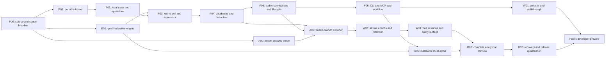

# Supabricks local runtime implementation plan

*Status: Proposed implementation sequence · Date: 2026-09-05*

Build the local product in **`supabricks/platform`**. Use the existing
`supabricks/neon` and `supabricks/postgres` repositories for engine source changes
and builds. Keep design/product decisions in `supabricks/rfcs`, with enough public
technical documentation in `platform` to build, test and contribute without
access to that private repository.

Repository evidence, exact inspected commits, existing files and outstanding
upstream work are recorded in the [repository map](repository-map.md). This plan
is based on `platform/main@070903f1db5d7510572af3845c7efbf9d8bc36f4`.
Task IDs below are plan identifiers, not GitHub issues or completed PRs.

## 1. Outcome and scope

A developer installs Supabricks on macOS arm64 or Linux x86_64, initializes a
project, opens a coding agent, and builds an application with ordinary Postgres
clients. They can branch the database, rehearse a migration, query a consistent
analytical snapshot, discard the experiment, restart their machine and resume.

The first preview includes:

- A native CLI/daemon, project metadata, stable branch connections and diagnostics.
- Source-built Neon storage plus its compatible Postgres compute; automatic
  process management using bundled Process Compose and local S3 storage.
- Branch creation/deletion, connection-triggered wake, safe suspension and TTLs.
- CLI and project-scoped MCP access to the same operations.
- Frozen-branch exports to Delta/Parquet using existing client/Arrow/delta-rs
  libraries, and Sail sessions over explicitly published snapshots.
- A tested installer, offline runtime, examples, recovery instructions and a
  small static `supabricks.io` website.

Custom Scintilla execution, continuous CDC, recent-delta overlays, distributed
analytics, multi-user enterprise IAM, HA, data merge/revert, a new console and
PGlite synchronization are outside this preview. Kubernetes remains a supported
existing code path with its existing gates; local implementation does not wait
for a general deployment abstraction or require a Kubernetes cluster.

## 2. Repository responsibilities and release flow

| Work | Repository / branch | Deliverable consumed by platform |
|---|---|---|
| CLI, daemon, state, operations, gateway, materializer, Sail integration, agents, installer, website, integration tests | `platform/main` | Complete versioned Supabricks distribution |
| Neon source/build changes, PG extension, native engine bundle, storage tests | `neon/sb/main` | Qualified engine bundle and provenance manifest |
| PG core changes and regression validation | `postgres/sb/REL_17_STABLE` initially | Exact source commit/tag used by the Neon build |
| PC ledger and branch documentation | `postgres/main` | Pinned audit manifest/ledger revision |
| EC ledger | `neon/sb/main`, `docs/supabricks/engine-changes.md` | Change rationale, patch scope and verification |
| Architecture 016, scope/requirements addenda, component evidence | `rfcs/main` | Decision record; no runtime/build dependency |
| Third-party engines and helpers | Their upstream repositories | Versioned binaries/wheels/libraries with licenses and checksums |

The build chain is **Postgres source → Neon engine bundle → platform release**.
Build the Neon extension and Postgres against the same qualified combination;
do not mix arbitrary PG or extension binaries. Platform records both source SHAs
and artifact checksums. Source-build scripts and mirrors must be sufficient to
reproduce the product without Neon-private CI services.

**E01 decision, 2026-09-05:** target PG17 for the native runtime. The current
operator's PG16 setting remains part of the existing Kubernetes profile. The
Neon engine already implements PG17; PG18 requires additional version dispatch,
WAL handling, bindings and compute-extension work, so its integration follows
E01. First reproduce Neon's PG17 gitlink, then qualify the maintained branch and
current upstream PG17 minor before public preview.

The inherited Rust engine unconditionally generates bindings for PG14–17.
Fetch exact source gitlinks and install headers for all four at build time;
compile/package only PG17 compute and extensions. Removing the older header
requirement is a later build simplification, not a storage rewrite.

## 3. Platform layout

Add only two Rust crates initially. Keep modules together until there is a real
reason to split them into separate libraries.

```text
platform/
  crates/
    operator/                    existing Kubernetes implementation
    core/                        portable types, validation, lifecycle decisions,
                                 compute-spec/auth helpers extracted when reused
    local/
      src/bin/supabricks.rs      CLI; daemon and MCP bridge subcommands
      src/project.rs            project/worktree context and paths
      src/store/                SQLite migrations, operation journal, leases
      src/operations/           database, branch, endpoint, snapshot operations
      src/engine/               direct-pageserver and compute_ctl adapters
      src/supervisor/           Process Compose adapter and ownership checks
      src/connections/          stable TCP listeners and connection leases
      src/analytics/            export orchestration and analytical session lifecycle
      src/api/                  local socket API, MCP, typed errors/results
      tests/                    native integration tests and fixtures
  python/analytics/              private worker package: exporter, delta writer,
                                 Sail session bootstrap; pyproject + lock
  components/
    components.lock.json         qualified versions, SHAs, targets, hashes, licenses
    schemas/                     manifest validation schemas
  install/native/                bootstrap, install/uninstall, bundle assembly
  e2e/native/                    isolated local acceptance/failure scenarios
  examples/orders/               small normal-Postgres app and analytics workflow
  agents/                        shipped workflow instructions and client adapters
  spikes/local-analytics/        imported component probe and recorded evidence
  website/                       initial static marketing/docs site
  docs/plans/                    this plan and repository map
  docs/handbook/local-*.md        implementation and operating instructions
  .github/workflows/native-*.yml new checks alongside existing ci.yml
```

The file names above are proposed additions. The single public executable is
`supabricks`; `supabricks daemon` is its long-lived service and `supabricks mcp`
is a thin project-aware bridge. Python is private implementation machinery,
provided by the release rather than installed by the user.

Keep `chart/`, existing `install/up.sh`/`down.sh`, and the K8s test scripts in
place. Local work must not change what those existing entry points mean.

## 4. Milestones and dependency order



An early developer artifact from E01 is sufficient for P03; E01 is complete only
after both target packages pass. A01 also requires the working lifecycle leases
from P05 before it can safely run concurrently with suspension/deletion. Start
design/fixtures earlier, but gate live export on both P04 and P05.

For a small team, finish one runtime slice before opening another. Engine builds
and the small analytic fixture can proceed independently of state-model work.
There is no defensible calendar estimate until E01 and P03 resolve native-build,
S3 and process-ownership risks. Measure these spikes, then size the remaining
PRs against the concrete acceptance cases rather than the complete vision.

### P00 — Establish the implementation baseline

**Changes:** `platform/docs/plans/`, component-lock schema and initial source
inventory; `rfcs/design/016-*` and dated requirements/scope addenda.

Record the architecture choices and their qualification gates: Process Compose,
SeaweedFS, Sail, Delta/delta-rs, SQLite, full snapshots first. Import the September
5 analytical probe into `spikes/local-analytics/`. Link the local implementation
plan from the handbook. Record the existing image digests separately from source
SHAs; do not label an untested combination as qualified.

Account for open platform PR #1 removing the UI. The local plan does not need
Carbon and must survive either merge order. Keep the original MCP schema and
K8s behavior intact. Publish enough architectural context in platform that the
private RFC repo is optional for contributors.

**Exit:** every initial component has an owner repository and a qualification
state; commands in the plan are visibly prospective; existing implementation
checks remain available. This documentation step is not evidence of a runtime.

### E01 — Produce the first reproducible native engine bundle

**Changes:** `neon` native build scripts/workflow and staged EC-0001 addendum;
`postgres` source-branch CI/ledger corrections as needed; `platform/components/`
and qualification harness.

1. Build the selected Neon + PG17 source combination on Linux x86_64 and macOS
   arm64 without Neon-private credentials, container-image dependencies, or
   recursive fetching of unrelated sources (PG14–16 headers remain build inputs).
2. Fix the inherited source-branch CI triggers. Document that PG `main` is not a
   build branch. Normalize PC trailer/ledger conventions and make audit CI read
   the appropriate pinned ledger; do not add behavioral patches with TODO-only
   rationale.
3. Assemble pageserver, safekeeper, broker, `compute_ctl`, Postgres, required
   extensions, initdb/pg_ctl/psql/pg_dump utilities, and runtime libraries into a
   relocatable archive. Check dynamic-library paths, ICU/OpenSSL dependencies,
   bundled extension availability and macOS signing requirements.
4. Pin and package Process Compose and the local S3 candidate separately; these
   belong in the platform component lock, not inside the PG source tree.
5. Qualify the existing `sb/REL_17_STABLE` integration and a maintained PG minor
   separately from first reproduction. Update Neon gitlinks/version metadata
   together only after compatibility gates pass. Do not fetch floating branches
   at install time.

**Exit:** a clean machine without a compiler, Docker, Java or Homebrew can unpack
the development bundle and run native SQL plus branch/terminate/wake tests after
the bundle is moved to another path, including a path containing spaces.
Artifact metadata identifies all sources, build flags, libraries and digests.
Postgres regression checks pass for the selected source; Neon integration checks
establish that the patched build actually works with the storage bundle.

**Fallback:** retain a known-good image-based engineering harness while fixing
native packaging. It is not the public local-install success criterion. Native
build failures do not justify a storage rewrite or immediate multi-major PG work.

### P01 — Extract the portable implementation kernel

**Changes:** `crates/core`, workspace manifest, narrow imports in `operator`.

Move reusable compute-spec and Ed25519 helpers, input validation, typed LSNs and
branch-ingestion decisions out of kube-dependent call sites. Preserve their
existing golden/behavioral tests. Represent PG major and paths as explicit
inputs. Keep Kubernetes resource/status mapping in the operator.

Define portable IDs and resource types, operation errors and capabilities.
Avoid a generic plugin framework. Do not require `core` or `local` to link
`kube`, `k8s-openapi`, the UI bundle, or read cluster configuration.

**Exit:** existing operator unit/contracts and affected K8s integration checks
still pass; `cargo tree -p supabricks-local` has no Kubernetes dependency; portable
helpers can render and validate the native compute configuration.

### P02 — Local state, ownership and durable operations

**Changes:** `crates/local/src/project.rs`, `store/`, `operations/`, migrations.

Use SQLite with a single daemon writer. Persist projects, branches/timeline IDs,
endpoints/ports, operation IDs, desired state, process ownership generations,
epochs/table mappings and work leases. Scope names beneath stable UUIDs;
renaming a branch does not create a different engine timeline.

Acquire an OS lock on the installation data root before serving writes. Add a
versioned schema and atomic migrations. Keep public project settings in
`supabricks.toml`; local credentials, checkout selection and paths are private
state. Support multiple Git worktrees with explicit branch-targeted connections.

For mutations, store intent before external effects and checkpoints after each
idempotent step. Do not hold a SQLite transaction across a network call. A
replayed idempotency key with identical parameters returns the same operation;
different parameters return a conflict. Use resource revisions to reject stale
work completing after a delete/suspend decision.

**Exit:** kill/restart between each operation checkpoint and verify convergence;
simultaneous daemon startup yields one owner; a second request never duplicates
resources; incomplete cleanup survives restart; migrations never discard data.

### P03 — Run the local storage cell and qualify supervision

**Changes:** `supervisor/`, `engine/`, private runtime templates, `e2e/native/`.

The daemon owns desired state. Process Compose supplies execution, probes and
logs. `supabricks up` starts/reconnects to the daemon; the daemon finds or starts
its authenticated private supervisor. Intentional compute suspension must not
trigger an automatic supervisor restart. On either daemon or supervisor death,
reconcile verified owned process groups before creating a replacement writer.
PID alone is insufficient: use process start identity, generation and data-root
ownership, and fail closed on ambiguous surviving processes.

Start broker, one safekeeper, pageserver and the candidate SeaweedFS process with
explicit loopback addresses, private credentials and generated ports. Qualify
S3 operations Neon uses: upload/list/range reads, multipart where used,
deletion, restart behavior and space exhaustion. Inspect and test acknowledged
write/flush semantics; kill-process recovery does not prove power-loss safety.

Implement the direct-pageserver tenant/timeline API for the pinned engine. The
existing storage-controller client is a separate adapter: changing its base URL
does not make controller and pageserver APIs interchangeable. Omit controller,
controller-PG and notify sink only in the bounded single-owner local profile.

**Exit:** create data through native Postgres, stop/restart the cell, and recover
it from the designated local object store after clearing only disposable engine
state in an isolated test root. Dynamic supervisor updates add/remove computes
without bouncing storage. Killing the supervisor/daemon never creates duplicate
writable computes; all child processes can be accounted for and stopped.

**Fallbacks:** if direct attachment fails, retain a controller-backed local
profile temporarily and update the process-count claim. If SeaweedFS fails,
qualify another existing S3 implementation using the same suite. If Process
Compose cannot enforce the lifecycle, replace just its adapter with a small
native process runner. Do not adopt Neon's test-only LocalFs as durable storage.

### P04 — Database and branch operations

**Changes:** database/branch operations, native compute specs, storage cleanup.

Implement create/get/list/delete with operation IDs and explicit tenant/timeline
pins. Store endpoint credentials independently of disposable compute files.
Separate application roles from internal compute-control/export credentials;
test authentication and do not emit private keys/passwords in logs.

Implement head branching first: capture flush LSN, wait for pageserver ingestion,
then create the exact ancestor branch. For a suspended parent use its recorded
safe boundary where sufficient; otherwise wake under an internal lease. Never
fall back to an earlier branch point after timeout. Preserve branch-of-branch
behavior; add explicit LSN/time branches after the head path passes.

Reject parent deletion with children or active protected work. Record ordered,
retriable teardown and verify cell-side resources are reclaimed. Define TTL
behavior: an expired busy branch rejects new work, allows existing leases to
drain, then deletes; forced teardown is a separate explicit operation. Protect
the project's default branch from accidental TTL assignment/deletion.

**Exit:** concurrent duplicate create, immediate-write-then-branch, parent/child
isolation, branch-of-branch, bad LSN, ingestion failure, TTL and interrupted
cleanup pass. Local control-state loss/recovery tests distinguish metadata
reconstruction from ordinary compute restart.

### P05 — Stable connections, wake and suspension

**Changes:** `connections/`, lifecycle operations and driver tests.

Persist one loopback listener address per branch; return ordinary PG URIs.
Bind sockets rather than assuming a previously available port is still free.
If another program takes a persisted port after restart, report a conflict;
do not silently redirect existing connection strings to another database.

Acquire a connection lease on accept before deciding whether to wake. Deduplicate
concurrent wakes, wait for authenticated SQL readiness, then relay bytes to the
compute. Apply bounded connection queues/startup timeouts. Postgres owns SQL,
authentication and TLS protocol behavior; this layer does not pool sessions.

Suspend only without client or internal-work leases. Capture the terminate
flush LSN, stop the verified process group and retire its disposable compute
directory. Wake gets a fresh directory and stable data identity. Preserve idle
pooled connections; do not pretend they consume zero compute.

**Exit:** ordinary `psql`, Python psycopg and Node `pg` exercise auth, transactions,
prepared statements, COPY, cancellation, disconnect during wake, TLS negotiation
where configured, startup timeout and many concurrent connects. Race tests cover
suspend/accept/delete/TTL. Every successful wake sees previously committed data.

### P06 — Complete the first application and agent workflow

**Changes:** CLI, local socket API/MCP, `agents/`, `examples/orders/`, handbook.

Expose `init`, `up`, `down`, `status`, `doctor`, `connect`, and database/branch
operations with structured output and deterministic exit codes. Long work
returns an operation ID and observable progress rather than an unexplained hang.
`down` retains data; destructive removal names the resource and is a separate
command.

The MCP bridge binds to an explicit project/worktree and invokes the same
operations as the CLI. Keep the old operator's MCP contract separate from the
local API version. Add capabilities, catalog discovery, bounded SQL execution,
diagnostic errors, and explicit resource limits. Never rely on an LLM to decide
whether a lifecycle transition is correct.

Ship an idempotent coding-agent setup adapter and local workflow instructions.
Validate it against installed supported agent versions during implementation;
do not assume a particular tool can silently register configuration or bypass
its trust model. Support manual setup and generic MCP clients. Installation
requires no model/API key for the database itself.

**Exit:** a person and a real coding-agent session independently build the sample
app, create a branch, run a migration there, verify parent isolation, remove the
branch and resume after a daemon restart. Machine API contract tests are required;
a real-agent smoke is a separately recorded usability check, not a replacement.

### A00 — Retain and qualify the off-the-shelf analytical fixture

**Changes:** `spikes/local-analytics/`, then `python/analytics/` dependency lock.

Import the already executed Sail/delta-rs probe without claiming it is the
Postgres POC. Reproduce on both target architectures. Pin Sail, lightweight
PySpark client, Python, Arrow, delta-rs and tested transitive dependencies; avoid
the pandas compatibility warning found with unconstrained resolution. Confirm
the earlier analytical POC engine if its code becomes available before choosing
whether any integration can be reused.

**Exit:** decimal aggregation, cross-engine writes/updates/deletes, historical
DataFrame reads, named `VERSION AS OF` views and fresh-server reads pass. Record
startup and memory with measurement boundaries. Retain regressions for unsafe
snapshot binding forms; passing SQL parsing is not proof of pinned reads.

### A01 — Export a frozen Postgres branch

**Changes:** export operations and a small Python worker using maintained PG,
Arrow and delta-rs libraries. Depends on P04, P05 and A00.

Capture a consistent source boundary and fork an internal export branch. Give
it a work lease and exporter-only connection path. Disable inherited background
job execution and prevent user-table writes in the export compute; copying a
database also copies scheduled-job metadata. Use a single read-only transaction
for catalog discovery and all exported tables.

Implement a bounded type mapping: booleans, integers, text, nulls, bounded
decimals, dates and supported timestamps first. Explicitly reject or report
unsupported schema/type combinations, precision overflow, infinity and collation
differences; never silently coerce exact numbers to floats. Start with ordinary
tables in one PG database. Export supported empty tables as well as populated
ones. Publish a schema/type support matrix.

Stream batches with bounded memory into a new unpublished Delta generation.
The parent continues serving writes. Enforce export concurrency/disk budgets
and cancellation. Do not copy a full database into RAM. The worker reports
counts, schemas, source identity and file/table metadata; the daemon controls
publication and cleanup.

**Exit:** compare exported rows against the frozen source for inserts, updates,
deletes, rollbacks, long-running transactions and basic ADD/DROP/ALTER cases.
A transaction changing orders and payments never appears half-applied. Confirm
bulk export scans occur on the temporary compute, and measure their shared
storage impact. Parent activity and a failed export cannot corrupt each other.

### A02 — Atomic analytical epochs, retention and failure recovery

**Changes:** epoch/catalog tables and migrations, publisher, manifests, GC.

Define an epoch by installation/project/database/branch/timeline identity,
source LSN, schema map, Delta version/path for each table, engine versions and
observation time. Local epoch IDs order publication; an LSN is not a global ID.

Use explicit stages: `requested → exporting → files_complete → published`, with
failure/cancel states. Durably finish data, Delta metadata and an exportable
manifest before atomically switching the published pointer in SQLite. A crash
after file completion but before publication produces reclaimable or recoverable
staging data, not partially visible tables. Serialize refresh publication per
branch or reject stale completion by resource generation.

Lease published epochs for query sessions. Retention/deletion accounts for all
leases and references before deleting files. Do not run standalone Delta vacuum
against files the platform still references. Reconcile SQLite, manifests and
staging directories on restart; document how a complete recovery bundle restores
each. Full exports initially have independent generation paths, so no analytical
CoW branch or free refresh claim is made.

**Exit:** fail after each file/table/manifest write and around publication; readers
see the old complete epoch or the new complete epoch. Competing refreshes cannot
publish out of order. Restart preserves referenced history; cancellation cleans
unreferenced staging data; out-of-space errors preserve the previous snapshot.

### A03 — Sail sessions and the analytical user surface

**Changes:** worker bootstrap, session operations, CLI/MCP analytics methods.

Create a bounded on-demand Sail worker/catalog per analytical session initially.
Populate named source tables and public views pinned to the selected epoch
before returning its Spark Connect endpoint. Use immutable generation paths and
the verified named-table `VERSION AS OF` mechanism. Do not rely on the table
option that failed to pin reads in the component investigation.

Implement `analytics refresh/status`, `spark shell`, analytical SQL, session
close, row/byte/time limits and cancellation. First access can create a snapshot
automatically. Report refresh progress and snapshot age. Existing sessions stay
pinned; fresh sessions can select a newer epoch. Every raw PySpark session has
discoverable epoch metadata; normal DataFrame results are not custom envelopes.

Reject mutation of Postgres-owned analytical objects through supported platform
operations. Treat same-user Python/UDF access as trusted local execution, not an
enterprise security sandbox. Keep separately owned lakehouse tables out of the
initial export namespace; add their write lifecycle as a later bounded slice.

**Exit:** the sample app's tables are queryable with ordinary SQL/DataFrame code;
two sessions hold different epochs without interference; refreshing never
changes a running query's snapshot; worker crash/cancellation releases leases;
an independent Delta reader reproduces selected table versions from the manifest.

### R01 — Installable local Postgres alpha

**Changes:** `components/`, `install/native/`, release assembly, native CI.

Begin assembly tooling during E01; complete this slice once P06 works. Produce
a private per-user install containing tested native binaries and libraries.
Supply `psql` and required helpers. Support repeat install, existing system
Postgres, port conflicts, paths containing spaces and explicit data-root override.
No source compile, root access, Docker, JVM or cloud account is required on the
target machine.

Add a versioned manifest, checksums/signatures, license notices and source/build
provenance. Core runtime runs with external network denied after installation.
Disable bundled helper telemetry/update checks in runtime mode; check this with
network observation rather than documentation alone.

**Exit:** clean machines on both target architectures install the exact artifact
and complete the app/branch workflow. A changed working directory or moved
installation does not break linked libraries or branch connections. Preserve
machine evidence; a containerized Linux test does not qualify macOS packaging.

### R02 — Assemble the full analytical developer preview

**Changes:** analytics component bundles, private Python runtime, full example.

Add the qualified Python/Sail/delta-rs environment to the distribution. The
default install supports the complete promised analytical workflow offline;
an optional smaller Postgres-only bundle may exist, but must be labeled as such.
Do not resolve dependencies at first analytical query or rely on the user's
Python/pip environment.

Measure total download/unpacked size, cold/warm readiness, RSS including helper
processes, idle CPU, wake latency, export throughput and disk growth on named
16 GiB macOS/Linux machines. Test 10 MB, 100 MB and 1 GB datasets and choose an
honest initial ceiling from results. Full-snapshot time is a measured product
limit, not a hidden background cost.

**Exit:** install → app writes → analytical snapshot → branch migration →
analytical refresh → cleanup works for a non-builder on both targets. An offline
restart needs no package registry, website, provider control plane or model.

### R03 — Recovery, upgrade and public release qualification

**Changes:** native failure suite, recovery tooling, upgrade checks, runbook.

Port SSPC's core data-safety scenarios to isolated native roots. Distinguish
graceful suspend, compute kill, pageserver/safekeeper/supervisor kill, OS restart,
and power-loss/durable-acknowledgment qualification. Never describe a graceful
flush-and-restore test as proof of unflushed failure durability.

Implement a coordinated recovery bundle covering local object-store state,
SQLite metadata, manifests, analytical files and credential/key material. Flush
and checkpoint appropriately; do not advertise copying a live directory as a
backup. Restore into a new root and prove exact parent/branch data, epoch
bindings, writable resumed computes and protected credential restoration.

Validate upgrades against stored engine/catalog format versions. Reject
incompatible downgrades before changing files; document when restore/export is
the return path. Test interrupted download/install/update and uninstall that
retains data by default. Include extension/library version compatibility.

**Exit:** all mandatory suites pass on the exact signed release artifacts;
failure artifacts contain useful redacted diagnostics; operator/K8s checks still
pass for shared-code changes; known limitations and supported targets are public.

### W01 — Website, examples and release documentation

**Changes:** `website/`, public quickstart/compatibility/recovery docs and website CI.

Build a static `supabricks.io` site tied to the real release workflow. Explain
Postgres, analytics and branches through one application demonstration. Before
artifacts qualify, show development status rather than a fictional install
command. When qualified, `/install.sh` serves the small inspectable bootstrap
for immutable versioned bundles.

The website is not the runtime console and not a dependency of local operations.
Use the existing org structure: keep the first site in platform; move it only if
a dedicated repository is deliberately created. A future console consumes
versioned public contracts and can be developed independently.

**Exit:** a non-builder follows published instructions against the advertised
release; website/install commands match the artifact; source and limitations
are easy to find. Publishing infrastructure/DNS is a release action, separate
from writing this implementation plan.

## 5. Contracts to settle before implementation spreads

| Contract | Initial rule | Owning slice |
|---|---|---|
| Component lock | Source SHA + artifact hash + platform/ABI/PG major + license + qualification state; no floating `latest` | P00 / E01 |
| Local metadata | Versioned SQLite schema; stable UUIDs; single daemon writer; journaled effects | P02 |
| Runtime ownership | Lock + generation + verified process identity; stale/unknown processes block replacement writers | P02 / P03 |
| Resource API | Explicit project/branch; idempotency key and request fingerprint; observable operation ID | P02 / P06 |
| Engine adapter | Typed tenant/timeline/LSN, create/branch/delete/status/terminate; preserve HTTP error meaning | P03 / P04 |
| Connection address | Stable per-branch listener; collision is an error; client lease spans wake and relay | P05 |
| Worker protocol | Versioned JSON requests/progress/completion over private IPC; Arrow for batches where useful; data not stdout prose | A01 |
| Epoch format | Complete database snapshot map, durable publication, explicit source lineage and schema | A02 |
| Session binding | One pinned epoch per session; bounded lifetime/resources; refresh never mutates active bindings | A03 |
| Release format | Tested platform bundle, relocatable libraries, offline dependencies, compatible data-format migration | R01–R03 |

These are small internal contracts, not a new public data API. Postgres and
Spark remain the application-facing query interfaces.

## 6. Required validation and CI organization

Add native jobs alongside existing `.github/workflows/ci.yml`. Initially retain
the existing checks; optimize path filters only once new coverage and branch
protection are explicit. Shared-core changes must exercise both native and
operator paths. Native builds must never obtain engines from private artifacts
that external contributors cannot reproduce.

| Suite | Runs / required evidence | Owned by |
|---|---|---|
| Portable unit/contract | IDs, validation, operation errors, spec rendering, schema migrations | P01 / P02 / P06 |
| Engine bundle qualification | PG regression, Neon compatibility, relocatable binary/library checks | E01 |
| Native lifecycle | Create, head branch, isolation, duplicate requests, wake/suspend, delete/TTL | P03–P05 |
| Driver conformance | psql, psycopg, Node pg; cancellation/auth/transactions/COPY/prepared statements | P05 |
| Analytical components | Sail/delta-rs compatibility and version binding | A00 |
| Snapshot correctness | Transaction/schema/type cases, complete publication, sessions/retention | A01–A03 |
| Native failure/recovery | Process deaths, interrupted work, metadata recovery, restore and upgrade | P02 onward / R03 |
| Clean install + offline | Two native target families; exact release bundles; no hidden downloads | R01–R03 |
| Real agent workflow | Versioned client, prompt, tool trace and resulting resources; non-blocking scheduled check plus release evidence | P06 / R02 |
| K8s regression | Existing unit/schema/hardening/e2e/chaos/restore gates | Existing operator owners |
| Website | Broken links, command examples, artifact-manifest agreement | W01 |

Every destructive scenario creates its own temporary data root and storage
namespace. Tests must refuse to use an ordinary developer installation. Capture
component versions, operation journal state, process tree, readiness failures,
storage status and redacted logs on failure. No teardown by global process name.

Suggested developer entry points: `just verify-local-static`,
`just verify-local-runtime`, `just verify-analytics`, and `just verify-native-release`.
They must match their CI jobs. Existing `verify-static`/`verify-runtime` remain
the operator gate until a deliberate, documented rename.

## 7. First PR sequence

Keep these review units small enough to diagnose regressions. Split any unit
that changes both engine semantics and product lifecycle behavior.

| Order | PR scope | Prerequisite | Concrete review result |
|---|---|---|---|
| 1 | Platform plan/map + imported analytical fixture; RFC scope update separately | None | Agreed file ownership, reusable experiment, measured baseline |
| 2 | Neon native PG17 bundle recipe and standalone CI; PG source CI fixes separately | 1 | Reproducible candidate artifacts, clearly labeled qualification status |
| 3 | Extract portable keys/spec/validation with unchanged operator behavior | 1 | Shared code and regression evidence |
| 4 | Local daemon skeleton, project paths, SQLite schema and operation journal | 3 | Restart-safe local ownership and idempotency tests |
| 5 | Supervisor adapter + storage cell + direct-pageserver qualification | 2, 4 | Native create/write/restart and no-duplicate-writer evidence |
| 6 | Database/branch create and ordered deletion | 5 | Data isolation, ingestion wait, cleanup failure cases |
| 7 | Stable TCP listeners + wake/suspend leases | 6 | Real driver compatibility and lifecycle races |
| 8 | CLI/MCP app workflow + native installer alpha | 7 | A person and agent build the example from an installed bundle |
| 9 | Frozen export compute + bounded Delta writer | 6, 7, analytical fixture | Correct standalone generation under concurrent parent activity |
| 10 | Epoch publication + retention + Sail session binding | 9 | Complete snapshots across crashes and concurrent sessions |
| 11 | Analytical CLI/MCP + private runtime bundle | 8, 10 | Full app/analytics/branch workflow on both targets |
| 12 | Complete recovery/upgrade qualification + website/release docs | 11 | Exact artifacts meet public preview acceptance |

Rows 2, 5, 10 and 12 will likely need several PRs. They are bounded work packages,
not an expectation that one large patch should contain all their changes.
The first customer-usable checkpoint is row 8; row 11 establishes the distinctive
transactional-plus-analytical experience. Do not wait for Scintilla or CDC to
let developers try row 8.

## 8. Stop conditions and later decisions

If a selected off-the-shelf component misses a required behavior, record the
small failing case and evaluate a bounded adapter or alternative. Stop expanding
the product surface while data safety or native installation is unresolved.

After preview usage, decide separately whether to add incremental decoding,
more Spark functions/types, lakehouse-owned writes, analytical CoW branches,
PGlite integration, PG18, distributed execution, a console, or Scintilla.
Each must solve a measured limitation. Upstream Postgres integration maintenance
continues throughout, but replacing Neon storage is not a planned prerequisite.

## Status of this plan

The platform portion of P00 is in [PR #2](https://github.com/supabricks/platform/pull/2): source/candidate inventory,
JSON Schema and semantic validation, qualification checks, imported analytical
fixture, handbook links and a separate baseline CI workflow. See
[components/README.md](../../components/README.md) for executable checks and their
limits. Component validation, the analytical probe, operator unit tests and e2e
passed in GitHub CI. RFC scope publication remains a separate repo change.

E01 now has native build/packaging scripts and standalone Linux/macOS CI in
[neon PR #1](https://github.com/supabricks/neon/pull/1). The selected PG17.8 pair
passed 224 PostgreSQL regression tests and nine relocated runtime checks on
Linux x86_64 and macOS arm64, including branch isolation, compute restart,
restricted core-dump policy and lazy SLRU download. Linux also passed inside a
minimal userspace with no build tools or external networking. PG17 source CI and
its pinned patch-ledger audit are in
[Postgres PR #2](https://github.com/supabricks/postgres/pull/2), with the completed
rationale inventory in [PR #1](https://github.com/supabricks/postgres/pull/1).
Platform records source pins, helper archive checksums and bundle verification
in `components/`. The evidence is an engineering probe: macOS clean-host/offline
qualification, current upstream minor integration, license notices
and signing remain open. S3 and product lifecycle qualification remain P03.
No platform CLI, installer or website is implemented yet.
