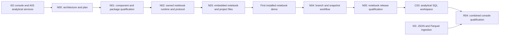

# Console notebook implementation plan

*Status: Implemented preview under repair qualification · Updated: 2026-09-10*

The original acceptance criteria below remain the completion gates. Subsequent
PR labels drifted: N04 added files, N05 added kernel controls, and N06 added an
execution client. Those labels did not establish completion of the original
N03–N05 milestones. The [holistic review](../reviews/n00-n06-notebooks.md) records
the defects at `cb1f4f7`; the [repair record](../reviews/n00-n06-repairs.md) maps
each finding to its fix and distinguishes local tests from installed evidence.

| Original slice | Current implementation and evidence |
| --- | --- |
| N00 | Architecture and plan present; this table restores the milestone mapping |
| N01 | Qualified upstream JupyterLab widget selected; now integrated in the product with exact locked dependencies |
| N02 | Owned Jupyter/Sail runtime retained; restart now preserves its selected epoch |
| N03 | Product editor, binary execution, conditional persistence, dirty/conflict handling and MIME policy implemented; real Linux source-build browser test passes |
| N04 | Branch selection, saved epoch binding, refresh/cancel and explicit rebind implemented; local browser tests prove refresh isolation and pinned restart; broader fault and child-branch acceptance remain qualification work |
| N05 | Runtime fault harness retained and actual product harness added to both native release targets; fresh installed Linux/macOS reports are required before claiming preview qualification |
| N06 (later PR label) | Replaced the broken channel client with the qualified binary protocol and correlated, serialized execution |

User workflow: [notebook runbook](../handbook/notebooks.md). These repairs are
in the extraction worktree based on N06; they do not themselves extract the UI
to a separate repository or mark I03/C03/R04 complete.

A subsequent branch based on the repaired PR #33 performs the
[console source split](../architecture/console-source-split.md). It preserves
these notebook semantics and consumes the frontend through a pinned submodule.

Implement in `supabricks/platform`, starting from I02 at
`main@d18aae72b3aa5e130adfe6ddcfc2241926a3277b` (PR #23, alpha.8). The
[notebook architecture](../architecture/local-notebooks.md) owns product
semantics, process/authentication boundaries, files and snapshot behavior. This
plan owns implementation order and evidence. N00-N05 are planning identifiers;
the status table above records implementation against the original criteria.

The first useful milestone is an **installed embedded notebook that queries
`public.orders`, saves, reopens and restarts against the same snapshot**. Use
off-the-shelf notebook components and the existing Sail session service.

## 1. Repository map and baseline

| Component | Existing or proposed location in `platform` | Work |
| --- | --- | --- |
| React notebook UI | `console/src/notebooks/` (new), existing client/navigation | Component adapter, project files, branch/epoch context, run/save controls |
| Browser transport | `crates/local/src/console/` | Authenticated allowlisted HTTP/WebSocket routing and ownership checks |
| Notebook coordinator | `crates/local/src/notebooks/` (new), `daemon.rs`, `supervisor.rs` | Lazy server/kernel ownership, generations, admission and cleanup |
| Analytical binding | `sessions.rs`, `store/sessions.rs`, `python/analytics/session.py` and `shell.py` | Reuse A03 opening, epochs, leases, full endpoint and cancellation |
| Jupyter adapter/bootstrap | `python/notebooks/` (new) | Contents policy, kernel lifecycle hooks, bootstrap and kernelspec |
| Dependencies | `console/package.json` and lock, `python/analytics/pyproject.toml` and locks | Pin selected upstream packages and preserve qualified analytical versions |
| Shared platform contracts | `api.rs`, `client.rs`, store/migrations, capability fixtures | Typed lifecycle/status actions; no raw Python execution API in CLI/MCP for this phase |
| Recovery | `recovery.rs`, `upgrade.rs`, process ownership records | Explicit migration if needed, child shutdown, ephemeral-state exclusion |
| Native release | `install/native/{analytics,assemble,qualify_console,recovery}.py`, workflows | Inventory, relocation, offline and upgrade qualification |
| Examples/tests | `examples/notebooks/`, `console/scripts/`, `e2e/native/` (new files) | Synthetic `.ipynb`, walkthrough and real installed kernel tests |
| Documentation | `docs/architecture/`, `docs/handbook/`, `docs/plans/` | Decision/evidence records, supported behavior, limits and roadmap |

Paths marked new are proposals; retain existing layout where practical. All new
work is in `platform`. `supabricks/neon` and `supabricks/postgres` continue to own
the qualified PG17 engine, and upstream Sail remains the bundled package. The
legacy Kubernetes `ui/` and operator are separate. No new repository, engine fork,
website deployment or change to the running demo is required by N00.

## 2. Sequence and milestones

This inserts the requested notebook phase after the now-complete I02 demo. I03
is independent of notebooks and can follow N05; C03 is not a prerequisite for
N01-N05. Reuse small branch/snapshot controls instead of building C03 inside a
notebook slice. R04 continues to require I03 and C03 as well as any notebook
capability included in its release. No calendar estimate until N01 measures the
dependency and packaging work. Split large slices at the stated review boundaries.

| Milestone | Required slices | Evidence |
| --- | --- | --- |
| Component decision | N01 | Exact upstream versions, native/offline feasibility, component protocol and bundle measurements |
| First installed notebook demo | N02-N03 | Real browser -> Python -> Sail query, save/reopen/restart on both targets |
| Branch-aware notebook workflow | N04 | Explicit refresh/rebind, unchanged pinned results, clear loss/cancellation outcomes |
| Notebook preview | N05 | Exact archive, limits, recovery/upgrade, regression reports and user runbook |

## 3. Implementation slices

### N00 — Record architecture and implementation boundaries

**Deliverable:** this plan, the architecture, and links from the runtime/console
plans and handbook. Record I02 completion, the new notebook scope and the
continuing I03/C03/R04 gates. Identify Datalayer as a candidate pending N01.

**Acceptance:** a contributor can identify the first implementation PR, source
ownership, file/backup policy and testable exit criteria. No runtime behavior or
dependency changes; validate relative links and review status claims.

### N01 — Qualify the component and packaged kernel stack

Qualified on Linux x86_64 and macOS arm64: [N01 decision and evidence](../architecture/n01-notebook-qualification.md),
[reproducible probe](../../e2e/native/notebooks/README.md). No product feature is enabled yet.

**Depends on:** N00. **Touch:** isolated reproducible probe under `examples/` or
`e2e/native/`, candidate frontend/Python locks, assembly fixture and an N01 report.

- Pin `@datalayer/jupyter-react`, Jupyter Server and `ipykernel` plus transitives;
  record source identities, licenses and Linux/macOS native wheel availability.
  Prove the candidate against the existing React 19/Vite build without dependency
  overrides that hide an incompatible version. Assess lazy loading and CSS scope.
- Render an actual notebook and execute Python against the packaged kernel.
  Connect `spark` to a real A03 session; query the installed synthetic orders data.
  Exercise text/table/static-image output and save/reopen a standard `.ipynb`.
- Probe the same-origin authenticated HTTP/WebSocket integration, including
  cookies, CSRF/handshake authorization, negotiated binary messages, CSP and
  output sanitization. Identify which Jupyter APIs the component actually uses.
  No disabled authentication, permissive origins or CDN in the qualifying path.
- Prove Jupyter lifecycle hooks can preserve daemon ownership/admission before
  kernel execution. Verify full endpoint binding, interrupt behavior during a
  real Sail call and all subprocesses spawned by server/kernel startup.
- Inspect save behavior, external-edit conflict support, notebook metadata,
  replay behavior on reconnect, and output backpressure. Record necessary narrow
  adapters rather than assuming defaults satisfy the architecture.
- Measure candidate frontend bytes, archive delta, kernel/server idle RSS and
  cold-start latency on both targets. Record missing limits or incompatible
  dependencies and choose the supported MIME set and exact client/server protocol.

**Acceptance:** retained reproducible reports on Linux x86_64 and macOS arm64
using packaged, relocated dependencies offline; real `spark` result and notebook
round-trip. An explicit adopt/reject decision and integration inventory, including
all exceptions needed from current content policy. A source-only screenshot or
working external JupyterLab tab is insufficient.

**Decision gate:** if Datalayer fails, compare a small upstream JupyterLab adapter
against the same probe and update the decision. Do not quietly expand into a
custom editor/runtime. The probe does not expose an unfinished product feature.

### N02 — Add owned notebook runtime and authenticated transport

Runtime design and API: [N02 ownership contract](../architecture/n02-notebook-runtime.md).

**Depends on:** accepted N01 decision. **Touch:** coordinator, daemon/supervisor,
console bridge, Jupyter hooks/bootstrap, capabilities and recovery contracts.

- Add typed create/start/status/interrupt/restart/shutdown actions, idempotent
  lifecycle admission and project/worktree/session ownership. Keep execution on
  Jupyter's standard channels; no alternate HTTP execute-code endpoint.
- Start Jupyter lazily from the immutable installation. Restrict configuration,
  kernelspec and extension discovery. Register server/kernel identities and
  generations; reconcile crashes before admitting replacements.
- Bind one kernel to one A03 session/epoch; bootstrap `spark` and `epoch` without
  persisting endpoints in documents. Share the existing installation-wide Sail
  admission budget with CLI and Spark shells. Roll back failed starts and release
  all session references when kernel startup fails.
- Implement allowlisted proxy routes with per-ID ownership and complete HTTP/WS
  session checks. Test session expiry/sign-out while channels are already open.
  Do not proxy arbitrary host URLs, kernel commands, terminals or file roots.
- Enforce bounded message queues, output/frame sizes, submission concurrency,
  lifetime and memory policies before the UI is enabled. Measure and record the
  server RSS bound. Keep control/shutdown responsive under stdout floods.
- Implement interrupt with observed outcomes, escalation to A03 session closure
  when necessary, restart without hidden code replay, and explicit lost states.
  Account for children in `down`, daemon recovery, backup and upgrade.
- Decide whether current process records suffice. If durable schema changes are
  required, allocate the next migration from the actual merge baseline, add R03
  upgrade/restore evidence and update format/capability fixtures explicitly.

**Acceptance:** real packaged kernels execute a query and cleanly stop on both
targets. Admission races, cross-project/kernel IDs, forged WS origins, revoked
sessions, failed bootstraps, stale generations, server/kernel SIGKILL, daemon
restart, Spark expiry and runtime shutdown leave no unmanaged platform child or
leaked epoch lease. No database query or cell is silently replayed.

**Review boundary:** separate migration/ownership contract from runtime launch
if needed. Keep the notebook capability unavailable to the ordinary UI until
the N03 file/editor path is complete.

### N03 — Embed the notebook and implement project persistence

**Depends on:** N02. **Touch:** console notebook adapter, restricted contents
service, existing asset inventory, browser tests and `examples/notebooks/`.

- Add the notebook list and editor, lazy-loaded inside the existing console.
  Explicitly start a selected branch's kernel. Show current project, branch,
  epoch and state; support Python/Markdown, run cell/all, interrupt, restart and
  shutdown. Preserve the notebook binding across navigation changes.
- Implement create/list/open/save/rename/download for files under the canonical
  project's `notebooks/` root. Validate `.ipynb`, reject symlinks/traversal,
  enforce size/cell limits and implement atomic saves with conflict handling.
  Source/Markdown save by default; output persistence is explicit and bounded.
- Show dirty state, errors and external-edit conflicts. Preserve edits for
  retry/download after a failed save; do not clear dirty state before confirmed
  persistence. No browser-storage copy of source, outputs or credentials.
- Apply the qualified MIME/rendering policy to imported and newly generated
  outputs. Stored HTML/Markdown must not execute script or call console APIs.
- Reload/reopen without starting or rerunning cells. Reconnect an authorized
  live session explicitly, with generation checks and visible output gaps. Do
  not claim that in-flight kernel output is a durable execution log.
- Add a synthetic orders notebook and walkthrough based on the existing CSV.
  Demonstrate the text-to-decimal cast when the importer used conservative text.
  Include notebook assets/bootstrap in the immutable release and verification.

**Acceptance:** installed browser on both targets imports/orders or uses the
explicit fixture, creates a notebook, returns the correct Sail result, saves,
reloads, reopens and explicitly restarts/reruns on the same epoch. A normal
Jupyter nbformat reader accepts the saved file. Test keyboard/focus behavior,
save disk-full/interruption, conflicting tabs/external edits, path substitution,
malformed/oversized files, hostile outputs and execution disconnect without replay.
Existing SQL and CSV/browser tests still pass.

**First demo exit:** a non-builder can perform that workflow from a localhost
installed archive with no user-supplied Python/Jupyter/Node and no external network.

### N04 — Complete branch, snapshot and session workflows

**Depends on:** N03. **Touch:** reusable analytical context controls, notebook
binding operations, existing refresh/session APIs and native browser scenarios.

- Add explicit refresh progress and failure/cancel handling. Refresh publication
  leaves the current kernel on its original epoch. Restart-on-latest and branch
  changes clearly discard variables and require a new kernel/session binding.
- Show source identity/age and provenance of saved outputs even after a new
  context starts. An unavailable saved branch/epoch produces a selection flow;
  it never silently binds to a different database or newest snapshot.
- Release the old context before creating a replacement when admission slots
  are occupied. Failed refresh/rebind does not claim success or discard the saved
  document. Existing non-notebook analytical clients remain independently owned.
- Finish user-facing handling for epoch expiry/GC, branch suspend/delete,
  expired browser authorization and interrupted Spark execution. A pinned epoch
  remains protected through its actual session lifetime; opening a notebook file
  alone does not pin it indefinitely.
- Keep controls reusable by C03; do not add a second analytical session service
  or implement the full analytical SQL workspace in this slice.

**Acceptance:** notebook sees an initial snapshot; a PostgreSQL change leaves
its results unchanged; refresh creates a new epoch; explicit restart observes
the new rows. Repeat on a child branch and prove unchanged parent data. Test
both occupied session slots, old output provenance, deleted branch, expired/GC'd
epoch, refresh failure/cancel and session interruption without silent retargeting.

### N05 — Qualify and document the installed notebook preview

**Depends on:** N04. **Touch:** native release jobs, console/recovery harnesses,
installer manifest, notices, handbook and recorded compatibility/limits.

- Qualify the exact signed archive on Linux x86_64 and macOS arm64, offline and
  after relocation. Assert all requests/assets remain local; no globally
  installed Jupyter, Python, Node or dynamic dependency downloads can mask gaps.
- Exercise installation verify, coordinated down/up, notebook-kernel crash,
  disk/output/memory limits, migration (if any), upgrade from alpha.8 and restore
  to a separate data root with the exact source release.
- Demonstrate the backup boundary: saved notebooks remain project files and
  need application-source backup; runtime restore preserves platform identities
  but never restores live kernel memory, credentials or executes saved cells.
- Run existing native cell, analytics, console/import and recovery checks for
  the final release revision. Record archive checksums, release identities,
  browser/OS versions and actual measured startup/RSS/archive/frontend costs.
- Write the notebook runbook, supported package/MIME matrix, limits, example
  walkthrough and troubleshooting for file conflicts, lost kernels and stale
  snapshots. State that arbitrary Python is trusted local execution.

**Acceptance:** a non-builder completes the installed walkthrough on both
targets; exact-archive evidence covers save/reopen/restart, refresh isolation,
cancellation, recovery and offline operation. Chromium is the first qualified
browser; other browser/public-distribution claims require separate evidence.
N05 does not mark I03, C03, R04 or the real-agent usability check complete.

## 4. Completion and review discipline

- Land each slice through a PR with its actual component versions, changed
  behavior and matching evidence. Keep `main` protection and existing CI gates.
- Record limits as measured policies, not security-sandbox guarantees. Adjust
  proposed budgets through the architecture and tests when measurements justify it.
- A notebook screenshot is not lifecycle, persistence or installation evidence.
  Use real Jupyter kernels, Sail sessions and native engine data for acceptance.
- Keep the running alpha.8 demo intact during development; use separate program,
  project and data directories for candidate releases and upgrade fixtures.
- Update this plan with implementation/evidence links as slices merge. The next
  gate is installed qualification of the repaired product on both native targets.
