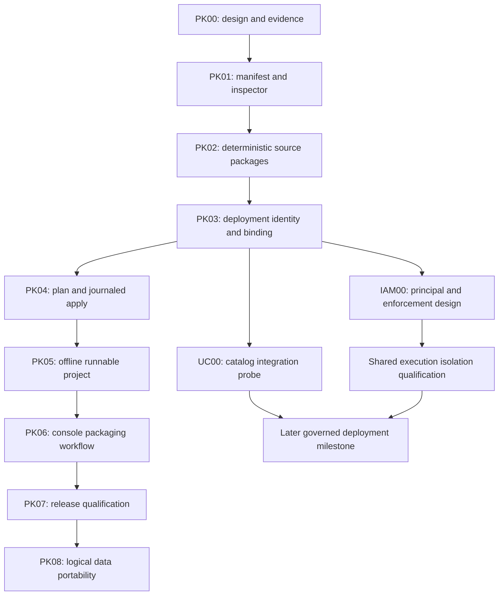

# Project packaging implementation plan

Status: proposed. PK00 design/research is documented; PK01–PK08 are not
implemented. Baseline: merged platform #45 (`916a793`), alpha.17, catalog 10,
console `70af6a2`. No runtime or console code changes accompany this plan.

[Architecture](../architecture/project-packaging.md) ·
[Primary-source research](../research/project-packaging-industry.md) ·
[Delivery status](status.md).

## Outcome and scope

Ship a project that another person can inspect, unpack and explicitly run on an
existing compatible Supabricks installation, offline when its dependency closure
is included. Keep the installed application, portable project, destination
configuration and physical recovery backup independently versioned.

The first release milestone covers source, queries, notebooks, locked Python
dependencies, declared database creation and bounded fixtures. Full data export,
shared catalog enforcement, IAM, job scheduling and arbitrary application hosting
are separate increments. Their identity and capability requirements shape the
schema now; unsupported features must fail rather than appear to work.

## Dependency order

This is a dependency graph, not a request to implement all slices concurrently.
Finish the local portability milestone before committing to the service footprint
of a shared deployment. No calendar estimates are assigned before the first
manifest and deployment-binding work reveal their actual migration cost.

## PK00 — Architecture and industry evidence

Deliver the architecture, research and this plan. Establish the definition /
package / deployment / workspace / catalog / principal vocabulary and the
single-user versus governed execution boundary. Inventory existing source IDs,
saved queries, notebook/environment files and physical recovery semantics.

Completion: linked documents, sourced vendor claims and concrete acceptance
criteria for the next slice. This slice does not claim an operational UC or IAM
integration. Open-source Unity Catalog is the selected integration target;
Databricks-hosted compatibility is outside scope and the roadmap.

## PK01 — Project manifest and read-only inspection

**First implementation slice.** Extend `crates/local/src/project.rs` behind a
versioned parser and add a pure project graph module. Preserve format-1 behavior;
validate a proposed format-2 file without mutating it. Keep the old initializer
until the binding/adoption migration is ready. No catalog schema change yet.

Add CLI and shared API/MCP definitions for `project validate` and `project inspect`
against source directories. Return stable resource keys, source inventory,
dependency hashes, capability requirements and unresolved binding requirements.
Keep source inspection independent of runtime startup. Distinguish source
inspection from package archive inspection, which arrives in PK02.

Freeze a machine-readable schema and fixtures for databases, SQL resources,
notebooks, environment declarations and selected fixture inputs. Validate
resource references/DAGs, engine selection, path containment, duplicates,
unsupported capabilities and explicit default-target rules. Reject shell hooks,
unknown security fields and implicit environment-variable interpolation.
Initial TOML resource includes have bounded depth and no arbitrary templates.

Acceptance:

- Every existing format-1 project reads unchanged; unsupported format-2 fields
  produce actionable errors rather than being dropped.
- A realistic non-Python application can describe its existing notebooks/uv
  files without replacing root application dependency files.
- Inspection produces equivalent canonical graphs on Linux and macOS from the
  same portable inputs, and has no daemon, network or executable side effects.
- Traversal, symlink substitution, duplicate keys, missing locks and cyclic
  references fail before any runtime operation.
- Checked fixtures define the manifest and JSON output contract. New commands
  are marked preview; later reserved kinds fail as unsupported.

## PK02 — Deterministic source package, verify and unpack

Implement `project pack`, archive `project inspect`, `project verify` and
`project unpack` in platform. Freeze `.sbproj` layout/version and digest rules.
Use existing archive/hash libraries where suitable; no registry service or
external tar executable is required on the target merely to inspect an artifact.
Set and document initial resource limits before exposing archive input.

Export saved queries through an explicit API into portable source files; preserve
private originals and revisions. Strip notebook outputs and local runtime
metadata in the packaged copy. Include only declared files. Expose the complete
inventory, exclusions and capability/target report. Extract only into a new
private destination, with a completion marker committed last. An unpacked
project is unbound; it cannot silently attach to an existing runtime by UUID.
Before PK03 lands, add the admission guard that rejects execution of these new
format-2 unpacked definitions. Full deployment resolution is deferred, not
bypassed by returning their source UUID through the legacy binding path.

Acceptance: identical inputs yield identical artifact bytes; corruption,
duplicate/case-colliding paths, zip/tar bombs, links, traversal, interrupted
publication and source-file substitution fail safely. Output stripping leaves
source files byte-identical. Fixtures prove that known secret/config locations
are excluded. Exporting one project includes no other project's queries or
files. Inspect/unpack never runs SQL, Python, package resolvers or hooks.

## PK03 — Deployment identity and explicit adoption

Introduce realm/workspace defaults, project-definition records, deployment UUIDs,
and mappings to existing runtime project UUIDs. Implement a central binding
resolver used by CLI, MCP, console, notebook and environment admission. Keep
private runtime IDs and canonical worktree selections out of source manifests.

Add explicit attach/create/fork/adopt flows. The compatibility migration creates
one legacy deployment per existing project, preserving all branch/resource IDs.
A new instance of a copied definition gets a new runtime project/Neon tenant.
A deliberate second worktree attach shares the deployment while retaining
existing worktree-specific branch and environment state. Conflicting or
ambiguous mappings stop with an actionable resolution.

The next catalog version must be allocated against main at implementation time;
do not assume version 11 remains unused. Use the existing backed-up migration
and exact-source restore contract. Add stable actor/effective-principal fields
with only a local-owner provider enabled. Those fields do not enable multiuser
security or trust actor IDs sent by a client.

Acceptance: one definition deployed twice cannot share branch state accidentally;
renaming a folder or project label does not retarget data; every adapter resolves
the same deployment; legacy notebook locks, outputs, saved SQL, branch selections
and restart behavior survive upgrade/restore. Copied UUIDs never grant access.

## PK04 — Read-only plan and durable apply

Add `project plan`, `project apply`, operation inspection and cancellation.
The plan binds package/input digests, target, destination binding revisions,
expected resource revisions and the authenticated local actor. Apply rejects
stale plans; retrying an identical request recovers the existing journal entry.

Limit initial resource adapters to fresh database creation or explicit adoption,
source query/notebook installation, and existing environment preparation.
Track resource ownership explicitly. Stage immutable deployment revisions;
activate their pointer only after preparation completes. Missing declarations
retain resources; deletion/unbinding needs separate explicit operations.

Acceptance: concurrent applies serialize per deployment; lost replies cannot
create duplicate branches; changed sources/bindings require replanning; SIGKILL
at every journal boundary can resume or report a recoverable failure without
marking partial state active. Existing running kernels keep their leased revision.
UI edits to deployment-owned assets produce drafts rather than modifying the
immutable installed revision.

## PK05 — Runnable offline project and bounded initialization

Compose NE04's verified wheel-bundle import/export with project packages. Add a
per-target closure report: code may be portable while wheels are not. Reuse
bundled Python/uv and kernel contracts; do not ship materialized virtualenvs or
resolve packages during launch.

Add explicit plan steps for ordered checksummed transactional PG migrations and
bounded fixture ingestion into fresh/owned destinations. First fixtures use
already-qualified ingestion formats and APIs. Keep notebook execution an
explicit user operation; there are no install hooks or automatic saved-cell
replays. Use the current Spark snapshot APIs for the example, preserving complete
epoch and kernel-environment provenance.

Acceptance: one packaged sales project creates a fresh database, loads its
explicit sample fixture, prepares its environment, runs PostgreSQL and Spark
queries and executes its notebook on both native targets without networking.
Missing target wheels or kernel compatibility fail before activation. Fixture
or migration retries do not duplicate rows; migration failure reports its actual
transaction boundary; no claim of automatic DDL rollback after committed changes.
Custom compiled application services and arbitrary jobs remain out of scope.

## PK06 — Console project packaging workflow

Implement in `supabricks/console`, with typed platform API/MCP support in platform.
Show source versus installed revision, deployment identity, target, logical data
bindings, required capabilities and offline readiness. Provide package preview,
export, inspect, unpack, plan, apply/progress and reopen flows. Use the same graph
and plan results as the CLI; no UI-side authorization or independent resolver.

Show which queries/notebooks/fixtures travel and which credentials/data remain
local. Preserve unsaved drafts on cancel/error. Show missing binding or capability
as a concrete next step; do not offer working-looking UC/role editors before
those backend capabilities exist. Opening a package never starts a kernel.

Acceptance: browser coverage for import into a new project, stale plan, invalid
package, lost reply, conflicting deployment, failed preparation and recovery;
CLI-created deployments reopen in the console with identical identity. Land the
console PR and then update the platform gitlink through its release workflow.

## PK07 — Installed portability release qualification

Extend the R04 evidence collector instead of introducing a competing release
authority. Bind reports to exact platform/console/Sail source, native archive,
package digest, environment locks and synthetic fixture hashes.

Qualify: create/package on one supported host, verify/unpack on a clean second
installation, explicitly deploy, run SQL/Spark/notebook, restart, upgrade and
restore. Cross-target tests must transfer the same source artifact and provide
matching target wheel closures; independently rebuilding a similar project on
each target is insufficient portability evidence.

Exercise two deployments and two worktrees; conflicting names, path relocation,
low disk, cancellation, malformed archive, missing wheels, changed bindings,
interrupted apply and retained resources. Verify loopback-only/offline operation
on Linux and the established macOS restricted runner. Measure package/expanded
size, prepare/start time, RSS and disk peak with stated fixture sizes. Record
specific limits from evidence rather than promising arbitrary project size.

Completion: native archives pass all retained runtime gates plus the project
portability suites, the installed walkthrough ships, and every PK status is
reconciled. This finishes the first **local project packaging** milestone, not
shared-user governance or physical power-loss qualification.

## PK08 — Logical data package profile

After PK07, scope an independent data export/import adapter milestone. Probe PG
logical tooling versus the existing frozen export path for schema/type fidelity.
Define an explicit matrix for extensions, sequences, constraints, indexes,
binary data, Delta versions and unsupported objects. Begin with selected tables
from one consistent database snapshot and fresh import destinations.

Preserve source provenance while replacing runtime IDs, credentials and storage
locations. Pin source epochs against GC while packaging; validate complete data
before publishing destination bindings. Exclude roles/grants and physical cell
state. Multi-table snapshot-set consistency, data size limits, import retry
semantics and ownership must be demonstrated. Expand to other source versions
or formats only through evidence. Packages containing data have explicit export
rights in the later governed profile.

## UC00 and IAM00 — Follow-on design/probes, not PK completion gates

**UC00:** select and pin an open-source Unity Catalog server release/source
revision and test it with the existing Sail provider. Record build provenance,
required Java/runtime dependencies, license inventory and a native/on-prem
packaging proposal. Compare platform-managed local service versus an
operator-managed on-prem service; both use OSS UC. No Databricks account, hosted
endpoint or proprietary service may be required.

Test metadata resolution, Delta reads, denied reads, credential expiry,
direct-path bypass, rename/recreate, snapshot-set consistency and backup/restore
using operator-controlled storage and identity. Measure startup, idle RSS, disk
and disconnected operation on both native targets. Validate storage credential
behavior rather than treating an HTTP catalog listing as integration success.
Report gaps in OSS UC or Sail as explicit engineering decisions, not a reason to
fall back to a Databricks service. Do not publish an unsupported row/mask or write
capability. Hosted Databricks compatibility is not a follow-on deliverable.

**IAM00:** define stable realm principal/group IDs, local-owner and OIDC adapters,
authorized `run_as`, permission vocabulary, revocation/cache contracts and audit.
Evaluate an existing on-prem IdP such as Keycloak. Enumerate enforcement in
CLI/MCP/console, direct PostgreSQL, Spark Connect, kernels, files and storage.
Build a separate isolation proposal and adversarial qualification before enabling
shared untrusted execution. Imported logical roles cannot self-assign grants.

A later governed deployment milestone joins both workstreams: the same package
is bound to different allowed data, denied for an unauthorized principal, cannot
bypass denial through another interface, and stops new access after revocation.
It must qualify the derived-snapshot policy as well as live database policy.
No hosted website or Kubernetes requirement follows from this design.

## Repository ownership and initial files

| Repository | Responsibility |
| --- | --- |
| `supabricks/platform` | Manifest/schema/graph, package engine, deployment journal, binding resolver, API/MCP, credential mediation, data adapters and release evidence |
| `supabricks/console` | Project/package/binding screens and browser acceptance; consumes platform contracts |
| `supabricks/sail` | Existing UC provider and any narrowly scoped engine/auth changes required by UC00 |
| `supabricks/neon`, `supabricks/postgres` | Engine maintenance; no expected PK01–PK07 source changes |
| `supabricks/rfcs` | Optional decision mirror; public executable contracts remain in platform |

Expected platform touch points: `crates/local/src/project.rs`, a new
`crates/local/src/projects/` module, `api.rs`, `client.rs`, CLI/MCP routing,
`store/`, `environments/`, `notebooks/`, `console/workspace.rs`, and the existing
`install/native` qualification/evidence modules. Reuse existing Rust crates
where possible; add a dependency only after a concrete missing primitive is
identified. Do not build a new catalog server, identity provider, dependency
resolver or distributed scheduler as a side effect of packaging.
