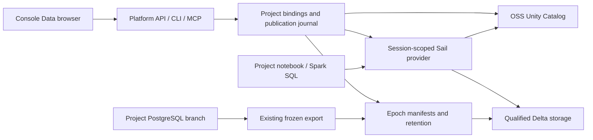

# Open-source Unity Catalog integration plan

Status: UC00 merged in platform #56; UC01 merged in #57 with both native offline suites qualified.
UC02 is merged in #58 with Linux/macOS native qualification; UC03 is merged in platform #59 and Unity Catalog #3 with both native catalog suites passed; UC04 is merged in #60 with both native catalog suites passed; UC05 is merged in #61 with both native catalog suites passed; UC06 is merged in platform #62 and console #7 with required checks and both native catalog/browser suites passed; UC07 is implemented in platform #63 with 241 Rust tests and 9 local native recovery scenarios passed; cross-platform CI and Linux ENOSPC qualification pending; UC08–UC09 remain planned; see the [UC00 capability report](../architecture/uc00-catalog-probe.md) for qualification and selected boundaries. Baseline: platform `8c81417` after
PK08 #54 and project creation #55, with console #6 merged. Packaging is
implemented; release qualification remains incomplete. This plan expands the
UC00 follow-on in the [packaging plan](project-packaging-implementation.md).

[Packaging architecture](../architecture/project-packaging.md) ·
[Industry research](../research/project-packaging-industry.md) ·
[Delivery status](status.md).

## User outcome and delivery milestones

A user creates a project in the console, imports a file, publishes a consistent
analytical snapshot, finds the dataset in **Data**, inspects its schema and
freshness, opens it in a notebook, and explicitly binds it into another project.
The same workflow is available through CLI/MCP for agents. It runs locally
without a Databricks account, cloud service, Kubernetes, Docker, system Java,
or a separate catalog administration UI.

**Local catalog milestone: UC00–UC08.** Deliver project-owned, discoverable,
read-only analytical datasets, durable publication, pinned Sail reads, explicit
cross-project consumption, portable logical bindings, and qualified recovery.
The actor is the local OS owner. Project boundaries organize ownership and
operations; arbitrary Python running as that owner is not a tenant sandbox.

**Governed on-prem milestone: UC09 plus IAM and isolation prerequisites.**
Deliver authenticated users and service identities, enforceable data permissions,
scoped storage access, revocation and audit across supported access paths.
Deployment on an on-prem machine alone does not qualify this security profile.

The first catalog milestone covers tables and their metadata. Existing imported
CSV/JSON/Parquet files continue through the PostgreSQL ingestion workflow.
Managed file volumes, direct lake ingestion, writable analytical tables,
functions, models, arbitrary notebook lineage, row filters, column masks, CDC,
and third-party remote query clients require later capability-specific slices.
Notebooks, jobs and saved queries remain project assets managed by Supabricks;
they do not need to become fictitious UC table objects.

## Decisions and invariants

1. **OSS UC only.** Build a reviewed source revision under Supabricks control.
   Reuse the upstream server and Sail's existing provider. No hosted Databricks
   endpoint, compatibility deliverable or proprietary fallback is planned.
2. **One authority for each kind of state.** UC owns its provider object IDs,
   namespaces and supported grants. Supabricks owns project/deployment ownership,
   logical bindings, publication journals and epoch retention. PostgreSQL owns
   live database schema. Search results are projections with source and freshness,
   never a second grant database.
3. **Mandatory project ownership.** Every platform-created dataset and namespace
   has an owning project and deployment; ownership comes from validated platform
   state, not user-editable UC properties. A consuming project receives a binding,
   not ownership. External objects retain their external owner; their local
   bindings always belong to a project. Console home cannot create data assets.
4. **Names are labels.** Persist provider instance identity, object UUID and
   incarnation/version evidence. Do not identify an asset by its name or URL
   alone. Renaming or dropping/recreating an object requires explicit reconciliation.
   Two deployments of the same project get distinct default publication scopes.
5. **Keep the namespace convenient.** Provision a default namespace lazily on
   first catalog use. Offer a readable deployment catalog alias and schema, with
   deterministic collision handling. Preserve existing `public.table` queries;
   add qualified aliases such as `storefront.analytics.orders`. Projects may bind
   several catalogs, and a catalog may contain assets from several projects.
6. **Live and analytical data are distinct.** A live PG table and its published
   Delta snapshot have separate identities linked by provenance. UC publication
   does not change database branching or introduce continuous synchronization.
7. **Pin complete snapshot sets.** A session resolves one complete published
   revision, pins its epochs, and keeps those versions until an explicit switch.
   Registering several UC tables is not an atomic transaction across that set.
   An independent catalog client is not promised the Supabricks snapshot contract.
8. **Local first, bounded services.** Bundle the selected runtime and supervise
   one managed UC service per installation, not one JVM per project or notebook.
   Start it lazily; expose readiness and resource use. Ordinary PostgreSQL work
   remains available when UC is stopped or unhealthy. Support an explicitly
   configured operator-managed OSS UC service only to the extent qualified.
9. **Capabilities are explicit.** Distinguish catalog authentication, metadata
   authorization, actual data access and multi-user isolation. Unsupported reads,
   writes, storage schemes or permissions fail clearly; no fallback to broad
   credentials, another catalog, or a different snapshot.
10. **Source packages stay portable.** `.sbproj` carries logical dataset
    requirements, not UC credentials, grants, runtime UUIDs, absolute storage
    paths or live service configuration. `.sbdata` remains the bounded PG data
    transfer format. Neither archive grants access or silently publishes data.

## Architecture and repository ownership

| Repository | Work and concrete integration points |
| --- | --- |
| `supabricks/platform` | Contracts, service supervision, ownership, publication, retention, destination bindings, credentials and release evidence. Extend `crates/local/src/{api.rs,client.rs,cli.rs,mcp.rs,daemon.rs}`, `store/`, `projects/`, `project_apply.rs`, `analytics.rs`, `recovery.rs`, `console/`, and `python/analytics/session.py`. Proposed new modules: `catalog/` and `store/catalog.rs`; allocate migration numbers from current main. |
| `supabricks/console` | Data browser, publication and binding flows, provenance/freshness, notebook/SQL handoff and browser tests. Extend `src/{api.ts,main.tsx,projects.tsx,analytics.tsx,notebook.tsx}`; keep implementation in this repo and advance platform's gitlink after its PR merges. |
| `supabricks/sail` | Narrow changes to `crates/sail-catalog-unity/` and provider configuration/credentials if the probe requires them. Platform consumes a reviewed commit through `components/sail-source.lock.json`. |
| `supabricks/unitycatalog` | Created by UC00 as the controlled OSS UC fork. The reviewed v0.6.0 candidate and loopback patch are pinned in platform; loopback patch #1 is merged; retired-key authentication fix #2 is merged. Product orchestration stays in platform. |
| `supabricks/neon`, `supabricks/postgres` | Existing engine dependencies. No catalog-driven storage rewrite or PostgreSQL fork change is assumed. |
| `supabricks/rfcs` | Optional decision mirror. Platform owns the executable contracts, plan and qualification evidence. |

New platform build/qualification files should follow the Sail pattern:
`components/unity-catalog-source.lock.json`, `components/build-unity-catalog.py`,
`install/native/unity_catalog.py`, and bounded `e2e/native/catalog/` scenarios.
These paths now contain the UC00/UC01 implementations. Do not use the archived
`sspc` repo or revive the Kubernetes UI.

## Slice sequence

| Slice | Deliverable | Depends on |
| --- | --- | --- |
| UC00 | Pinned OSS UC/Sail/storage feasibility and capability contract | Current platform and packaging contracts |
| UC01 | Source-built, bundled and supervised local UC service | UC00 |
| UC02 | Project-owned asset identities, provider adapter and metadata APIs | UC00, UC01 |
| UC03 | Durable publication of complete analytical snapshot sets | UC02 |
| UC04 | Session-pinned catalog reads through Sail | UC03 |
| UC05 | Cross-project bindings and portable project requirements | UC04 |
| UC06 | Complete console Data and agent workflows | UC05 |
| UC07 | Recovery, upgrade, reconciliation and operational limits | UC05; validate UC06 flows |
| UC08 | Exact installed-release qualification and local demo | UC00–UC07; existing release failures resolved |
| UC09 | Governed on-prem access | UC08, IAM00 implementation and execution-isolation qualification |

Each slice should fit a reviewable platform PR plus a coordinated Sail, UC or
console PR where needed. Split a slice further if its acceptance criteria cannot
be reviewed together. Do not promise dates before UC00 measures the dependency
footprint and exposes provider/storage gaps.

## UC00 — Qualify the actual integration

Implementation: [platform #56](https://github.com/supabricks/platform/pull/56).
The [capability report](../architecture/uc00-catalog-probe.md) records the source
pin, native evidence, local-owner boundary and UC01 handoff. Both native targets pass all 14 checks; the measured ceilings and local-owner
GO decision are frozen in that report. The acceptance criteria below remain the specification; UC00 does not install UC in a release.

Start with an isolated developer harness; do not change the user's installed
runtime or ship UC in the release yet. Pin a candidate UC tag to its resolved
commit, API schema hash, source/license inventory and Java/build inputs. Upstream
v0.6.0 is the candidate to investigate as of this plan, not an approved runtime
pin. Use the currently pinned source-built Sail 0.7.1 as the baseline.

Build a minimal project with two related PG tables, export one complete epoch,
register its Delta tables, and read them using Sail's existing UC provider.
Exercise a second project and a second principal in the harness. Record actual
capabilities, including failures, for list/describe, name resolution, Delta
versions, credentials, denied access, expiry and delete/recreate behavior.

Evaluate the current local epoch files first. Separately test the existing
SeaweedFS S3 interface with the exact endpoint, path-style and credential behavior
needed by UC/Sail. Do not assume AWS STS-compatible credential vending follows
from S3 compatibility. Local-owner file reads may qualify the first profile;
shared access remains unsupported until its storage enforcement qualifies.

Decide and record: supported metadata backend and stopped-backup method, service
bootstrap with authentication, bundled JRE vendor/version/license, explicit Sail
configuration without ambient credential discovery, publication naming strategy,
and the smallest required fork patches. The UC metadata store must bootstrap
independently of a user project or of the catalog it serves.

Acceptance:

- Linux x86_64 and macOS arm64 reports contain exact pins, real Sail query results,
  supported/unsupported capability matrix, denied-access outcomes and restart data.
- Record cold start, readiness, idle/peak RSS, archive growth and disconnected
  execution. Initial budgets to evaluate: at most 512 MiB additional idle RSS,
  20 seconds cold readiness and 300 MiB compressed runtime growth. Freeze measured
  release ceilings here; a miss requires an explicit design decision before UC01.
- Demonstrate a two-table session cannot silently combine different publication
  revisions; identify the adapter needed if native UC resolution cannot ensure it.
- Produce `docs/architecture/uc00-catalog-probe.md` with the selected source pin,
  backend, local profile and follow-up patches. A successful HTTP listing alone
  is not completion. A failed capability does not trigger a proprietary fallback.

## UC01 — Own the service and its deployed source

Implementation merged in [platform #57](https://github.com/supabricks/platform/pull/57). Both native suites passed 14 compatibility and 13 installed-service checks each. Full alpha.27 archive qualification failed on stale alpha.26 harness defaults; UC02 reconciles them. See the
[service handbook](../handbook/catalog-service.md) for managed/external modes,
source ownership, lifecycle and qualification boundaries.

Build UC from the controlled source pin in CI. Bundle the built server, its
runtime dependency closure and a checksum-pinned JRE for both targets. Preserve
source/build provenance and component licenses; never download Java, Maven/SBT
artifacts or UC dependencies on the end user's first launch. Installed runtime
startup must not execute the development build script.

Integrate process ownership, private configuration/data/log directories, dynamic
loopback port selection, authenticated service requests, readiness, bounded
restart/backoff, log rotation and `up`/`down`/`status` behavior. Keep secrets out of
command arguments, browser responses and public diagnostics. No unauthenticated
upstream development configuration is accepted as the shipped default.

Register a separate provider mode for operator-managed OSS UC using explicit
endpoint/TLS and secret references, capability checks and provider identity.
Supabricks must not stop, migrate or back up that external service as if it owned
it. Cross-host storage access stays disabled until its profile qualifies.

Acceptance: install and first catalog start offline with no host Java/build
tool dependencies; restart preserves metadata; port collisions and stale PIDs do
not affect unrelated processes; UC failure leaves existing PG workflows usable.
Missing/dirty source artifacts fail assembly. Document resource measurements.

## UC02 — Project ownership, identities and metadata contracts

Implementation merged in [platform #58](https://github.com/supabricks/platform/pull/58); see the [UC02 contract](../architecture/uc02-catalog-metadata.md) and [walkthrough](../handbook/catalog-metadata.md). Control schema 14 adds ownership records through the existing backed-up upgrade path. Both native targets passed 14 compatibility and 22 installed-service checks; full archive qualification remains incomplete.

Implement the provider adapter and versioned API/MCP contracts: capabilities,
list/describe, resolve object/version, health and typed errors. Bound pagination,
result sizes, retries and request deadlines. Expose one consistent view of live
PG metadata and published analytical metadata with an explicit provider/type.

Persist owning project/deployment, resource key, provider instance, UC object
ID/incarnation, alias, publication revision and lifecycle state. Validate source
schema drift and case/quoting collisions before publication. A descriptive UC
property may help reconciliation but cannot establish ownership or grant access.
Create defaults only after a project is selected; name collisions never cause
adoption of another project's objects.

Acceptance: two same-named project deployments remain distinct; projectless
creation is rejected in console/CLI/MCP; rename and delete/recreate invalidate
stale bindings; unavailable catalog and empty catalog are distinguishable;
existing projects need no destructive automatic migration.

## UC03 — Publish complete snapshots durably

Implementation is on `feat/uc03-durable-publication`; see the [journal contract](../architecture/uc03-durable-publication.md) and [workflow](../handbook/catalog-publication.md). Control schema 15 and [UC fork #3](https://github.com/supabricks/unitycatalog/pull/3) add durable publication/retention and identity-conditioned provider writes. Qualification is in progress.

Add explicit preview/publish/status/unpublish operations with a request key and
expected source/binding revision. Reuse frozen exports and immutable epoch
manifests. Preview identifies the owner, source branch, table set, schema,
snapshot time, retention impact and destination before mutation.

Publication is a resumable journal: acquire a durable retention reference;
register epoch-qualified UC objects; verify their identities and locations;
commit a complete publication manifest and atomically advance the platform's
logical alias. Candidate registrations remain unavailable to platform consumers
until that final commit. UC writes and SQLite commits are separate operations;
record remote object IDs and reconcile a lost reply rather than duplicate them.

Extend A02 retention: a published revision has a durable reference beyond a
short reader lease, including while the daemon is stopped. Active sessions and
consumer bindings retain old revisions. Unpublish first blocks new binding or
session acquisition; retire only owned registrations after references drain;
then release retention. Never cascade deletion into live PG or another project.
If files are copied to a qualified storage backend, verify immutable objects
before registration and journal incomplete copies for cleanup.

Acceptance: kill/restart at each boundary, UC outage, partial registration,
concurrent refresh, lost reply, source deletion and GC cannot expose partial
sets or remove referenced data. Replays have one publication identity. Orphan
cleanup is bounded and cannot delete unowned UC objects or arbitrary locations.

## UC04 — Read by catalog name without losing snapshot consistency

Implementation: [frozen catalog reads](../architecture/uc04-catalog-reads.md).
CLI/MCP, console workspace API and notebook creation share the explicit catalog
selector; browser Data controls remain UC06.

Adapt `python/analytics/session.py`, platform session descriptors and Sail's
provider together. Resolve a logical dataset-set revision once, validate all UC
IDs/versions, acquire leases, then install session-scoped qualified aliases.
Use a frozen resolution adapter or immutable per-revision namespace if required;
do not repeatedly resolve mutable UC names during execution. Preserve existing
`public.table` behavior and the current read-only analytical contract.

Pass only explicit provider configuration and scoped credentials; scrub inherited
`UC_*`, `UNITY_*`, `DATABRICKS_*` and ambient storage credential discovery where
applicable. Keep provider/cache state isolated between sessions and principals.
Do not install a Spark JVM plugin in notebook kernels to configure the Rust
execution engine. Catalog DDL/DML and writes through discovered locations remain
unsupported for this milestone.

Acceptance: SQL workspace, Spark Connect and notebooks read the same pinned
revision; publication refresh affects only explicitly refreshed/new sessions;
Sail cache invalidation cannot cross principals or object incarnations. Provider
outage blocks new resolutions; existing pinned reads continue only within valid
leases and credential/policy lifetime. Errors never select a different dataset.
Test malicious path/URI metadata against the allowed storage roots/endpoints.

## UC05 — Bind datasets into projects and packages

Implementation: [dataset bindings](../architecture/uc05-dataset-bindings.md) and
[operator workflow](../handbook/catalog-datasets.md).

Introduce an explicit catalog-dataset binding kind and capability version in
project manifests, destination bindings and reviewed plan/apply. Proposed UI:
**Add existing dataset** in the consuming project. Resolve the owning deployment,
provider ID and complete publication revision before confirmation.

Bindings default to a fixed revision. Offer discovery of a newer publication as
an explicit update with schema/provenance diff; never let a running notebook
silently follow “latest.” A project can bind multiple datasets/catalogs. Joining
independently published sets records each revision; it does not imply one shared
source transaction across those sets.

Packages carry logical requirements and optional expected schema/content
fingerprints. Import shows unresolved requirements and asks for destination
mapping; it never trusts a source object UUID as destination authority. Retain
source IDs only as provenance. Offline inspection, pack and verify do not start
UC. Notebook outputs and private connection details obey existing package rules.

Acceptance: two projects share one published dataset without duplicate storage or
ownership transfer; importing the same package elsewhere needs explicit bindings;
a changed object or schema produces a plan diff/failure; project deletion removes
its bindings without deleting producer data. Source publication withdrawal and
consumer-held retention references have visible, bounded lifecycle behavior.

Lifecycle reconciliation: PK04 has no project-delete/uninstall operation and
retains other installed resources. UC05 implements consumer decommission through
reviewed removal of dataset declarations (`unbind`), before checkout removal.
Deleting a checkout alone cannot release durable references. A future project
delete operation must use this same binding cleanup without deleting producer
data; it is not introduced by this slice. Browser binding forms belong to UC06.

## UC06 — Deliver the console and agent experience

Implementation: [platform #62](https://github.com/supabricks/platform/pull/62) merged at `35e5463`, pinning [console #7](https://github.com/supabricks/console/pull/7) at `16b27f4`. Both native Linux/macOS catalog and browser suites passed. Local native qualification passed all 11 catalog browser scenarios, 54 existing console checks, 13 notebook checks, 16 environment checks and 237 Rust tests. Linux/macOS catalog CI and full release-archive qualification remain separate. See [console Data workflow](../architecture/uc06-console-data.md) and
[operator workflow](../handbook/catalog-datasets.md#console-workflow).

Build a project-scoped **Data** browser in `supabricks/console`. Show owned and
explicitly bound datasets; allow discovery of other available datasets only as
inputs to an explicit binding. Display type/provider, owner, schema/comments,
source branch, publication revision, snapshot time and known freshness. When the
source cannot be compared, show freshness as unknown rather than current.

Deliver preview/publish, add-existing, update-binding, unpublish, and notebook/
Spark SQL handoff flows. Keep internal service paths and admin credentials out
of the interface. Existing ingestion ends with an optional publication action;
it does not silently copy data into another project's scope. Live PostgreSQL and
its analytical snapshot remain visibly different choices.

Describe only observed provenance edges: ingestion receipt to PG table, export
to snapshot set, publication to binding, and execution to resolved inputs. Do not
claim arbitrary Python or column-level lineage. Record package/environment/data
versions for runs where the existing execution journal supplies them.

Acceptance: real browser test creates project A, ingests and publishes data,
creates project B, binds the dataset, queries it in SQL and a notebook, refreshes
A and verifies B's pinned behavior. Include reload/lost-response recovery,
project switching, absent provider, stale schema, empty states and CSRF checks.
CLI/MCP exercise the same operation contracts. Merge console source before
advancing the platform submodule pin; existing browser gates remain mandatory.

## UC07 — Recovery and operational completion

Implementation: [platform #63](https://github.com/supabricks/platform/pull/63) and the [stopped catalog recovery contract](../architecture/uc07-catalog-recovery.md). All 241 Rust tests and 9 installed native recovery scenarios passed locally, including moved-root bound reads, interruption and upgrade activation boundaries. Linux/macOS CI and actual Linux ENOSPC qualification remain pending; the exact-archive release gate remains UC08.

Extend stopped-cell backup/restore to the owned UC metadata backend, publication
journal, object mappings, retention references and any newly managed data paths.
Define a recoverable checkpoint: stop catalog mutations/readers and UC before
copying its database using the method qualified in UC00. Never copy a live
metadata database using an unqualified filesystem snapshot.

On restore to a different root, rebuild only owned physical-location mappings,
verify content and provider identities, and reconcile complete publications before
serving them. Keep catalogs/epochs retained until every binding is reconciled.
External UC requires an operator-coordinated metadata backup or explicit rebind;
a local backup cannot claim to restore that remote service's grants or state.

Version the server/backend migration contract, platform schema, publication
manifest and capability profile independently. Back up before upgrades and refuse
unsafe downgrades; rollback after an irreversible backend migration means a
qualified restore, not merely launching an older JAR. Reissue local service
credentials as appropriate; never turn backup provenance into a new remote grant.

Acceptance: stopped restore, moved-root restore, interrupted upgrade, corrupt
metadata, disk exhaustion and missing external provider have tested outcomes.
Bound catalog entries, publication/retention disk use, connections, JVM memory,
logs and reconciliation work. Surface health and repair guidance without secrets.
Ordinary `down` and uninstall do not silently delete user catalog data.

## UC08 — Qualify the installed local product

Extend the existing native-release/R04 evidence collector; preserve PG, ingest,
console, notebooks, environments, project packaging, data transfer and recovery
gates. Reports must identify the exact platform/console/Sail/UC commits, JRE,
metadata schema, capability profile, archive hashes and measured resource costs.
No floating dependencies or unrelated cached report can qualify the candidate.

Qualify both Linux x86_64 and macOS arm64 through the actual localhost curl
installer. Cover first-run catalog bootstrap, absent system Java, install paths
with spaces, offline restart, browser workflow, cross-project reads, publication
failure recovery, GC protection, package rebinding and moved-root restore.
Account for the UC process and its descendants in network and resource evidence.
Persist bounded safe diagnostics for failed gates so a failed kernel or export
is diagnosable without publishing credentials or user data.

Acceptance: all inherited and new exact-archive gates pass on the final candidate;
record any retry and its explanation. A required PR check passing or a merge is
not release completion. Ship an installed two-project walkthrough requiring no
manual UC CLI setup. Update this plan, delivery status and handbook from the
recorded evidence, not from implementation presence.

## UC09 — Governed on-prem profile with IAM

This slice is a joint milestone, blocked on actual IAM principal/group/run-as
implementation and qualified isolation of untrusted execution. IAM00 as a design
alone does not satisfy the dependency. An on-prem identity provider must work
without a Databricks account; the local-owner experience remains available.

Map stable platform principals to supported UC permissions, keep project control
rights separate from data rights, and obtain least-privilege storage credentials
or mediated read handles. Verify permission changes, expiry, cache invalidation
and an explicit revocation bound. Decide whether previously materialized results
or derived snapshots may be retained; revocation cannot erase bytes a reader
already legitimately copied. New exports/copies need their own authorization.

Acceptance: an unauthorized principal cannot list restricted metadata or read it
through console, CLI/MCP, Spark Connect, notebook Python, direct PG, file paths or
object storage in the advertised governed deployment. Test copied URLs, guessed
paths, stale credentials, pooled sessions and cross-project identities. Prevent
alternate engine paths from bypassing UC policy; direct PG needs its own role /
gateway enforcement. Permission failures are audited with actor, effective
identity, operation and dataset revision, without result data or secrets.

Catalog API authorization alone is insufficient. If a storage provider or runtime
cannot satisfy the profile, keep that deployment mode unsupported and document
the concrete dependency; do not claim multi-user security for the OS-owner mode.
Row/mask policies, writable tables and third-party client access each need their
own enforcement and consistency qualification before being advertised.

## Existing release debt and completion accounting

PK08 and console project creation are merged. Alpha.24 remains the last fully
qualified predecessor recorded by the packaging workstream. The latest checked
[alpha.25 run](https://github.com/supabricks/platform/actions/runs/35495263448)
and [alpha.26 run](https://github.com/supabricks/platform/actions/runs/35496334403)
both concluded failure. The former includes macOS notebook/Spark and snapshot
export failures; the latter failed Linux assembly. Preserve these reports and
triage them in release stabilization. UC00 may run independently; UC08 cannot
mark a candidate qualified while inherited failures remain unresolved.

Completion of UC08 means the local catalog workflow is implemented and qualified.
Completion of UC09 means the explicitly tested governed deployment profile is
qualified. Neither means model management, a scheduler, full lineage, arbitrary
formats, hosted delivery or all enterprise capabilities have been implemented.

## Primary evidence and decisions to confirm

- [OSS UC repository](https://github.com/unitycatalog/unitycatalog) and
  [v0.6.0 release](https://github.com/unitycatalog/unitycatalog/releases/tag/v0.6.0):
  candidate source to pin and qualify, not evidence of compatibility with Sail.
- [UC namespace](https://docs.unitycatalog.io/quickstart/),
  [table API](https://docs.unitycatalog.io/usage/api/tables/) and
  [volume API](https://docs.unitycatalog.io/usage/api/volumes/): catalog/schema/asset
  hierarchy and metadata interfaces. Volumes are outside the first table profile.
- [Server configuration](https://docs.unitycatalog.io/server/configuration/):
  documented Java dependency, file-backed metadata example and storage-credential
  configuration. Recheck the selected source; the documentation examples alone
  do not qualify a production backend or local S3 credential isolation.
- [Authentication](https://docs.unitycatalog.io/server/auth/) and
  [privileges](https://docs.unitycatalog.io/server/users-privileges/): supported
  identity/authorization building blocks, not proof of end-to-end enforcement.
- [Pinned Sail provider guide](https://github.com/supabricks/sail/blob/9544c9253e981a82c5f9e493c43ce98a4d9d41b7/docs/guide/catalog/unity.md)
  and [implementation](https://github.com/supabricks/sail/blob/9544c9253e981a82c5f9e493c43ce98a4d9d41b7/crates/sail-catalog-unity/src/provider.rs):
  reusable UC provider plus credential/caching behavior that UC00 must exercise.
- Local contracts: [atomic epochs](../architecture/a02-analytical-epochs.md),
  [analytical sessions](../architecture/a03-analytical-sessions.md),
  [source-built Sail](../architecture/source-built-sail.md),
  [recovery](../architecture/r03-recovery-upgrades.md) and
  [R04 evidence](../architecture/r04-local-release.md).

UC00 resolves the source/JRE/backend/storage/profile questions before feature
implementation. Later slices retain those decisions as versioned evidence and
reopen them explicitly when an upstream or runtime capability changes.
