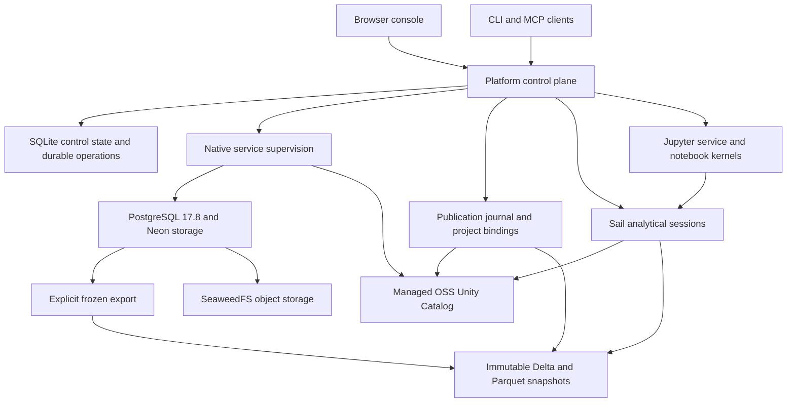

# What we have built

[Documentation home](README.md) · [Delivery ledger](plans/status.md) ·
[Implementation plans](plans/README.md) · [Architecture details](architecture/README.md)

As of 2026-09-22, Supabricks combines branchable PostgreSQL, snapshot analytics,
project packaging, file ingestion, browser notebooks and open-source Unity Catalog
in one native application. A Rust control plane exposes the same underlying
operations to the console, CLI and MCP clients. The frontend is maintained in a
separate repository and shipped inside the native release.

UC00–UC09, including IAM00 and UC09.1–UC09.8, is complete for its planned profiles.
The latest retained qualification is alpha.35: local-owner Linux x86_64 and macOS
arm64, plus the explicitly qualified Linux governed server. See the
[exact-archive evidence](architecture/uc098-governed-release.md); these claims do
not automatically transfer to a new build from the same branch or version label.

## What a user can do

| Capability | Delivered behavior | Guide |
| --- | --- | --- |
| Projects and databases | Create a project and main database; branch PostgreSQL; query, cancel and save SQL | [Projects](handbook/project-creation.md), [database workspace](handbook/database-workspace.md) |
| File ingestion | Preview and import CSV/TSV, JSON/JSONL/document and Parquet into new PostgreSQL tables | [File ingestion](handbook/file-ingestion.md) |
| Analytics | Explicitly publish immutable Delta/Parquet snapshots and query pinned versions with Sail/Spark SQL | [Analytical workspace](handbook/analytical-workspace.md) |
| Notebooks | Edit project notebooks in the browser, execute Sail-backed kernels and manage locked Python environments | [Notebooks](handbook/notebooks.md), [environments](handbook/notebook-environments.md) |
| Catalog and sharing | Discover published datasets, inspect schema/freshness and explicitly bind datasets into another project | [Catalog demo](handbook/catalog-demo.md), [dataset bindings](handbook/catalog-datasets.md) |
| Portable projects | Inspect, package, bind and apply source; carry offline dependencies and bounded logical table data | [Portability](handbook/project-portability.md), [logical data](handbook/project-data.md) |
| Governed access | Sign in through OIDC; enforce project/execution permissions and catalog grants; isolate workloads and revoke access | [Governed server](handbook/governed-server.md) |
| Recovery | Stop and back up a cell, restore into a new root, and perform supported explicit upgrades | [Recovery](handbook/recovery.md) |

## How the stack fits together

The diagram shows the logical data flow. Local-owner processes run as the local
OS user. Governed execution adds authorization, admitted inputs and isolated
workloads around the analytical/notebook path; it does not expose the native
services as public endpoints.

PostgreSQL owns live database data and schema. The platform owns project and
deployment identities, durable operations, publication journals and snapshot
retention. Unity Catalog owns provider object identities, metadata and supported
grants. Sail reads the snapshot set selected for a session. Publishing a newer
snapshot does not silently change an existing session's pinned data.

Source, installed program files and mutable runtime data are separate:

- Project source contains definitions, notebooks, queries and dependency locks.
- The installed release contains verified binaries, the compiled console,
  private Python/Java runtimes and dependency inventories.
- The data directory contains control state, storage, environments and service
  state. Defaults are `~/.local/share/supabricks` for the program and
  `~/.supabricks` for data; overrides are explicit.

## Deployment profiles

| Profile | Supported boundary | Requirements and limits |
| --- | --- | --- |
| Local owner | Linux x86_64 and Apple Silicon macOS; loopback console; trusted OS owner | Bundled runtimes; no target-machine Docker, Kubernetes, system Python or Java required. Notebook code has the owner's host permissions. |
| Governed shared server | Dedicated Linux x86_64 server; TLS/OIDC login; authorized, isolated workloads | Operator-prepared Docker/gVisor inputs, IdP, TLS and a matching reviewed R04 receipt. OS/Docker owner remains trusted. The qualified initial envelope is two concurrent executions on a dedicated 4-CPU/16-GiB host. |
| Earlier Kubernetes prototype | Separate operator, Helm chart and regression suites | Historical deployment profile; its architecture, auth defaults and backlog do not describe the current native product. |

The native target baselines are glibc 2.39+ / Ubuntu 24.04 and macOS 15+ arm64.
Chromium is the qualified browser. macOS has no governed shared-server profile.
See the [installer](../install/native/README.md) and
[governed setup](handbook/governed-server.md) for exact prerequisites.

## Components and source ownership

| Component / repository | What it owns | Source and build contract |
| --- | --- | --- |
| [platform](https://github.com/supabricks/platform) | CLI/MCP, daemon, state, orchestration, identity/authorization, catalog integration, packaging and qualification | [crates/local](../crates/local/src/), [python](../python/), [install/native](../install/native/), [e2e/native](../e2e/native/) |
| [console](https://github.com/supabricks/console) | Browser workspaces, notebooks and governed UI | Pinned [console/](../console/) git submodule; [ownership contract](architecture/console-source-split.md) |
| [neon](https://github.com/supabricks/neon) | Pageserver, safekeeper, broker, compute control and PostgreSQL extension | [Native cell](architecture/native-cell.md), [component baseline](../components/README.md) |
| [postgres](https://github.com/supabricks/postgres) | Controlled PostgreSQL source and inherited patch ledger | PG17.8 selected by the [component inventory](../components/components.lock.json) |
| [sail](https://github.com/supabricks/sail) | Maintained analytical engine source, built as a native Python wheel | [Source build](architecture/source-built-sail.md), [source lock](../components/sail-source.lock.json) |
| [unitycatalog](https://github.com/supabricks/unitycatalog) | Controlled OSS catalog server and narrow integration changes | [Source lock](../components/unity-catalog-source.lock.json), [catalog service](handbook/catalog-service.md) |
| Bundled helpers and runtimes | Process Compose, SeaweedFS, Python, Java and uv | [Component/build inventories](../components/README.md); every installed file is recorded in `release.json` |
| [rfcs](https://github.com/supabricks/rfcs) | Private product direction and historical decisions | Context only; no runtime or build dependency |

Within `crates/local/src`, `store/` holds control state; `engine/`, `connections/`
and `supervisor/` manage the native cell; `analytics.rs`, `catalog/`, `ingest/`,
`notebooks/` and `environments/` implement data workflows. `identity/`,
`authorization/`, `execution/` and `governed/` implement the shared-server boundary.
The [repository investigation](plans/repository-map.md) retains earlier source
baselines; use current lock files and release provenance for exact build pins.

## Build, qualify and operate

The [native build guide](../install/native/README.md) is the build entry point.
It assembles the platform binary and pinned console, verified engine/helpers,
source-built Sail and Unity Catalog, and locked Python/notebook dependencies.
The manifest records their identities and installed file checksums. The target
machine uses the assembled release rather than building these components itself.

Release qualification runs against exact installed archives. The
[R04 contract](architecture/r04-local-release.md) defines combined acceptance;
[UC09.8](architecture/uc098-governed-release.md) records the latest full matrix,
archive identities, retries and shared-ingress receipt. Subsystem probes, merged
PR checks and workstation smoke tests have narrower scopes.

Start with the [local walkthrough](handbook/local-demo.md) or the
[governed server guide](handbook/governed-server.md). For engineering work, follow
the [implementation plan index](plans/README.md) to the relevant contract and
qualification suite.

## What remains outside the delivered scope

Public `supabricks.io` delivery, publisher signing/notarization, the transitive
redistribution audit, and physical-machine/reboot/power-loss qualification remain
open. Hosted console transport, HA/distributed execution, managed incremental sync,
writable analytical tables, row filters, column masks and additional governed
deployment profiles need separate work. Local-owner project boundaries are not
tenant security boundaries.

[Managed analytical synchronization](plans/analytical-sync-implementation.md)
plans triggered and continuous PostgreSQL → analytics modes after the delivered
snapshot baseline. “No user-managed CDC” allows platform-owned change capture;
these modes are planned, not available today. SY01 delivers managed snapshot
scheduling, SY02 adds durable capture, and [SY03](architecture/sy03-incremental-epochs.md)
adds explicit local incremental epochs for review. Reverse sync is later scope.

See the [delivery ledger](plans/status.md) for the maintained backlog and release
history. Historical plans and the Kubernetes backlog must not be read as a list
of missing native features.
